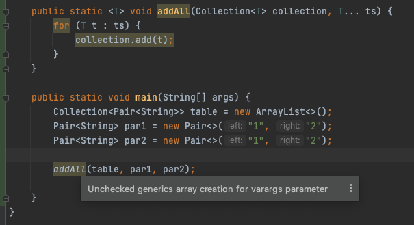

# 040-Varargs警告

Java不支持泛型类型数组,向参数个数可变的方法传递一个泛型类型的实例

```java
public static <T> void addAll(Collection<T> collection, T... ts) {
  for (T t : ts) {
    collection.add(t);
  }
}
```

为了调用这个方法，Java虚拟机必须建立一个Pair＜String＞数组，这就违反了前面的规则。

不过，对于这种情况，规则有所放松，你只会得到一个警告，而不是错误。
可以采用两种方法来抑制这个警告。

- 一种方法是为包含addAll调用的方法增加注解@SuppressWarnings(“unchecked”)。
- 或者在Java SE 7中，还可以用@SafeVarargs直接标注addAll方法：



```java
@SafeVarargs
public static <T> void addAll(Collection<T> collection, T... ts) {
  for (T t : ts) {
    collection.add(t);
  }
}
```

或者

```java
@SuppressWarnings("unchecked")
public static void main(String[] args) {
  Collection<Pair<String>> table = new ArrayList<>();
  Pair<String> par1 = new Pair<>("1", "2");
  Pair<String> par2 = new Pair<>("1", "2");

  addAll(table, par1, par2);

}
```

