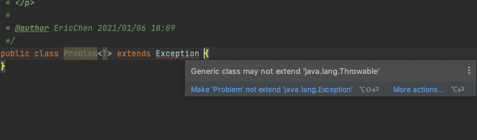
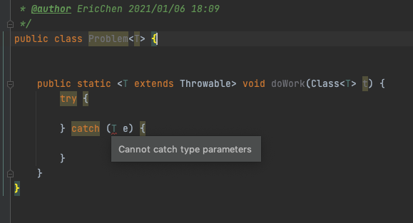

# 080-不能抛出或者捕获泛型类的实例

[TOC]

## 简介

既不能抛出也不能捕获泛型类对象。实际上，甚至泛型类扩展Throwable都是不合法的。例如，以下定义就不能正常编译：



## catch子句中不能使用类型变量



## 异常规范中使用类型变量是允许的

```java
public static <T extends Throwable> void doWork(T t) throws T {
  try {

  } catch (Throwable e) {
    t.initCause(e);
    throw t;
  }
}
```

