## jvisualvm

> 来源：朝雨忆轻尘
>
> cnblogs.com/xifengxiaoma/p/9402497.html

- JVisualVM 简介

- 案例分析

- - 准备模拟内存泄漏样例
  - 使用JVisualVM分析内存泄漏
  - JVisualVM 远程监控 Tomcat

# JVisualVM 简介

VisualVM 是Netbeans的profile子项目，已在JDK6.0 update 7 中自带，能够监控线程，内存情况，查看方法的CPU时间和内存中的对 象，已被GC的对象，反向查看分配的堆栈(如100个String对象分别由哪几个对象分配出来的)。在JDK_HOME/bin(默认是C:\Program Files\Java\jdk1.6.0_13\bin)目录下面，有一个jvisualvm.exe文件，双击打开，从UI上来看，这个软件是基于NetBeans开发的了。

VisualVM 提供了一个可视界面，用于查看 Java 虚拟机 (Java Virtual Machine, JVM) 上运行的基于 Java 技术的应用程序的详细信息。VisualVM 对 Java Development Kit (JDK) 工具所检索的 JVM 软件相关数据进行组织，并通过一种使您可以快速查看有关多个 Java 应用程序的数据的方式提供该信息。您可以查看本地应用程序或远程主机上运行的应用程序的相关数据。此外，还可以捕获有关 JVM 软件实例的数据，并将该数据保存到本地系统，以供后期查看或与其他用户共享。

双击启动 jvisualvm.exe，启动起来后和jconsole 一样同样可以选择本地和远程，如果需要监控远程同样需要配置相关参数。

主界面如下；

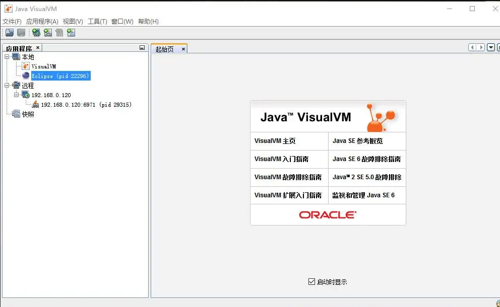

VisualVM可以根据需要安装不同的插件，每个插件的关注点都不同，有的主要监控GC，有的主要监控内存，有的监控线程等。

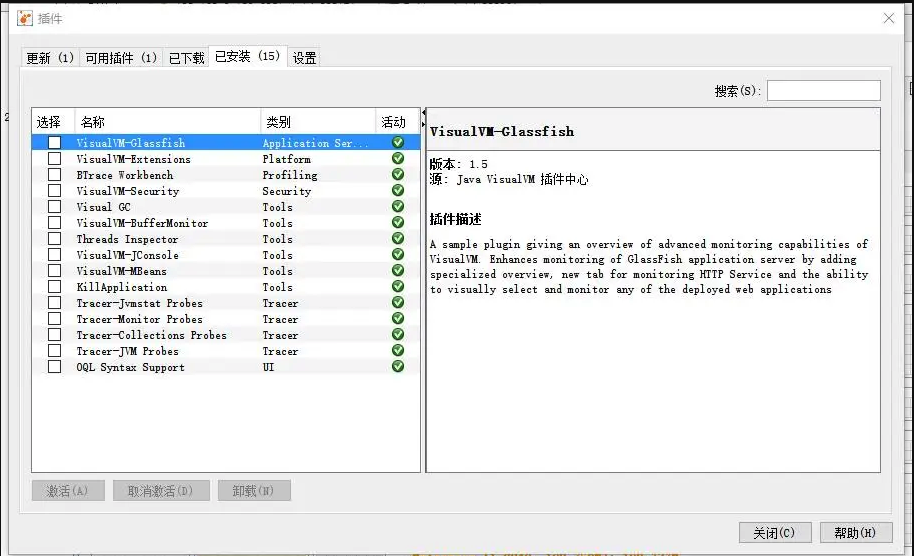

如何安装：

> 1、从主菜单中选择“工具”>“插件”。2、在“可用插件”标签中，选中该插件的“安装”复选框。单击“安装”。3、逐步完成插件安装程序。

我这里以 Eclipse(pid 22296)为例，双击后直接展开，主界面展示了系统和jvm两大块内容，点击右下方jvm参数和系统属性可以参考详细的参数信息.


因为VisualVM的插件太多，我这里主要介绍三个我主要使用几个：监控、线程、Visual GC

监控的主页其实也就是，cpu、内存、类、线程的图表

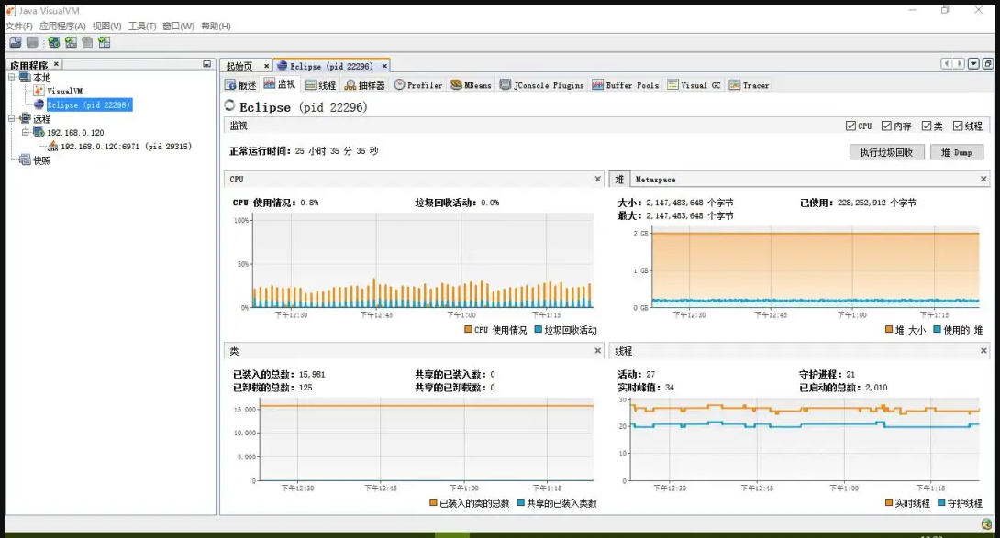

线程和jconsole功能没有太大的区别

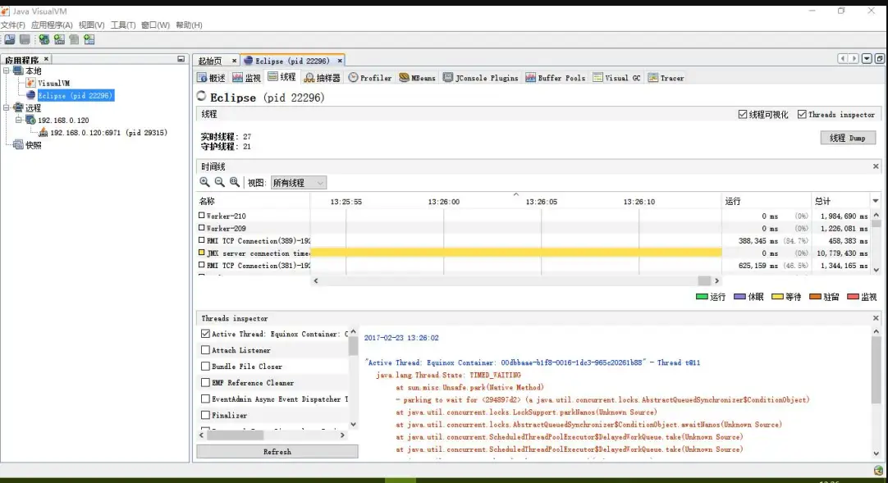

Visual GC 是常常使用的一个功能，可以明显的看到年轻代、老年代的内存变化，以及gc频率、gc的时间等。

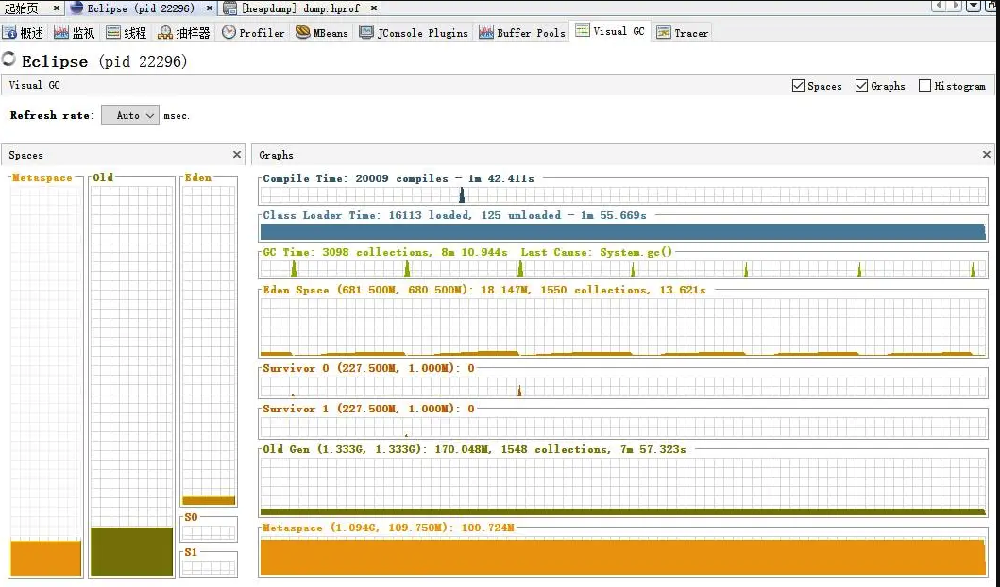

以上的功能其实jconsole几乎也有，VisualVM更全面更直观一些，另外VisualVM非常多的其它功能，可以分析dump的内存快照，

dump出来的线程快照并且进行分析等，还有其它很多的插件大家可以去探索

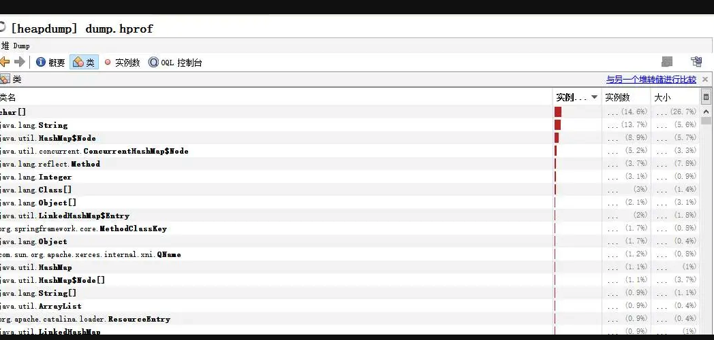

# 案例分析

## 准备模拟内存泄漏样例

1、定义静态变量HashMap

2、分段循环创建对象，并加入HashMap

代码如下：

```java
/**
 * <p>
 * 模拟内存泄漏
 * </p>
 *
 * @author EricChen 2020/04/28 19:57
 */
public class ExampleOfMemoryLeak {

    //声明缓存对象
    private static final Map map = new HashMap();

    public static void main(String[] args) {
        try {
            Thread.sleep(10000);//给打开 visualvm 时间
        } catch (InterruptedException e) {
            e.printStackTrace();
        }
        //循环添加对象到缓存
        for (int i = 0; i < 1000000; i++) {
            TestMemory testMemory = new TestMemory();
            map.put("key" + i, testMemory);
        }
        System.out.println("first");
        //为dump出堆提供时间
        try {
            Thread.sleep(10000);
        } catch (InterruptedException e) {
            e.printStackTrace();
        }
        for (int i = 0; i < 1000000; i++) {
            TestMemory t = new TestMemory();
            map.put("key" + i, t);
        }
        System.out.println("second");

        try {
            Thread.sleep(10000);
        } catch (InterruptedException e) {
            e.printStackTrace();
        }
        for (int i = 0; i < 3000000; i++) {
            TestMemory t = new TestMemory();
            map.put("key" + i, t);
        }
        System.out.println("third");
        try {
            Thread.sleep(10000);
        } catch (InterruptedException e) {
            e.printStackTrace();
        }
        for (int i = 0; i < 4000000; i++) {
            TestMemory t = new TestMemory();
            map.put("key" + i, t);
        }
        System.out.println("forth");
        try {
            Thread.sleep(Integer.MAX_VALUE);
        } catch (InterruptedException e) {
            e.printStackTrace();
        }
        System.out.println("qqqq");

    }
}

```

配置jvm参数如下：

```java
   -Xms512m
         -Xmx512m
         -XX:-UseGCOverheadLimit
         -XX:MaxPermSize=50m
```

运行程序并打卡visualvm监控

## 使用JVisualVM分析内存泄漏

1、查看Visual GC标签，内容如下，这是输出first的截图

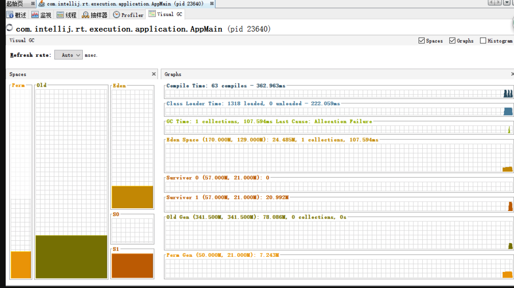

这是输出forth的截图：

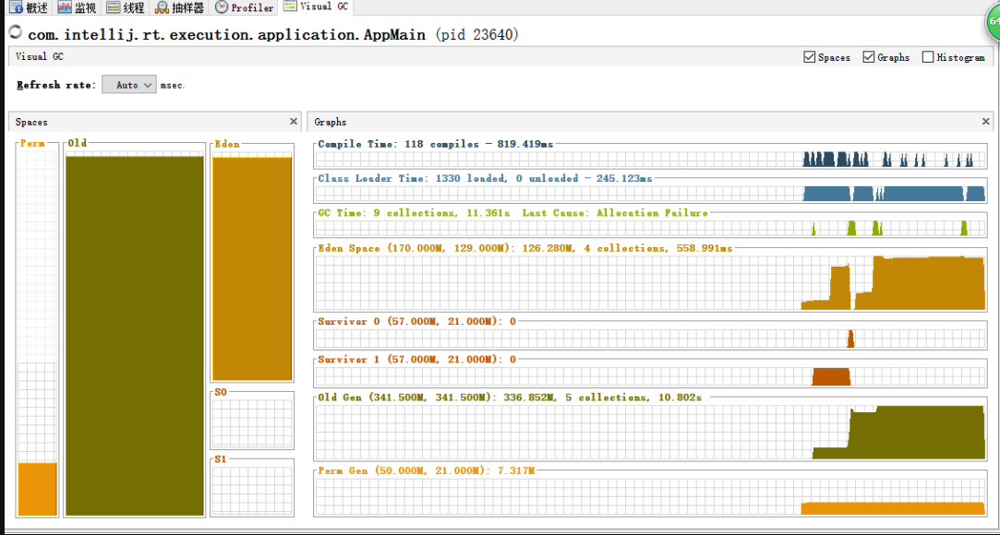

通过2张图对比发现：

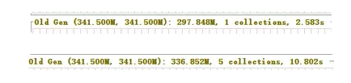

老生代一直在gc，当程序继续运行可以发现老生代gc还在继续：


增加到了7次，但是老生代的内存并没有减少。说明存在无法被回收的对象，可能是内存泄漏了。

如何分析是那个对象泄漏了呢？打开抽样器标签：点击后如下图：

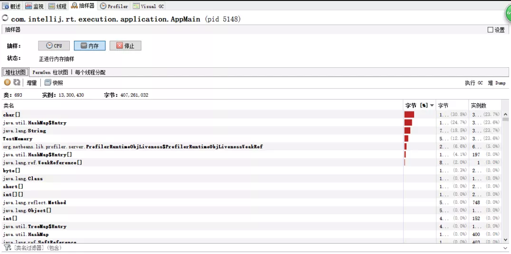

按照程序输出进行堆dump，当输出second时，dump一次，当输出forth时dump一次。

进入最后dump出来的堆标签，点击类：

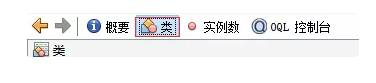

点击右上角：“与另一个堆存储对比”。如图选择第一次导出的dump内容比较：

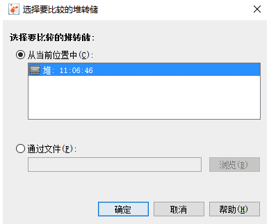

比较结果如下：

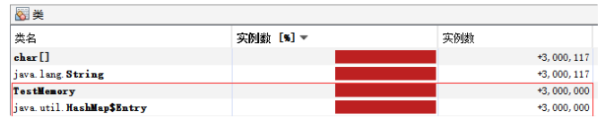

可以看出在两次间隔时间内TestMemory对象实例一直在增加并且多了，说明该对象引用的方法可能存在内存泄漏。

如何查看对象引用关系呢？

右键选择类TestMemory，选择“在实例视图中显示”，如下所示：

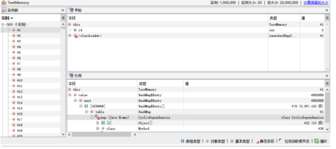

左侧是创建的实例总数，右侧上部为该实例的结构，下面为引用说明，从图中可以看出在类CyclicDependencies里面被引用了，并且被HashMap引用。

如此可以确定泄漏的位置，进而根据实际情况进行分析解决。

## JVisualVM 远程监控 Tomcat

1. 修改远程tomcat的catalina.sh配置文件，在其中增加：

   1. JAVA_OPTS="$JAVA_OPTS
   2. -Djava.rmi.server.hostname=192.168.122.128
   3. -Dcom.sun.management.jmxremote.port=18999
   4. -Dcom.sun.management.jmxremote.ssl=false
   5. -Dcom.sun.management.jmxremote.authenticate=false"

   这次配置先不走权限校验。只是打开jmx端口。打开jvisualvm，右键远程，选择添加远程主机：

2. 打开jvisualvm，右键远程，选择添加远程主机：

   

3. 输入主机的名称，直接写ip，如下：

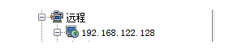

右键新建的主机，选择添加JMX连接，输入在tomcat中配置的端口即可。

​	