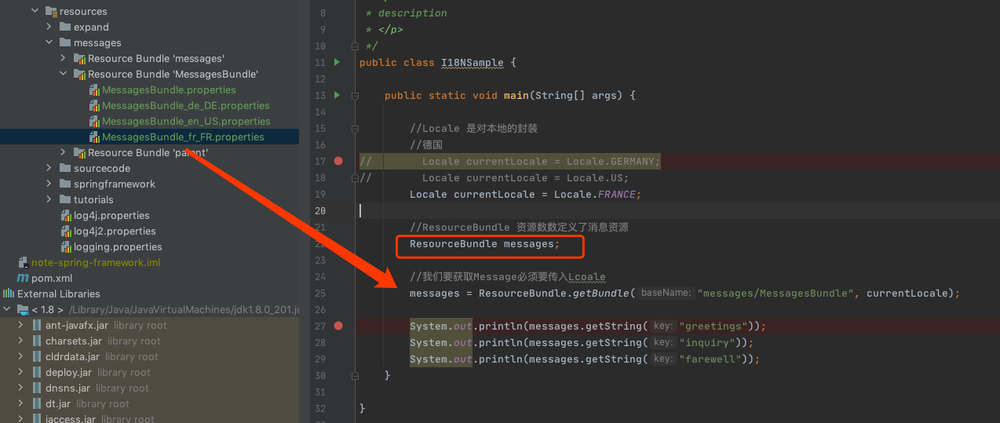

# Java中的国际化消息机制

[TOC]

## 参考

https://docs.oracle.com/javase/tutorial/i18n/TOC.html

https://docs.oracle.com/javase/tutorial/i18n/index.html

- [Java编程版本的i18n示例](#Java编程版本的i18n示例)

## 国际化关注点

- 日期
- 时间
- 货币
- 数字

#### 货币

对于普通货币

```
123,456.78
```

对于德国用户 

```
123.456,78
```

可以看出,小数点和逗号是相反的,

#### 日期

对于普通日期

```
3/22/61
```

对于德国用户

```
22.03.1961
```

对于英语

```
March 22, 1961
```

在中国则表示为

```
1961 年 3 月 22 日
```

## Java编程版本的i18n示例

#### 国际化之前

```java
public class NotI18N {

    static public void main(String[] args) {

        System.out.println("Hello.");
        System.out.println("How are you?");
        System.out.println("Goodbye.");
    }
}
```

#### 国际化之后

```java
import java.util.*;

public class I18NSample {

    static public void main(String[] args) {
        //Locale 是对本地的封装
        //德国
//        Locale currentLocale = Locale.GERMANY;
//        Locale currentLocale = Locale.US;
        Locale currentLocale = Locale.FRANCE;

        //ResourceBundle 资源数数定义了消息资源
        ResourceBundle messages;

        //我们要获取Message必须要传入Lcoale
        messages = ResourceBundle.getBundle("messages/MessagesBundle", currentLocale);

        System.out.println(messages.getString("greetings"));
        System.out.println(messages.getString("inquiry"));
        System.out.println(messages.getString("farewell"));
    }
}
```



## EC有话说

很显然使用模式是 

- ResourceBundle 加载国际化资源
- 通过传入 Locale 来获取国际化信息
- properties 用来添加信息,后缀区分

## 使用Java国际化基本流程

#### 1. 创建Properties文件

The default properties file, which is called `MessagesBundle.properties`, contains the following lines:

```
greetings = Hello
farewell = Goodbye
inquiry = How are you?
```

Now that the messages are in a properties file, they can be translated into various languages. No changes to the source code are required. The French translator has created a properties file called `MessagesBundle_fr_FR.properties`, which contains these lines:

```
greetings = Bonjour.
farewell = Au revoir.
inquiry = Comment allez-vous?
```

Notice that the values to the right side of the equal sign have been translated but that the keys on the left side have not been changed. These keys must not change, because they will be referenced when your program fetches the translated text.

The name of the properties file is important. For example, the name of the `MessagesBundle_fr_FR.properties` file contains the `fr` language code and the `FR` country code. These codes are also used when creating a `Locale` object.

#### 2. Define the Locale

The `Locale` object identifies a particular language and country. The following statement defines a `Locale` for which the language is English and the country is the United States:

```
aLocale = new Locale("en","US");
```

The next example creates `Locale` objects for the French language in Canada and in France:

```
caLocale = new Locale("fr","CA");
frLocale = new Locale("fr","FR");
```

The program is flexible. Instead of using hardcoded language and country codes, the program gets them from the command line at run time:

```
String language = new String(args[0]);
String country = new String(args[1]);
currentLocale = new Locale(language, country);
```

`Locale` objects are only identifiers. After defining a `Locale`, you pass it to other objects that perform useful tasks, such as formatting dates and numbers. These objects are *locale-sensitive* because their behavior varies according to `Locale`. A `ResourceBundle` is an example of a locale-sensitive object.

#### 3. Create a ResourceBundle

`ResourceBundle` objects contain locale-specific objects. You use `ResourceBundle` objects to isolate locale-sensitive data, such as translatable text. In the sample program the `ResourceBundle` is backed by the properties files that contain the message text we want to display.

The `ResourceBundle` is created as follows:

```
messages = ResourceBundle.getBundle("MessagesBundle", currentLocale);
```

The arguments passed to the `getBundle` method identify which properties file will be accessed. The first argument, `MessagesBundle`, refers to this family of properties files:

```
MessagesBundle_en_US.properties
MessagesBundle_fr_FR.properties
MessagesBundle_de_DE.properties
```

The `Locale`, which is the second argument of `getBundle`, specifies which of the `MessagesBundle` files is chosen. When the `Locale` was created, the language code and the country code were passed to its constructor. Note that the language and country codes follow `MessagesBundle` in the names of the properties files.

Now all you have to do is get the translated messages from the `ResourceBundle`.

#### 4. Fetch the Text from the ResourceBundle

The properties files contain key-value pairs. The values consist of the translated text that the program will display. You specify the keys when fetching the translated messages from the `ResourceBundle` with the `getString` method. For example, to retrieve the message identified by the greetings key, you invoke `getString` as follows:

```
String msg1 = messages.getString("greetings");
```

The sample program uses the key `greetings` because it reflects the content of the message, but it could have used another `String`, such as `s1` or `msg1`. Just remember that the key is hardcoded in the program and it must be present in the  properties files. If your translators accidentally modify the keys in the properties files, `getString` won't be able to find the messages.

Java通过`java.util.Locale`类表示一个本地化对象，它允许通过语言参数和国家/地区参数创建一个确定的本地化对象。
java.util.Locale是表示语言和国家/地区信息的本地化类，它是创建国际化应用的基础。下面给出几个创建本地化对象的示例：

```java
//① 带有语言和国家/地区信息的本地化对象  
Locale locale1 = new Locale("zh","CN");   

//② 只有语言信息的本地化对象  
Locale locale2 = new Locale("zh");   

//③ 等同于Locale("zh","CN")  
Locale locale3 = Locale.CHINA;   

//④ 等同于Locale("zh")  
Locale locale4 = Locale.CHINESE;   

//⑤ 获取本地系统默认的本地化对象  
Locale locale 5= Locale.getDefault();
```


JDK的java.util包中提供了几个支持本地化的格式化操作工具类：

- NumberFormat
- DateFormat
- MessageFormat

而在Spring中的国际化资源操作也无非是对于这些类的封装操作，我们仅仅介绍下 MessageFormat 的用法以帮助大家回顾：