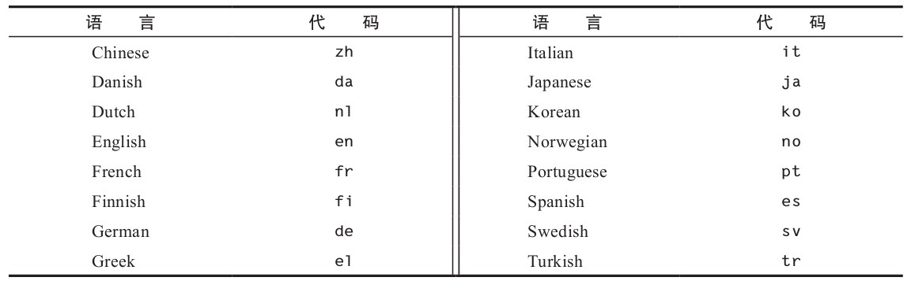
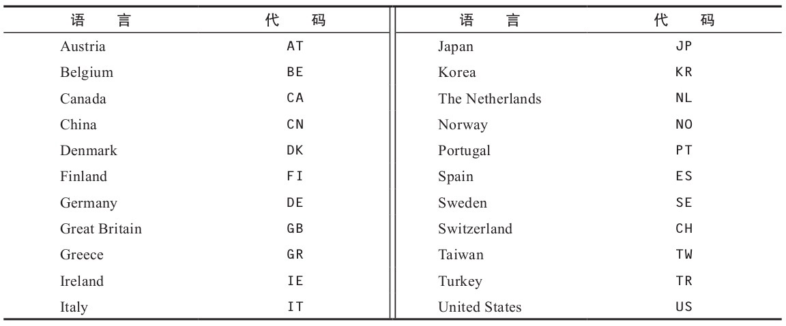

# Locale对象详解

[TOC]

## Locale简介

一个国际化的项目如何知道自己应该用哪种合适的语言或地区呢? Locale对象

一个Locale对象有两部分组成

- 语言(language)
- 地区(region)

## Locale对象

它描述了

- 一种语言
- 可选的一个国家或地区
- 一段脚本(可选, 自 JavaEE7 开始支持)
- 可选的一个变体
- 可选的一个扩展

#### 一种语言

由2个或者3个小写字母表示,例如 en(英语), de(德语), zh中文




#### 一段脚本(可选, 自 JavaEE7 开始支持)

可选的一段脚本，由首字母大写的四个字母表示，例如Latn（拉丁文）、Cyrl（西里尔文）和Hant（繁体中文字符）。这个部分很有用，有些中文读者更喜欢阅读繁体中文而不是简体中文。

#### 可选的一个国家或地区

由2个大写字母或3个数字表示，例如US（美国）和CH（瑞士）



#### 可选的一个变体

用于指定各种杂项特性，例如方言和拼写规则。变体现在已经很少使用了。过去曾经有一种挪威语的变体“尼诺斯克语”，但是它现在已经用另一种不同的代码nn来表示了。过去曾经用于日本帝国历和泰语数字的变体现在也都被表示成了扩展。

```
String outputString = new String();
Locale[] thaiLocale = {
             new Locale("th"),
             new Locale("th", "TH"),
             new Locale("th", "TH", "TH")
         };

for (Locale locale : thaiLocale) {
    NumberFormat nf = NumberFormat.getNumberInstance(locale);
    outputString = outputString + locale.toString() + ": ";
    outputString = outputString + nf.format(573.34) + "\n";
}
```


#### 可选的一个扩展

扩展描述了日历（例如日本历）和数字（替代西方数字的泰语数字）等内容的本地偏好。Unicode标准规范了其中的某些扩展，这些扩展应该以u-和两个字母代码开头，这两个字母的代码指定了该扩展处理的是日历（ca）还是数字（nu），或者是其他内容。例如，扩展u-nu-thai表示使用泰语数字。其他扩展是完全任意的，并且以x-开头，例如x-java。


## Locale对象遵循的标准

- 本地语言Language 遵循的标准时ISO-639-1
- 国家代码由大写的两个字母的代码来标表示 , 它遵循 ISO-3166-1s

## 什么是locale-sensitive

如果一个程序,当你传入不同的Locale对象时,会展现出不同的行为时,我们就说他是 locale-sensitive

例如 , NumberFormat 就是一个locale-sensitive 的对象

- 902 300 (France)
- 902.300 (Germany)
- 902,300 (United States)

可以看出展示的方式不一样

## 创建一个Locale

四种方式

- [Locale.Builder](#Locale.Builder方式创建一个Locale)
- [Locale构造器](#Locale构造器)
- [Locale.forLanguageTag工厂方法](#Locale.forLanguageTag工厂方法)
- Locale常量

## Locale.Builder方式创建一个Locale

```
Locale bLocale = new Locale.Builder().setLanguage("en").setRegion("US").build();
```

注意这个"en"可不是乱填的吗, 都有标准 IETF BCP 47

## Locale构造器

```
aLocale = new Locale("fr", "CA");
bLocale = new Locale("en", "US");
cLocale = new Locale("en", "GB");
dLocale = new Locale("ru");
```

## Locale.forLanguageTag工厂方法

```java
Locale aLocale = Locale.forLanguageTag("en-US");
Locale bLocale = Locale.forLanguageTag("ja-JP-u-ca-japanese");
```

## Locale常量

```
cLocale = Locale.JAPAN;
dLocale = Locale.CANADA_FRENCH;
```

## 国际化编码

 http://www.loc.gov/standards/iso639-2/php/code_list.php

| Language Code | Description |
| ------------- | ----------- |
| `de`          | German      |
| `en`          | English     |
| `fr`          | French      |
| `ru`          | Russian     |
| `ja`          | Japanese    |
| `jv`          | Javanese    |
| `ko`          | Korean      |
| `zh`          | Chinese     |

### Script Code

http://unicode.org/iso15924/iso15924-codes.html.

| Script Code | Description |
| ----------- | ----------- |
| `Arab`      | Arabic      |
| `Cyrl`      | Cyrillic    |
| `Kana`      | Katakana    |
| `Latn`      | Latin       |

## 地区code

The region (country) code consists of either two or three uppercase letters that conform to the ISO 3166 standard, or three numbers that conform to the UN M.49 standard. A copy of the codes can be found at http://www.chemie.fu-berlin.de/diverse/doc/ISO_3166.html.

The following table contains several sample country and region codes.

| A-2 Code | A-3 Code | Numeric Code | Description        |
| -------- | -------- | ------------ | ------------------ |
| `AU`     | `AUS`    | `036`        | Australia          |
| `BR`     | `BRA`    | `076`        | Brazil             |
| `CA`     | `CAN`    | `124`        | Canada             |
| `CN`     | `CHN`    | `156`        | China              |
| `DE`     | `DEU`    | `276`        | Germany            |
| `FR`     | `FRA`    | `250`        | France             |
| `IN`     | `IND`    | `356`        | India              |
| `RU`     | `RUS`    | `643`        | Russian Federation |
| `US`     | `USA`    | `840`        | United States      |

## locale-敏感的SPI

- `BreakIterator` objects
- `Collator` objects
- Language code, Country code, and Variant name for the `Locale` class
- Time Zone names
- Currency symbols
- `DateFormat` objects
- `DateFormatSymbol` objects
- `NumberFormat` objects
- `DecimalFormatSymbols` objects

| `java.util.spi`       | `java.text.spi`              |
| --------------------- | ---------------------------- |
| CurrencyNameProvider  | BreakIteratorProvider        |
| LocaleServiceProvider | CollatorProvider             |
| TimeZoneNameProvider  | DateFormatProvider           |
| CalendarDataProvider  | DecimalFormatSymbolsProvider |
|                       | NumberFormatProvider         |
|                       | DateFormatSymbolsProvider    |

例如, 如果你想通过SPI提供一个自定义的NumberFormat ,你得 实现 `java.text.spi.NumberFormatProvider`

并实现以下方法

```
getCurrencyInstance(Locale locale)
getIntegerInstance(Locale locale)
getNumberInstance(Locale locale)
getPercentInstance(Locale locale)
```

```
Locale loc = new Locale("da", "DK");
NumberFormat nf = NumberFormatProvider.getNumberInstance(loc);
```

