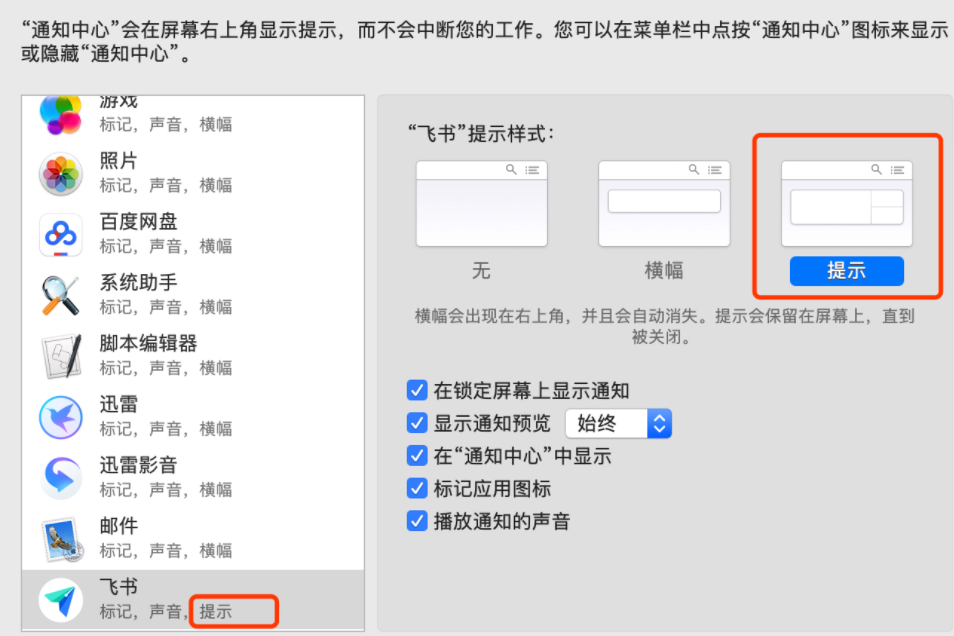

# 004-JavaBean事件监听

[TOC]

## 一个事件监听的例子

先举一个的例子，在 Mac 中设置飞书通知方式的时候，当界面右侧选择“提示”的时候，那么左侧也会相应的显示为“提示”：



如果将右侧看成一个 Java Bean，那么这中间势必存在一个属性变化监听。`java.beans` 包中也提供了相应实现：

| 序号 | 类                     | 解释                         |
| ---- | ---------------------- | ---------------------------- |
| 1    | PropertyChangeEvent    | 属性变化事件                 |
| 2    | PropertyChangeListener | 属性（生效）变化监听器       |
| 3    | PropertyChangeSupport  | 属性（生效）变化监听器管理器 |
| 4    | VetoableChangeListener | 属性（否决）变化监听器       |
| 5    | VetoableChangeSupport  | 属性（否决）变化监听器管理器 |

`PropertyChangeEvent` 的构造方法：

```java
public PropertyChangeEvent(Object source, String propertyName, Object oldValue, Object newValue) {
    super(source);
    this.propertyName = propertyName;
    this.newValue = newValue;
    this.oldValue = oldValue;
}
```

通过这个构造方法可以看出属性变化监听的关注点：

| 序号 | 关注点       | 解释               |
| ---- | ------------ | ------------------ |
| 1    | source       | 事件源             |
| 2    | propertyName | 发生变化的属性名称 |
| 3    | oldValue     | 旧值               |
| 4    | newValue     | 新值               |

## 属性（生效）变化监听器

示例代码：

在 `User` 中增加属性（生效）变化监听：

```java
public class User {

    private String username;

    private Integer age;

    /**
     * 属性（生效）变化监听器管理器
     */
    private PropertyChangeSupport propertyChangeSupport = new PropertyChangeSupport(this);

    /**
     * 启动属性（生效）变化
     * @param propertyName 
     * @param oldValue 
     * @param newValue
     */
    private void firePropertyChange(String propertyName, String oldValue, String newValue) {
        PropertyChangeEvent event = new PropertyChangeEvent(this, propertyName, oldValue, newValue);
        propertyChangeSupport.firePropertyChange(event);
    }

    /**
     * 添加属性（生效）变化监听器
     */
    public void addPropertyChangeListener(PropertyChangeListener listener){
        propertyChangeSupport.addPropertyChangeListener(listener);
    }

    /**
     * 删除属性（生效）变化监听器
     */
    public void removePropertyChangeListener(PropertyChangeListener listener){
        propertyChangeSupport.removePropertyChangeListener(listener);
    }

    /**
     * 获取属性（生效）变化监听器
     */
    public PropertyChangeListener[] getPropertyChangeListeners() {
        return propertyChangeSupport.getPropertyChangeListeners();
    }

    public void setUsername(String username) {
        String oldValue = this.username;
        this.username = username;
        firePropertyChange("username", oldValue, username);
    }
  
   // getter/setter
   // toString
}
```

测试代码：

```java
@Test
public void test3(){
    User user = new User();
    user.setAge(1);
    user.setUsername("zhangsan");
    user.addPropertyChangeListener(System.out::println);
    user.setUsername("lisi");
    user.setUsername("wangwu");
}
```

输出结果：

```java
java.beans.PropertyChangeEvent[propertyName=name; oldValue=zhangsan; newValue=lisi; propagationId=null; source=User{username='lisi', age=1}]
java.beans.PropertyChangeEvent[propertyName=name; oldValue=lisi; newValue=wangwu; propagationId=null; source=User{username='wangwu', age=1}]
```

可以看到在添加了监听器后，当 username 属性发生变化的时候会出发监听事件。

## 属性（否决）变化监听器

再看看另外一种监听器 `VetoableChangeListener`。在 `User` 中添加监听器：

```java
public class User2 {

    private String username;
    private Integer age;
    /**
     * 属性（否决）变化监听器
     */
    private VetoableChangeSupport vetoableChangeSupport = new VetoableChangeSupport(this);
    /**
     * 启动属性（否决）变化
     * @param propertyName
     * @param oldValue
     * @param newValue
     */
    private void fireVetoableChange(String propertyName, String oldValue, String newValue) throws PropertyVetoException {
        PropertyChangeEvent event = new PropertyChangeEvent(this, propertyName, oldValue, newValue);
        vetoableChangeSupport.fireVetoableChange(event);
    }

    /**
     * 添加属性（否决）变化监听器
     */
    public void addVetoableChangeListener(VetoableChangeListener listener){
        vetoableChangeSupport.addVetoableChangeListener(listener);
    }

    /**
     * 删除属性（否决）变化监听器
     */
    public void removeVetoableChangeListener(VetoableChangeListener listener){
        vetoableChangeSupport.removeVetoableChangeListener(listener);
    }

    public void setUsername(String username) throws PropertyVetoException {
        String oldValue = this.username;
        fireVetoableChange("username",oldValue,username);
        this.username = username;
        firePropertyChange("username", oldValue, username);
    }
    /**
     * 启动属性（生效）变化
     * @param propertyName
     * @param oldValue
     * @param newValue
     */
    private void firePropertyChange(String propertyName, String oldValue, String newValue) throws PropertyVetoException {
        PropertyChangeEvent event = new PropertyChangeEvent(this, propertyName, oldValue, newValue);
        vetoableChangeSupport.fireVetoableChange(event);
    }
}

```

测试代码：

```java
@Test
public void test3() throws PropertyVetoException {
    User user = new User();
    user.setAge(1);
    user.addVetoableChangeListener(evt -> {
        System.out.println(evt.getNewValue()+",,"+evt.getOldValue());
        if (Objects.equals(evt.getNewValue(), evt.getOldValue())) {
            throw new PropertyVetoException("当前属性值未发生任何变化", evt);
        }
    });
    user.addPropertyChangeListener(System.out::println);
    user.setUsername("lisi");
    user.setUsername("zhangsan");
    user.setUsername("zhangsan");
}
```

运行时发现一直无法抛出异常。查看源码发现 `PropertyChangeSupport` 和 `VetoableChangeSupport` 当新旧值相等时不会触发监听，于是修改测试代码：

```java
@Test
public void test3() throws PropertyVetoException {
    User user = new User();
    user.setAge(1);
    user.addVetoableChangeListener(evt -> {
        System.out.println(evt.getNewValue()+",,"+evt.getOldValue());
        if (Objects.isNull(evt.getNewValue())) {
            throw new PropertyVetoException("username 不能为null", evt);
        }
    });
    user.addPropertyChangeListener(System.out::println);
    user.setUsername("lisi");
    user.setUsername(null);
}
```

运行结果：

```java
lisi,,null
java.beans.PropertyChangeEvent[propertyName=username; oldValue=null; newValue=lisi; propagationId=null; source=User{username='lisi', age=1}]
null,,lisi

java.beans.PropertyVetoException: username 不能为null

  at introspector.test.IntrospectorTest.lambda$test3$1(IntrospectorTest.java:78)
  at java.beans.VetoableChangeSupport.fireVetoableChange(VetoableChangeSupport.java:375)
```

可以发现当符合“否决”属性变化的条件时，会抛出 `PropertyVetoException` 异常阻断属性的变化。

在之前的示例中 `userBeanInfo` 输出的 `EventSetDescriptor` 为空，这是因为并未到 `User` 类中增加事件。现在再测试一下获取 `EventSetDescriptor`：

```java
@Test
public void test1() throws IntrospectionException {
    BeanInfo userBeanInfo = Introspector.getBeanInfo(User.class, Object.class);
    EventSetDescriptor[] eventSetDescriptors = userBeanInfo.getEventSetDescriptors();
    Stream.of(eventSetDescriptors).forEach(System.out::println);
}
```

输出结果：

```java
java.beans.EventSetDescriptor[name=propertyChange; inDefaultEventSet; listenerType=interface java.beans.PropertyChangeListener; getListenerMethod=public java.beans.PropertyChangeListener[] introspector.bean.User.getPropertyChangeListeners(); addListenerMethod=public void introspector.bean.User.addPropertyChangeListener(java.beans.PropertyChangeListener); removeListenerMethod=public void introspector.bean.User.removePropertyChangeListener(java.beans.PropertyChangeListener)]
java.beans.EventSetDescriptor[name=vetoableChange; inDefaultEventSet; listenerType=interface java.beans.VetoableChangeListener; addListenerMethod=public void introspector.bean.User.addVetoableChangeListener(java.beans.VetoableChangeListener); removeListenerMethod=public void introspector.bean.User.removeVetoableChangeListener(java.beans.VetoableChangeListener)]
```

## 其他

在 Java 生态飞速发展的今天，很多底层技术细节都被高级框架所屏蔽，而 Java Beans 就是其中一种。也许平时根本就用不到，但是其代码设计和思想理念不应该被忽视。

Dubbo 2.7 之后提出了“服务自省”的概念，其灵感就来源于 Java Beans 内省机制。

