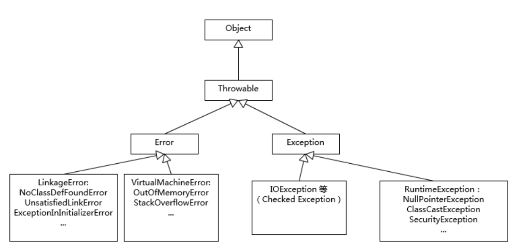

# 010-Error和Exception的区别

## 目录

------

[TOC]

## 简介

Exception 和 Error 都是继承了 Throwable 类，在 Java 中只有 Throwable 类型的实例才可以被抛出（throw）或者捕获（catch），它是异常处理机制的基本组成类型。

Exception 和 Error 体现了 Java 平台设计者对不同异常情况的分类。

## Exception

Exception 是程序正常运行中，可以预料的意外情况，可能并且应该被捕获，进行相应处理。

## Error

Error 是指在正常情况下，不大可能出现的情况，绝大部分的 Error 都会导致程序（比如 JVM 自身）处于非正常的、不可恢复状态。既然是非正常情况，所以不便于也不需要捕获，常见的比如 OutOfMemoryError 之类，都是 Error 的子类。

## NoClassDefFoundError和ClassNotFoundException 有什么区别

#### 类型

- ClassNotFoundException继承自Exception,属于Java异常类。

- NoClassDefFoundError继承自Error,在Java中Error一般属于不可恢复的系统错误，有JVM抛出，并且不能被开发者处理。

### 产生的原因

- ClassNotFoundException：当Java程序在运行时在类路径中找不到指定的类或者用Class.forName动态加载一个在类路径中不存在的类时，就会产生ClassNotFoundException异常。

- NoClassDefFoundError： 表示程序在编译时可以找到所依赖的类，但是在运行时找不到指定的类文件的情况，找不到的原因可能是打包时遗漏了某个类或者jar出现损坏等。

