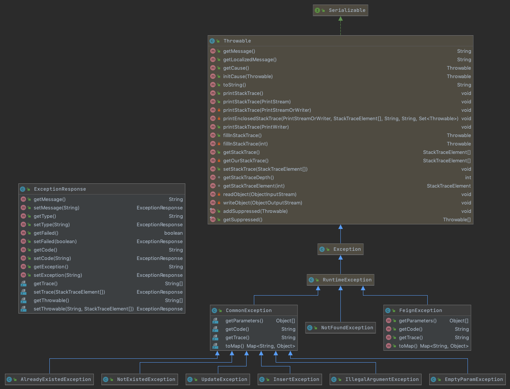

# 040-开源HZERO中的异常机制

## 目录

------

[TOC]

## 简介

开源版HZERO的异常机制主要有以下特点

- 自定义CommonException封装所有系统中的错误
- CommonException继承自RuntimeException也就是是非受检异常
- ExceptionResponse是返回给前端页面的统一格式,其国家化机制采用MessageAccessor国际化机制

## 继承结构



CommonException继承RuntimeException

```java
//io.choerodon.core.exception.CommonException
public CommonException(String code, Object... parameters) {
  super(code);
  this.parameters = parameters;
  this.code = code;
}
public CommonException(String code, Throwable cause, Object... parameters) {
  super(code, cause);
  this.parameters = parameters;
  this.code = code;
}
public CommonException(String code, Throwable cause) {
  super(code, cause);
  this.code = code;
  this.parameters = new Object[]{};
}

```

- 传入CODE即为MessageAccessor获取的ResouceBounde相关CODE
- message会自动使用国际化文案

## 全局异常处理

```java
//org.hzero.core.exception.BaseExceptionHandler
@ControllerAdvice
public class BaseExceptionHandler {

  private static final Logger LOGGER = LoggerFactory.getLogger(BaseExceptionHandler.class);

  @Value("${spring.profiles.active:" + DEFAULT_ENV + "}")
  private String env;

  @ExceptionHandler(FeignException.class)
  public ResponseEntity<ExceptionResponse> processFeignException(HttpServletRequest request, HandlerMethod method, FeignException exception) {
    if (LOGGER.isWarnEnabled()) {
      LOGGER.warn(exceptionMessage("Feign exception", request, method), exception);
    }
    ExceptionResponse er = new ExceptionResponse(MessageAccessor.getMessage(exception.getCode(), exception.getParameters()));
    setDevException(er, exception);
    return new ResponseEntity<>(er, HttpStatus.INTERNAL_SERVER_ERROR);
  }
```

采用全局异常处理,使用SpringWEB包中提供的切面处理

基本处理逻辑就是

- 解析报错,打印日志
- 使用MessageAccessor获取国际化文案
- 构建统一的异常包装类ExceptionResponse
- 返回统一的ResponseEntity,将ExceptionResponse输出到前端

