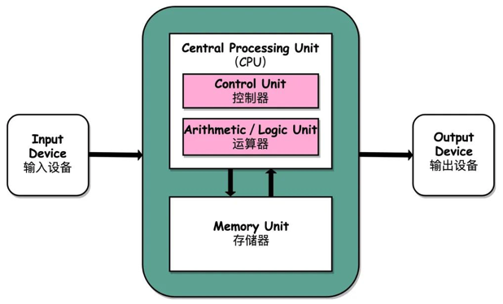

# 001-IO读写的基本原理.md

[TOC]

## 简介

用户进程对于IO的读写, 依赖于底层IO读写,基本上会用到底层的 read& write 两大系统调用, 在不同的操作系统中, IO读写的系统通用的名称可能不完全一样,但是基本功能是一样的

## 什么是I/O

根据冯.诺依曼结构，计算机结构分为 5 大部分：

- 运算器
- 控制器
- 存储器
- 输入设备
- 输出设备

#### 输入输出设备

输入设备（比如键盘）和输出设备（比如鼠标）都属于外部设备。网卡、硬盘这种既可以属于输入设备，也可以属于输出设备。

输入设备向计算机输入数据，输出设备接收计算机输出的数据。

## read%write指令

- read系统调用, 并不是直接从设备把数据读取到内存中
- write调用也不是简单地把数据写入到物理设备

上层无论是调用操作系统的read, 还是调用操作系统的write, 都会涉及到缓冲区

- read系统调用, 是把数据从内核缓冲区复制到进程缓冲区
- write系统调用, 是把数据从进程缓冲区复制到内核缓冲区

所以, 上层程序的IO操作, 实际上不是物理设备级别的读写, 而是缓存的复制, read&write 两大系统的调用, 都不负责数据在内核缓冲区和物理设备(如磁盘)之间的交换, 这项底层的读写交换, 是由操作系统内核(Kernal) 来完成的

## 为什么要有内核缓冲区和进程缓冲区

缓冲区的作用是为了 **减少频繁地与设备之间进行物理交换**

- 外部设备的读写,涉及到操作系统的中断
- 发生系统中断时, 需要保存之前的进程数据和状态等信息, 而中断结束以后,还需要恢复之间的进程数据和状态等信息

为了减少底层系统的时间损耗,性能损耗,于是出现了内存缓冲区

#### 有了内存缓冲区的优势

有了内存缓冲区

- 上层应用使用read系统调用时, 仅仅把数据从内核缓冲区复制到上层应用的缓冲区(进程缓冲区中)

- 上层应用使用write系统调用时, 仅仅把数据从进程缓冲区复制到内核缓冲区中

底层操作会对内核缓冲区进行监控,等待缓冲区达到一定的数量的时候,再进行IO设备的中断处理,集中执行物理设备的实际IO, 这种机制提升了系统的性能,至于什么时候中断(读中断, 写中断) , 由操作系统内核决定

## Java1.4之前的IO

Java1.4之前的早期版本， Java对于IO支持并不完善，开发人员在开发高性能IO程序的时候， 会面临一些巨大的困难和挑战， 主要问题如下：

- 没有数据缓冲区， IO性能存在问题
- 没有C或者C++的Channel的概念， 只有输入和输出流
- 同步阻塞IO通讯（BIO)通常会导致通讯现成被长时间阻塞
- 支持的字符集有限，硬件移植性不好

