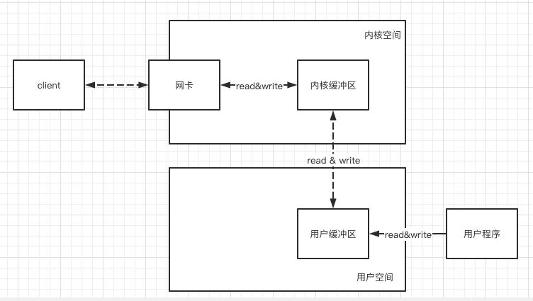

# 002-典型类型的系统调用流程

[TOC]

## 简介

用户程序所使用的用户调用 read&write , 它们不等价于数据在内核缓冲区和磁盘之间的交换

- read把数据从内核缓冲区复制到进程缓冲区
- write把数据从进程缓冲区复制到内核缓冲区

## read操作具体做了什么

如果是Java服务器端,完成一次socket响应,流程如下

1. 客户端请求: Linux通过网卡读取客户端的请求数据,将数据读取到内核缓冲区
2. 获取请求数据 : **Java服务器程序** 通过read系统调用, 从Linux 内核缓冲区中读取数据, 再送入Java进程缓冲区
3. 服务器端业务处理 : Java服务器在自己的用户控件中处理客户端的请求
4. 服务器返回数据 : Java服务器完成处理后, 构建响应数据,将这些数据从用户缓冲区缓冲区写入内核缓冲区, 这里用到的是write系统调用
5. 发送给客户端 :  Linux内核通过网络IO, 将内核传红曲中的数据写入网卡, 网卡通过底层的通讯协议,将数据发送给目标客户端

所以

- 服务端应用使用read系统调用时, 仅仅把数据从内核缓冲区复制到上层应用的缓冲区(进程缓冲区中)

- 服务端应用使用write系统调用时, 仅仅把数据从进程缓冲区复制到内核缓冲区中

底层操作会对内核缓冲区进行监控,等待缓冲区达到一定的数量的时候,再进行IO设备的中断处理,集中执行物理设备的实际IO, 这种机制提升了系统的性能, 至于什么时候中断(读中断, 写中断) , 由操作系统内核决定

