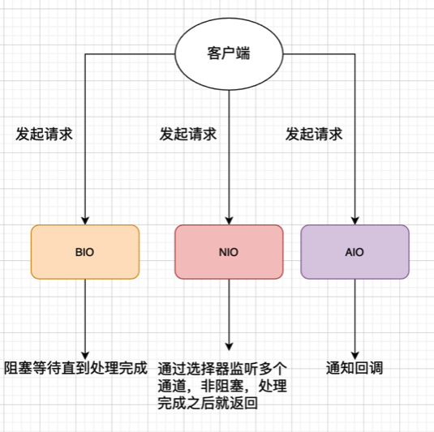

#   003-四种主要的IO模型

[TOC]

## Linux网络IO模型简介

Linux的内核将所有外部设备都看作一个文件来操作， 对一个文件的读写操作会调用内核提供的系统命令， 返回一个 file descriptor （文件路径，数据区等一些属性）

对于一个Socket的读写，也有相应的描述符， 简称socketfd （socket描述符）， 描述符是一个数字， 它指向内核中的一个结构体（文件路径， 数据区等一些属性）

根据Unix网络编程对IO模型的分类， UNIX提供了5种I/O模型

- 阻塞IO模型
- 非阻塞IO模型

## 什么是阻塞和非阻塞

阻塞和**非阻塞**是进程在访问数据的时候，数据是否准备就绪的一种处理方式,当数据没有准备的时候。 

- 阻塞：往往需要等待缓冲区中的数据准备好过后才处理其他的事情，否则一直等待在那里。 

- 非阻塞 : 当我们的进程访问我们的数据缓冲区的时候，如果数据没有准备好则直接返回，不会等待。如果数据已经准备好，也直接返回。

## 详解阻塞模型

阻塞IO模型： 最常用的IO模型就是阻塞IO模型， 默认情况下， 所有的文件操作都是阻塞的，

我们以套接字为例来讲解这个模型：

- 在进程中调用recvfrom, 其系统调用直到数据包到达且被复制到应用进程的缓冲区中或者发生错误的时候才返回， 在此期间一直等待

进程从调用revcfrom开始到它返回的中短时间内都是阻塞的， 因此被称为阻塞模型

 [031-同步阻塞IO(BlockingIO).md](031-同步阻塞IO(BlockingIO).md) 

## 详解非阻塞模型

recvfrom从应用层到内核的时候， 如果该缓冲区没有数据的话， 就直接返回一个EWOULDBLOCK错误， 一般都对非阻塞IO模型进行轮询检查这个状态， 看内核是不是有数据来

 [032-同步非阻塞IO(NoneBlockingIO).md](032-同步非阻塞IO(NoneBlockingIO).md) 

## 什么是同步和异步

同步和异步都是基于应用程序和操作系统处理 IO 事件所采用的方式。比如

- 同步：是应用程序要直接参与 IO 读写的操作。
- 异步：所有的 IO 读写交给操作系统去处理，应用程序只需要等待通知。

#### 处理IO事件的不同

同步方式在处理 IO 事件的时候，必须阻塞在某个方法上面等待我们的 IO 事件完成(阻塞 IO 事件或者通过轮询 IO 

事件的方式),对于异步来说，所有的 IO 读写都交给了操作系统。这个时候，我们可以去做其他的事情，并不需要去完 成真正的 IO 操作，当操作完成 IO 后，会给我们的应用程序一个通知。 

同步 : 阻塞到 IO 事件，阻塞到 read 或则 write。这个时候我们就完全不能做自己的事情。让读写方法加入到线程里面，然后阻塞线程来实现，对线程的性能开销比较大。 

#### 内存语义差异

同步IO和异步IO , 是一种用户空间与内核空间的IO发起方式

- 同步IO 指的是用户空间的线程是主动发起IO请求的一方, 内核空间是被动接受方
- 异步IO 反过来, 指的是系统内核主动发起IO操作的一方 , 用户空间的线程是被动接受的一方

## BIO/NIO/AIO图示

## 同步阻塞IO(Blocking IO)

 [031-同步阻塞IO(BlockingIO).md](031-同步阻塞IO(BlockingIO).md) 

阻塞IO, 指的是需要内核IO操作彻底完成之后, 才返回到用户空间执行用户的操作. 阻塞操作指的是用户空间程序的执行状态

- 传统的IO模型都是同步阻塞IO
- 默认创建的socket都是阻塞的

## 同步非阻塞IO(Non-Blocking IO)

 [032-同步非阻塞IO(NoneBlockingIO).md](032-同步非阻塞IO(NoneBlockingIO).md)

非阻塞IO,指的是 **用户空间的程序不需要等待内核IO操作彻底完成, 可以立即返回用户空间执行空间执行用户的操作**, 即处于非阻塞的状态, 与此同时, 内核会立即返回给用户一个状态值

简单来说 :

-  阻塞是指用户空间(调用线程) 一直在等待,不能干其别的事, 

- 非阻塞值得是用户空间(调用线程) 拿到内核返回的状态值后就返回到自己的空间, IO可以干就干, 不能干就干别的

非阻塞IO要求socket被设置为NONBLOCK

这里的NIO(同步非阻塞IO) 并不是Java 的 NIO库

## IO多路复用(IO Multiplexing)

 [033-IO多路复用模型(IOMutiplexing).md](033-IO多路复用模型(IOMutiplexing).md) 

经典的Reactor反应器设计模式, 有时候也成为 异步阻塞IO, Java中的Selector选择器 和Linux中的epoll 都是这种模型

## 异步IO(Asynchronous IO)

 [034-异步IO模型(AsynchronousIO).md](034-异步IO模型(AsynchronousIO).md) 

异步IO, 指的是, 用户空间与内核空间的调用方式反过来,

- 用户空间的线程编程被动接受者
- 内核空间成为了主动的调用者

这点有点类似Java 中比较典型的回调模式, 用户空间的线程向内核空间注册了各种IO事件的回调函数, 由内核去主动调用

