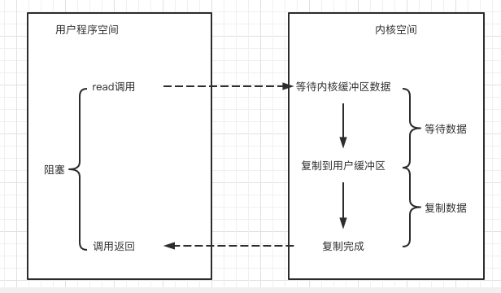

# 031-同步阻塞IO(BlockingIO)

[TOC]

## 简介

阻塞IO, 指的是需要内核IO操作彻底完成之后, 才返回到用户空间执行用户的操作. 阻塞操作指的是用户控件程序的执行状态, 

- 传统的IO模型都是同步阻塞IO
- 默认创建的socket都是阻塞的

## IO读写典型调用流程

## Java应用程序进程中的同步阻塞IO

在Java应用程序进程中, 默认情况, 所有的socket连接的IO操作都是同步阻塞IO (Blocking IO)

在阻塞式IO模型中

- Java应用程序从IO系统调用开始, 直到系统调用返回, 在这段时间内的Java进程都是阻塞的,

- 返回成功后, 应用进程开始处理用户空间的缓存区数据

Java中发起一个socket的read 操作的系统调用, 流程大致如下:

1. 从Java启动IO读, read系统调用开始, **用户线程进入阻塞状态**
2. 当系统内核收到read系统调用, 就开始准备数据, 一开始, 数据可能还没有到达内核缓冲区(例如, 还没有收到一个完整的socket 数据包, 这个时候内核就要等待)
3. 内核一直等到完整的数据到达 ,就会将数据从内核缓冲区复制到用户缓冲区(用户空间的内存), 然后内核返回结果(例如返回复制到用户缓冲区的字节数)
4. 直到内核返回后, 用户线程才会解除阻塞状态, 重新运行起来

## 阻塞IO的贴点

在内核进行IO执行的两个阶段,用户线程都是阻塞等待

## 阻塞IO的优点

应用的程序开发非常简单,

- 在阻塞等待数据区间, 用户线程挂起

- 在阻塞期间,用户线程基本不会占用CPU资源

## 阻塞IO的缺点

阻塞IO不适合高并发应用的场景

- 一般情况下, 会为每个链接配备一个独立的线程 , 也就是说, 一个线程维护一个连接的IO操作
- 在并发量大的情况下, 需要大量的线程来维护大量的网络连接, 内存, 线程切换开销会非常大