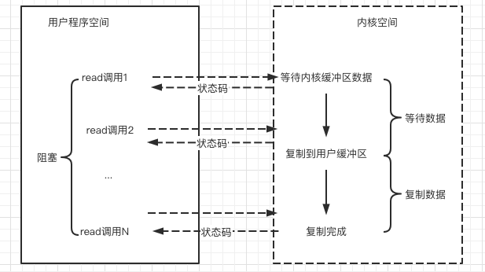

# 032-同步非阻塞IO(NoneBlockingIO)

[TOC]

## 什么是同步非阻塞IO

非阻塞IO,指的是 **用户空间的程序不需要等待内核IO操作彻底完成, 可以立即返回用户空间执行空间执行用户的操作**, 即处于非阻塞的状态, 与此同时, 内核会立即返回给用户一个状态值

简单来说 :

-  阻塞是指用户空间(调用线程) 一直在等待,不能干其别的事, 

-  非阻塞指得是用户空间(调用线程) 拿到内核返回的状态值后就返回到自己的空间, IO可以干就干, 不能干就干别的

非阻塞IO要求socket被设置为NONBLOCK

这里的NIO(同步非阻塞IO) 并不是Java 的 NIO库

## Socket中的同步非阻塞

Socket连接默认是阻塞模式, 在Linux系统下,我们可以通过设置Socket编程非阻塞的模式

在NIO模型中, 应用程序一旦开始IO系统操作, 会出现两种情况

- 在内核缓冲区中没有数据的情况下, 系统会立即返回, 返回一个调用失败的信息
- 在内核缓冲区中有数据的情况下, 是阻塞的,直到数据从内核缓冲复制到用户进程缓冲

复制完成后, 系统调用返回成功, 应用进程开始处理用户空间的缓存数据

## 非阻塞Socket的read读操作流程

1. 在内核数据没有准备好的阶段, 用户线程发起IO请求时, 立即返回
2. 用户线程不断发送调用IO请求:  为了读取到最终的数据
3. 用户线程读到数据后, 才会解除阻塞状态,重新运行起来, 也就是说, 用户进程需要经过多次尝试, 才能保证最终真正读到的数据, 而后继续执行

## 同步非阻塞IO的特点

- 应用程序的线程需要不断地进行IO调用,轮询数据是否已经准备好了
  - 如果没有准备好则继续轮询
  - 开始阻塞地从内核缓存复制到用户进程

## 同步非阻塞IO(NIO)的优点

- 每次发起IO系统调用, 在内核等待数据过程中可以立即返回, 用户不会阻塞, 实时性比较好

## 同步非阻塞IO(NIO)的缺点

不断地轮询内核, 这将占用大量的CPU时间,效率低下

## 总结

总体来说, 在高并发应用场景下, 同步非阻塞IO也是不可用的, 一般Web服务器不使用这种IO模型

NIO模型一般很少直接使用,而是在其他IO模型中使用到非阻塞IO这一个特性,在Java的实际开发中, 也不会涉及到这种IO模型

## 此NIO非彼NIO

同步非阻塞IO ,简称NIO , 

- 和 Java里的NIO (new IO) 不是一个东西,  Java中的 NIO 是指的IO多路复用模型 (IO Multipexing)
- 和蔚来汽车(NIO) 也不是一个东西 

## 如何解决非阻塞IO中的轮询等待问题呢?

 [033-IO多路复用模型(IOMutiplexing).md](033-IO多路复用模型(IOMutiplexing).md) 

## 支持多路复用调用的类型

目前支持 IO 多路复用的系统调用，有 select，epoll 等等。select 系统调用，是目前几乎在所有的操作系统上都有支持

- **select 调用** ：内核提供的系统调用，它支持一次查询多个系统调用的可用状态。几乎所有的操作系统都支持。
- **epoll 调用** ：linux 2.6 内核，属于 select 调用的增强版本，优化了 IO 的执行效率。

