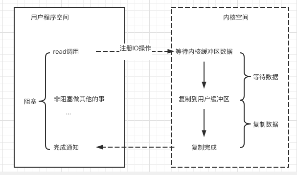

# 034-异步IO模型(AsynchronousIO)

[TOC]

## 异步IO模型(Asynchronous IO)

异步IO模型, 简称 AIO 

用户线程通过系统调用, 向内核注册某个IO操作, 内核在整个IO操作(包括数据准备,数据复制)完成后, 通知用户程序, 用户执行后续的业务操作

在异步编程模型中, 在整个内核的数据处理过程中, 包括内核将数据从网络物理设备(网卡) 读取到内核缓冲区, 将内核缓冲区的数据复制到用户缓冲区, 用户程序都不需要阻塞

## 异步IO模型的流程

1. 当用户线程发起了read系统调用, 立即就可以开始去做其他事情,用户线程不阻塞
2. 内核开始IO第一个阶段: 准备数据, 等到数据准备好了, 内核就会将数据从内核缓冲区复制到用户缓冲区(用户空间的内存)
3. 内核会给用户线程发送一个信号 (singal) ,或者回调用户线程注册的回调接口, 告诉线程的read操作完成了
4. 用户线程读取用户缓冲区的数据,完成后续的业务操作

## 异步IO模型的特点

在内核等待数据和复制数据的两个阶段, 用户线程都不是阻塞的

- 用户线程需要接收内核的IO操作完成的事件, 
- 或者用户需要注册一个IO操作完成的回调函数

正因为如此, 异步IO又称为信号驱动IO

## 异步IO模型的缺点

- 应用程序仅需要进行事件的注册和接受, 其他工作都留给了操作系统, 操作系统必须要支持
- 理论上来讲,异步IO是真正的异步输出输出,它的吞吐量高于IO多路复用模型的吞吐量

但是就目前而言,

- Windows 系统下通过 IOCP实现 真正的异步IO

- Linux 系统下, 异步IO模型在2.6 之后才引用, 目前不完善, 底层实现依然在使用epoll , 与IO多路复用相同, 因此没有太大的优势