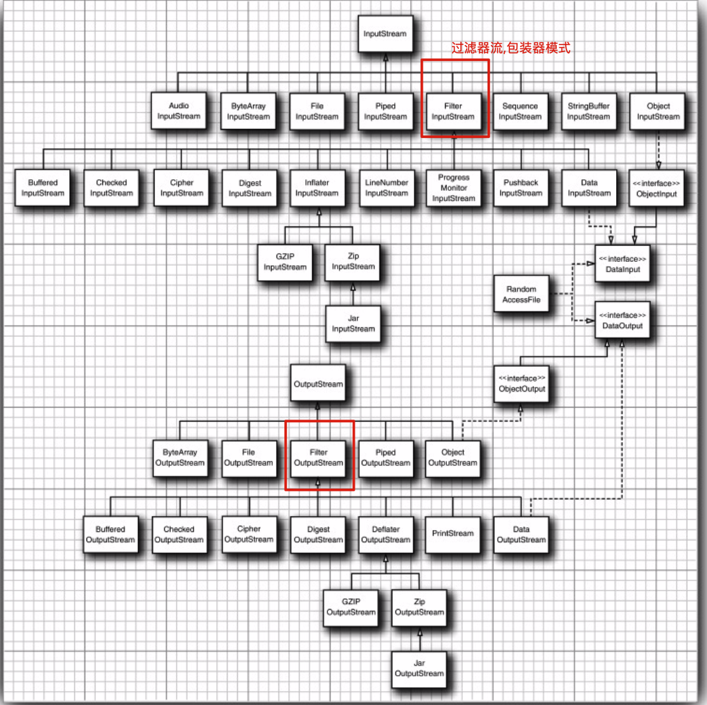

## 流的读取方式分类

[TOC]

## 什么是流

流是个抽象的概念，是对输入输出设备的抽象，Java程序中，对于数据的输入/输出操作都是以“流”的方式进行。设备可以是文件，网络，内存等。

- 流是同步的,也就是说,当线程请求一个流读/写一段数据的时候, 在做其他任何操作之前都要等待所读写的数据
- 流具有方向性，至于是输入流还是输出流则是一个相对的概念，一般以程序为参考，如果数据的流向是程序至设备，我们成为输出流，反之我们称为输入流。

Java支持基于通道(channel) 和 缓冲区(buffer)的非阻塞I/O, 非阻塞模型可以提高吞吐量

## 流的分类

1. 处理的数据单位不同，可分为：字符流，字节流

2. 数据流方向不同，可分为：输入流，输出流

3. 功能不同，可分为：节点流，处理流

### 输入流和输出流

 [010-InputStream(输入流)和OutputStream(输出流).md](010-InputStream(输入流)和OutputStream(输出流).md) 

### 节点流和处理流

 [009-节点流和处理流.md](009-节点流和处理流.md) 

### 字符流和字节流

 [011-字节流和字符流.md](011-字节流和字符流.md) 

## 流的分类图示

