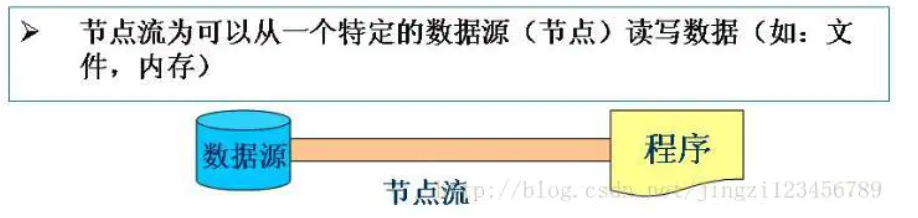
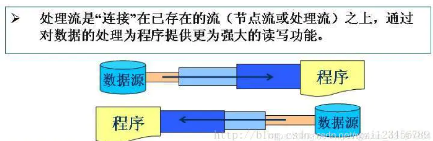

# 009-节点流和处理流

[TOC]

## 什么是节点流和处理流

- 节点流 : 直接连接数据源的流
- 处理流 : 连接已经存在的流

### 节点流

节点流是可以从一个特定的数据源(节点)读写数据. 如文件、内存

#### 常见的节点流

| 类型                                            | 字符流                               | 字节流                                          |
| ----------------------------------------------- | ------------------------------------ | ----------------------------------------------- |
| File(文件)                                      | FileReader FileWriter           | FileInputStream FileOutputStream           |
| Memory Array                                    | CharArrayReader CharArrayWriter | ByteArrayInputStream ByteArrayOutputStream |
| Memory String                                   | StringReader StringWriter       | -                                               |
| Pip(管道) 实现管道的输入和输出(进程间通讯) | PipedReader PipedWriter         | PipedInputStream PipedOutputStream         |

### 处理流

连接已经存在的流

处理流是"连接"在已存的流(节点流或处理流)之上,通过对数据的处理为程序提供更为强大的读写功能

#### 常见的处理流

| 处理类型                                                     | 字符流                                    | 字节流                                        |
| ------------------------------------------------------------ | ----------------------------------------- | --------------------------------------------- |
| Buffering 缓冲流 在读入或者写出时,对数据进行缓存,以减少IO次数 | BufferedReader BufferedWriter        | BufferedInputStream BufferedOutputStream |
| Filtering 过滤器流 在数据进行读写操作时进行过滤         | FilterReader FilterWriter            | FilterInputStream FilterOutputStream     |
| converting between bytes and character ,按照一定的编码/解码标准将字节流转化为字符流,或进行反向转换 | InputStreamReader OutputStreamWriter | -                                             |
| 对象序列化                                                   | -                                         | ObjectInputStream ObjectOutputStream     |
| Counting 计数流,在读入数据时对行计数                         | LineNemberReader                          | LineNumberInputStream                         |
| Peeking ahead 预读流: 通过缓存机制,进行预读                  | PusbackReader                             | PushbackInputStream                           |
| Printing 打印                                                | PrintWriter                               | PrintStream                                   |

### 