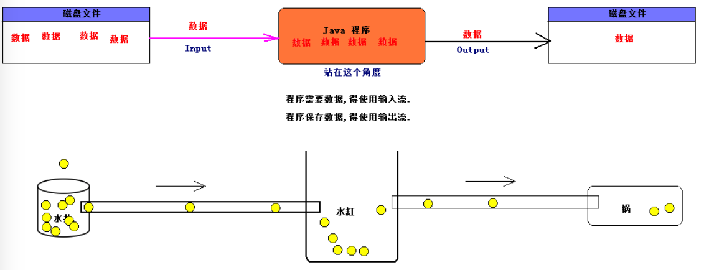

# 010-InputStream(输入流)和OutputStream(输出流)

[TOC]

## 什么是输入流和输出流

Java的I/O建立于流(stream)之上 ,抽象类InputStream和OutputStream构成了输入/输出（I/O）类层次结构的基础。

- InputStream输入流读取数据
- OutputStream输出流写入数据

这些字节序列的来源地和目的地可以是文件，网络连接，甚至是内存块。

当我们的程序需要从 硬盘,网络, 或者其他程序中读取或者写入数据的时候,数据传输量可能很大,而我们的内存或者带宽优先,无法一次性读取获取写入大量数据, 而流可以实现一点一点的逐步传输数据



## 输入流InputStream

输入流基本输入类是

```
java.io.InputStream
```

方法如下

```java
package java.io;
public abstract class InputStream implements Closeable {
  int	available()//返回从该输入流中可以读取（或跳过）的字节数的估计值，而不会被下一次调用此输入流的方法阻塞。
  void	close()//关闭此输入流并释放与流相关联的任何系统资源。
  void	mark(int readlimit)//标记此输入流中的当前位置。
  boolean	markSupported()//测试这个输入流是否支持 mark和 reset方法。
  abstract int	read()//从输入流读取数据的下一个字节。
  int	read(byte[] b)//从输入流读取一些字节数，并将它们存储到缓冲区 b 。
  int	read(byte[] b, int off, int len)//从输入流读取最多 len字节的数据到一个字节数组。
  void	reset()//将此流重新定位到上次在此输入流上调用 mark方法时的位置。
  long	skip(long n)//跳过并丢弃来自此输入流的 n字节数据。
}
```

### read方法

其中每个子类都要实现的抽象方法:

```java
abstract int read();
```

读取一个字节,并返回读入的字节,如果遇到输入源的末尾则返回-1 , read方法会等待并阻塞后面代码的执行知道有1字节的数据可以读取 

在具体的实现类中,这个方法具有不同的功能

- 在FIleInputStream 类中,将从某个文件中读入一个字节
- System.in(一个InputStream的子类预定义对象) 是从"标准输入"中读取信息,可以是控制台或者是重定向文件

我们会遇到读取数据到一半的时候没出现网络故障从而抛出IoException的场景,例如,我们要从一个网络连接中读取1024个字节,但是实际上只有512个字节到到,我们应该尝试使用read的另一个重载

```java
byte[] input = new byte[1024];
int bytesRead = in.read(inputStream);
```

这种方式向数组input中读取1024的个字节,不过,如果只有512字节可用,为了确保我们使用数组时完全可用,我们可以

```java
int bytesRead = 0;
int bytesToRead = 1024;
byte[] input = new byte[bytesToRead];
while (bytesRead < bytesToRead) {
	int result = in.read(input, bytesRead, bytesToRead - bytesRead);
	if (result == -1) break;// 流结束
	bytesRead += result;
}
```

如果我们不想等待所需的全部字节立即使用,可以使用available 方法来确定不阻塞的情况下有多少字节可以读取,

### available

返回从该输入流中可以读取（或跳过）的字节数的估计值，而不会被下一次调用此输入流的方法阻塞。

```java
int bytesAvailable = in.available();
if (bytesAvailable > 0) {
	byte[] data = new byte[bytesAvailable];
	in.read(data);
}
	//立刻执行程序其他部分
```

### skip方法

少数情况下,你可能希望跳过数据不进行读取, skip方法可以帮你完成这项任务,与读取文件相比,网络连接中它的作用不大,

- 网络连接是顺序的, 一般情况下很慢,所以与跳过数据(不读取)相比.读取数据不会耗费太长的时间
- 文件是随机访问的,所以要跳过数据,可以简单地为重新指定文件指针位置,而不需要处理要跳过的各个字节

### 标记和重置的方法

InputStream还有三个方法不太常用,允许程序备份和重新读取已经读取的数据

```java
void	mark(int readlimit)//标记此输入流中的当前位置。
boolean	markSupported()//测试这个输入流是否支持 mark和 reset方法。
void	reset()//将此流重新定位到上次在此输入流上调用 mark方法时的位置。
```

为了重新读取数据

- mark方法标记流的当前位置
- reset方法可以把流重置到之前标记的位置,不过不能随心所欲的重置任意远的位置,从标记处读取和重置字节数由mark和readAheadLimit参数确定
  - 如果试图重置太远,就会抛出IOExceoption
- 一个流中任何时刻只能有一个标记,标记第二个会清除第一个标记
- 标记和重置并不是所有的流实现类都支持,所以我们要使用 markSupported 来检测一下是否支持

## 输出流OutputStream

Java的基本输出流类是

```java
java.io.OutputStream;
```

这个类提供了写入数据锁需要的基本方法

```java
public abstract class OutputStream implements Closeable, Flushable {
  //写出一个字节的数据
    public abstract void write(int b) throws IOException;
		//写出所有字节或者某个范围的字节到数组b中
    public void write(byte b[]) throws IOException {...}
    public void write(byte b[], int off, int len) throws IOException {...}
  //冲刷输出流,也就是将所有缓冲的数据发送到目的地
    public void flush() throws IOException {..}
}
```

OutputStream的子类使用这些方法向**某种特定介质**写入数据

例如

- TelnetOutputStream使用这些方法将数据写入网络连接
- ByteArrayOutputStream使用这些方法将数据写入可拓展的字节数据

### 输出流中多态的力量

如果你知道了如何使用这些超类, 你就知道了如何使用这些子类

- 在Java类文档中找不到TelnetOutputStream,它被有意地隐藏在了sun包内
- java.net中有很多类的很多方法都会返回TelnetOutputStream,如java.net.Socket的getOutputStream()方法

但是,这些方法声明只返回OutputStream,而不是更特定的子类 TelnetOutputStream,这就是多态的威力

### write方法

```java
public abstract void write(int b) throws IOException;
```

write方法接受一个0-255之间的整数,将对应的字节写入到输出流中

- 子类ByteArrayOutputStream将字节复制到数组里
- 子类FileOutputStream则需要使用native代码,写入到文件中

值得注意注意的是形参 int类型的参数, 实际上写入的是无符号字节, **Java没有无符号字节数据类型,所以这里要用int来代替**

无符号字节和又符号字节之间的且唯一区别在于**解释**

- 他们都是由8个二进制位组成,当使用write(int b) 将 int写入一个网络连接时, 线缆上只有8个二进制位

- 如果将一个超出0-255的int传入write方法,将 写入这个数的最低字节 , 其他3个字节将会被忽略(也就是int强制转换成byte)

```
//32 的二进制是 0010 0001
//289的二进制是 1 0010 0001
他们两个输出都是 !
```

```java
public static void copy5(String src, String dest) throws IOException {
  FileOutputStream out = new FileOutputStream(dest);
  out.write(32);  //!
  out.write(289); //!
  out.close();
}
```

上例子可以看出,使用2 或者是258 都会输出同样的字符

### 实例-输出所有ASCII

ASCII 是一个7位字符集, 也就是 使用7个bit表示, 只需要一个字节就可以完成发送,

```java
public static void generateCharacters(String filePath) throws IOException {
  FileOutputStream out = new FileOutputStream(filePath);
  int firstPrintableCharacter = 33;
  int numberOfPrintableCharacters = 94;

  for (int i = firstPrintableCharacter; i < numberOfPrintableCharacters + firstPrintableCharacter; i++) {
    out.write(i);
  }
}

```

输出

```
!"#$%&'()*+,-./0123456789:;<=>?@ABCDEFGHIJKLMNOPQRSTUVWXYZ[\]^_`abcdefghijklmnopqrstuvwxyz{|}~
```

可以向某个输出位置写出一个字节

read和write方法在执行的时候都会阻塞,直至字节确实被读入或者写出,如果流不能被立即访问(通常是因为网络连接忙),那么当前线程就会被阻塞

在等待的过程中(等待指定的流变为可用),其他的线程有机会去执行其他工作

## Close关闭流

当你完成对输入/输出流的读写时，应该通过调用close方法来关闭它，这个调用会释放掉十分有限的操作系统资源。

如果一个应用程序打开了过多的输入/输出流而没有关闭，那么系统资源将被耗尽。

关闭一个输出流的同时还会冲刷用于该输出流的缓冲区：所有被临时置于缓冲区中，以便用更大的包的形式传递的字节在关闭输出流时都将被送出。

特别是，如果不关闭文件，那么写出字节的最后一个包可能将永远也得不到传递。

当然，我们还可以用flush方法来人为地冲刷这些输出。

即使某个输入/输出流类提供了使用原生的read和write功能的某些具体方法，应用系统的程序员还是很少使用它们，因为大家感兴趣的数据可能包含数字、字符串和对象，而不是原生字节。

