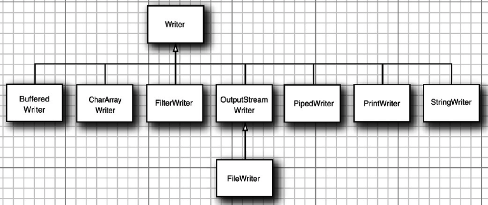
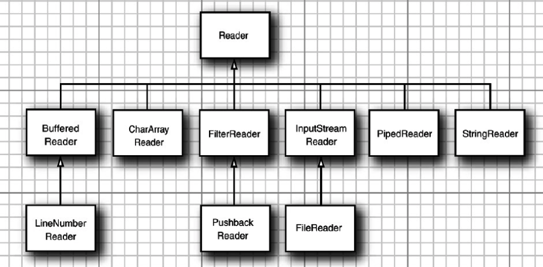

# 013-Reader(阅读器)和Writer(书写器)

[TOC]

## 什么是Reader(阅读器)和Writer(书写器)

阅读器reader和书写器writer可以串链到输入流和输出流上,允许程序读/写**文本(字符)** 而不是**字节**

- 字符是有编码
- 字节没有编码

Reader 和Writer可以处理很多字符集, 如 UFT-8

Java提供了一个体系,处理字符

```java
java.io.Reader // 类指定读取字符的API
java.io.Writer ///指定写字符的API
```

Reader和Writer都会使用Unicode字符,它们的子类允许读取/写入特定的源或者目标

## InputStreamReader和OutputStreamWriter

InputStreamReader和OutputStreamWriter 是两个最重要的子类, 

InputStreamReader包含一个底层输入流,可以从中读取原始字节,它根据指定的编码方式,将这些字节转化为 Unicode字符

OutputStreamWriter 从运行程序中接受Unicode,然后使用指定的编码方式将这些字符转化为字节,在将这些字节写入底层输入流中

## 书写器Writer

Writer 类是java.io.OutputStream类的映射,它是一个抽象类,有两个保护类型的构造函数

与OutputStream一样,它不能直接使用,可以使用其具体的子类实现

#### UML



### 方法

```java
void	write(char[] cbuf) //写入一个字符数组。
abstract void	write(char[] cbuf, int off, int len) //写入字符数组的一部分。
void	write(int c)//写一个字符
void	write(String str)//写一个字符串
void	write(String str, int off, int len)//写一个字符串的一部分。
abstract void	close() //关闭流，先刷新。
abstract void	flush() //刷新流。
```

abstract void	write(char[] cbuf, int off, int len) 方法是核心实现,其他四个都是在这个基础上实现,子类必须要覆盖

### 实例

给定一个Writer ,我们写入字符串"network"

```
char[] network = {'N', 'e', 't', 'w', 'o', 'r', 'k'};
writer.write(network, 0, network.length);
```

上述代码写入多少字节以及写入哪些字节,**由编码决定**

如果是 utf-16

不同的编码写入不同的字节序列

### OutputStreamWriter

OutputStreamWriter是Writer最重要的子类,会从java程序中接受字符, 根据指定的编码格式将这些字符转换为字节

```
OutputStreamWriter(OutputStream out, String charsetName)
创建一个使用命名字符集的OutputStreamWriter。
```

## 阅读器Reader





### 过滤器阅读器FilterReader和FilterWriter

InputStreamReader和OutputStreamWriter相当于输入输出流上的**装饰器**,把面向字节的接口改为面向字符的接口

java.io.FilterReader 和java.io.FilterWriter类的相当于InputStreamReader 和OutputStreamWriter的包装器,完成过滤工作

- BufferedReader
- LineNumberReader
- PushbackReader
- PrintWriter

BufferedReader 和 BufferedWriter 是基于字符的,对应于面向字节的 BufferedInputStream和BufferedOutputSTream

内部包含缓冲区,

- 当程序从Buffered读取时,文本会从缓冲区得到,而不是直接从底层输入流得到
- 当缓冲区清空时,将佣金可能多的文本再次填充,尽管这些文本不是全部立即需要,这一页可以使以后的读取速度更快

### 实例代码

```java
public static String getMacCyrillicString(InputStream in) thorws IOException{
	Reader r = new InputStreamReader(in, "MacCyrillic");
	r = new BufferedReader(r, 1024);
	StringBuilder sb = new StringBuilder();
	int c;
	while((c == r.read() != -1)){
		sb.append((char) c);
	}
	return sb.toString();
}
```


