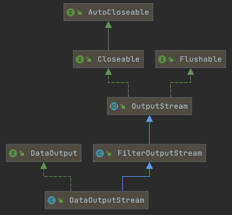

# 020-数据流-DataOutputStream

[TOC]

## 简介

**DataOutputStream和DataIutputStream提供的了一些方法,可以用 二进制格式读/写Java的基本数据类型和字符串**

所用的二进制格式主要用于在两个不同的Java程序之间交换数据,可能通过

- 网络连接
- 数据文件
- 管道
- 其他中间介质

## DataOutputStream

### DataOutputStream的UML




### DataOutputStream提供的方法

DataOutputStream 实现了 DataOutput 接口 , DataOutput 接口提供一下方法,可以写入特定的Java数据类型

```
package java.io;
public interface DataOutput {
    
    void write(int b) throws IOException;
    void write(byte b[]) throws IOException;
    void write(byte b[], int off, int len) throws IOException;
    void writeBoolean(boolean v) throws IOException;
    void writeByte(int v) throws IOException;
    void writeShort(int v) throws IOException;
    void writeChar(int v) throws IOException;
    void writeInt(int v) throws IOException;
    void writeLong(long v) throws IOException;
    void writeFloat(float v) throws IOException;
    void writeDouble(double v) throws IOException;
    void writeBytes(String s) throws IOException;
    void writeChars(String s) throws IOException;
    void writeUTF(String s) throws IOException;
}
```

所有的数据都以大端序(big-endian)格式写入,

- 整数用尽可能少的字节写为2 的补码
- byte 写为1 字节
- short 写为 2字节
- int 写为4字节
- long 写为8字节

浮点数和双精度数分别为4字节和8字节的 IEEE 754 格式

- 布尔数写为1字节 ,0 代表 false ,1 代表true

### writeBytes方法

```java
    void writeBytes(String s) throws IOException;
    void writeChars(String s) throws IOException;
void writeUTF(String s) throws IOException;
```

writeBytes 方法只是对String参数迭代进行循环处理,将各个字符按照顺序写为一个 2字节的(Utf-16)

writeBytes 方法迭代处理String参数,但只写入每个字符的低字节,因此如果字符串中包含有Latin-1字符集以外的字符,其中的信息将会丢失, 对于一些指定了ASCII编码的网络协议来说,这个方法或许有用, 但是大多数情况下应该避免使用

### writeUTF方法

 writeBytes 和writeChars  都不会对输出流的字符串长度编码, 因此,你无法真正区分原始字符和作为字符串一部分的字符

writeUTF方法包含了字符串的长度,它将字符串本身用UTF-8编码的一个变体进行编码, 由于这个变体编码方式与大多数非Java软件优点不兼容,所以应当值用于与其他使用DataInputStream的Java程序进行交互

为了和所有其他软件交换UTF-8文本,应当使用有适当编码的InputStreamReader 


## DataInputStream

DataInputStream有9个读取二进制的方法,与DataOutputStream遥相呼应

```
package java.io;
public interface DataInput {
    boolean readBoolean() throws IOException;
    byte readByte() throws IOException;
    short readShort() throws IOException;
    char readChar() throws IOException;
    int readInt() throws IOException;
    long readLong() throws IOException;
    float readFloat() throws IOException;
    double readDouble() throws IOException;
    String readUTF() throws IOException;
}
```

### 读取无符号数据

DataInputStream 提供了两个方法,可以读取无符号字节和无符号短整数,并返回等价的int

```
int readUnsignedByte() throws IOException;
int readUnsignedShort() throws IOException;
```

Java中没有这两个数据类型,但是读取C程序写入的二进制数据时会遇到

### 读取数组或者子数组

readFully 方法会重复地从底层输入流向一个数组读取数据,知道读取了所请求的字节数为止,会重复地从底层输入流向一个数据组读取数据,知道读取了所请求的字节数为止

如果不能读取到足够的数据,就会抛出IOException异常

```java
void readFully(byte b[]) throws IOException;
void readFully(byte b[], int off, int len) throws IOException;
int skipBytes(int n) throws IOException;

```

这个方法的使用时,如果你能知道要读取多少字节,这个方法就特别有用,例如你已经从HTTP首部读取了Context-length字段,就能知道有多少字节的数据

### readLine

可以读取结束符分隔的一行数据

```
String readLine() throws IOException;
```

**在任何情况下都不要使用这个方法**,它被废弃了, 因为有bug

在绝大多数情况下它不能正确将非ASCII字符传唤为字节, 我们应该用 BufferedReader类的readLine方法来处理

这两个方法都有一个bug: 不能总吧一个回车识别为行结束,readline只能识别换行或者回车/换行对

- 在流里检测到回车时,readline 在继续之前会等待,查询下一个字符是否是换行
  - 如果是换行,抛弃这个回车和换行,把一行作为String返回
  - 如果不是换行,就跑掉这个回车,吧一行作为String返回,刚读取的这个额外的字符会成为下一行的一部分

如果回车是流的最后一个字符,那么readLine会挂起,等待最后一个字符的出现,显然,这个字符是不会出现的