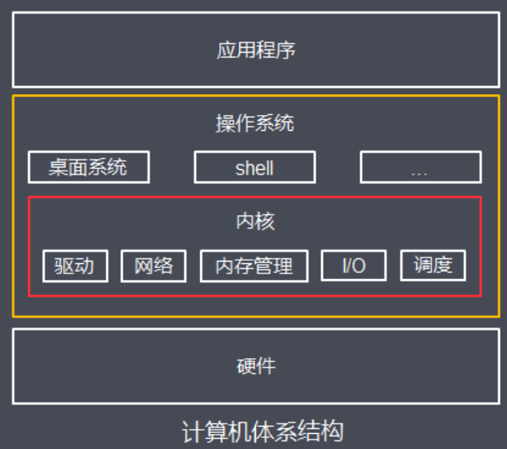
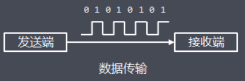
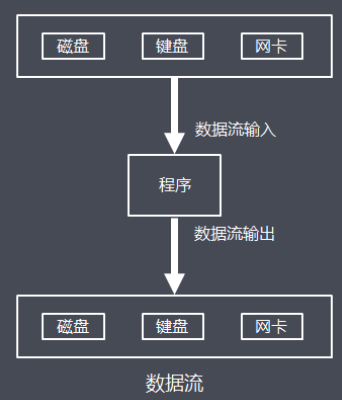

# 001-操作系统与内核

[TOC]

## 操作系统与内核

**操作系统**：管理计算机硬件与软件资源的系统软件**内核**：操作系统的核心软件，负责管理系统的进程、内存、设备驱动程序、文件和网络系统等等，为应用程序提供对计算机硬件的安全访问服务

## 内核空间和用户空间

为了避免用户进程直接操作内核，保证内核安全，操作系统将内存寻址空间划分为两部分：

- **内核空间（Kernel-space）**，
- 供内核程序使用**用户空间（User-space）**，

供用户进程使用 为了安全，内核空间和用户空间是隔离的，即使用户的程序崩溃了，内核也不受影响

## 数据流

计算机中的数据是基于随着时间变换高低电压信号传输的，这些数据信号连续不断，有着固定的传输方向，类似水管中水的流动，因此抽象数据流(I/O流)的概念：**指一组有顺序的、有起点和终点的字节集合**，

抽象出数据流的作用：**实现程序逻辑与底层硬件解耦**，通过引入数据流作为程序与硬件设备之间的抽象层，面向通用的数据流输入输出接口编程，而不是具体硬件特性，程序和底层硬件可以独立灵活替换和扩展

