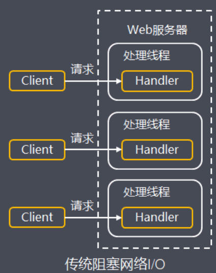

## 010-标准IO存在的问题

[TOC]

## 简述

Java NIO(New I/O)是一个可以替代标准Java I/O API的IO API(从Java 1.4开始)，Java NIO提供了与标准I/O不同的I/O工作方式，目的是为了解决标准 I/O存在的以下问题：

- 数据多次拷贝
- 操作阻塞

### 1.数据多次拷贝


标准I/O处理，完成一次完整的数据读写，至少需要从底层硬件读到内核空间，再读到用户文件，又从用户空间写入内核空间，再写入底层硬件

此外，底层通过write、read等函数进行I/O系统调用时，需要传入数据所在缓冲区**起始地址和长度**由于JVM GC的存在，导致对象在堆中的位置往往会发生移动，移动后传入系统函数的地址参数就不是真正的缓冲区地址了

可能导致读写出错，为了解决上面的问题，使用标准I/O进行系统调用时，还会额外导致一次数据拷贝：把数据从JVM的堆内拷贝到堆外的连续空间内存(堆外内存)

所以总共经历6次数据拷贝，执行效率较低

### 2.操作阻塞

传统的网络I/O处理中，由于请求建立连接(connect)，读取网络I/O数据(read)，发送数据(send)等操作是线程阻塞的

```java
// 等待连接
Socket socket = serverSocket.accept();

// 连接已建立，读取请求消息
StringBuilder req = new StringBuilder();
byte[] recvByteBuf = new byte[1024];
int len;
while ((len = socket.getInputStream().read(recvByteBuf)) != -1) {
	req.append(new String(recvByteBuf, 0, len, StandardCharsets.UTF_8));
}

// 写入返回消息
socket.getOutputStream().write(("server response msg".getBytes()));
socket.shutdownOutput();
```

以上面服务端程序为例，当请求连接已建立，读取请求消息，服务端调用read方法时，客户端数据可能还没就绪(例如客户端数据还在写入中或者传输中)，线程需要在read方法阻塞等待直到数据就绪

为了实现服务端并发响应，每个连接需要独立的线程单独处理，当并发请求量大时为了维护连接，内存、线程切换开销过大

