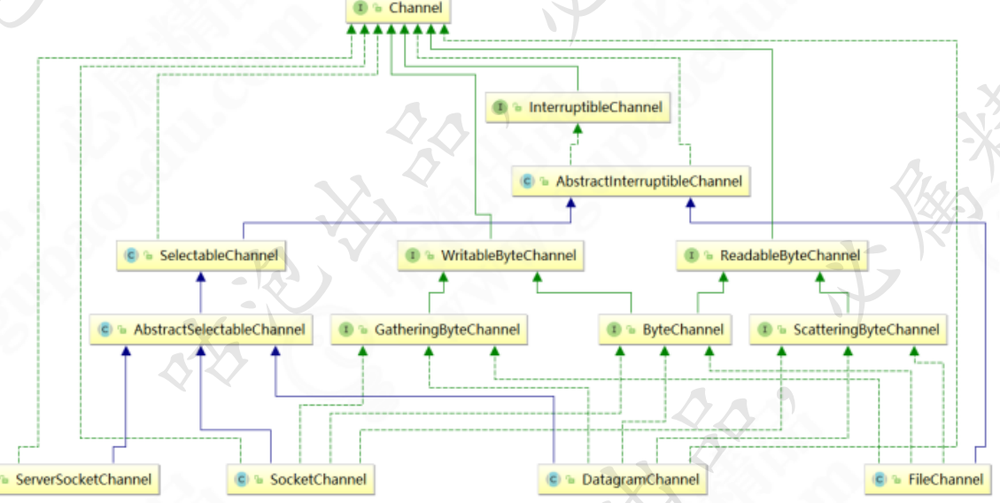

# 020-通道-Channel

[TOC]

## 简介

OIO中, 同一个网络连接会连接到两个流

- 一个输入流(input Stream)
- 一个输出流(Output Stream)

通过这两个流, 不断的进行输入和输出操作

NIO 中, 同一个同一个网络连接使用一个通道表示, 所有的NIO的IO操作都是从通道开始的 类似于OIO中的两个流的结合体, 既可以从通道中读取, 又可以从通道中写入

一个Channel 可以表示一个底层的文件描述符， 例如硬件，文件，网络连接，除了这些， Java NIO通道还可以更加细化， 例如， 对应不同的网络传输协议

## Channel的主要类型

主要的类型有四个

- FileChannel  文件通道， 用于文件的数据读取
- SocketChannel 套接字通道， 用于Socket套接字 TCP连接的数据读写
- ServerSocketChannel 服务器嵌套字通道（或者服务器监听通道），允许我们监听TCP连接要求，为每个监听到的请求， 创建一个SocketChannel套接字通道
- DatagramChannel数据报通道，用于UDP 协议读取



## Channel和流

Channel和流非常相似，主要有以下几点区别：

- Channel可以读和写，而标准I/O流是单向的
- Channel可以异步读写，标准I/O流需要线程阻塞等待直到读写操作完成
- Channel总是基于缓冲区Buffer读写

## Java NIO中最重要的几个Channel的实现

- FileChannel：用于文件的数据读写，基于FileChannel提供的方法能减少读写文件数据拷贝次数，后面会介绍
- DatagramChannel：用于UDP的数据读写
- SocketChannel：用于TCP的数据读写，代表客户端连接
- ServerSocketChannel: 监听TCP连接请求，每个请求会创建会一个SocketChannel，一般用于服务端

## 标准I/O获取输入流

基于标准I/O中，我们第一步可能要像下面这样获取输入流，按字节把磁盘上的数据读取到程序中，再进行下一步操作，而在NIO编程中，需要先获取Channel，再进行读写

```java
FileInputStream fileInputStream = new FileInputStream("test.txt");
FileChannel channel = fileInputStream.channel();
```

> **tips**: FileChannel仅能运行在阻塞模式下，文件异步处理的 I/O 是在JDK 1.7 才被加入的 java.nio.channels.AsynchronousFileChannel

```java
// server socket channel:
ServerSocketChannel serverSocketChannel = ServerSocketChannel.open();
serverSocketChannel.bind(new InetSocketAddress(InetAddress.getLocalHost(), 9091));

while (true) {
	SocketChannel socketChannel = serverSocketChannel.accept();
	ByteBuffer buffer = ByteBuffer.allocateDirect(1024);
	int readBytes = socketChannel.read(buffer);
	if (readBytes > 0) {
		// 从写数据到buffer翻转为从buffer读数据
		buffer.flip();
		byte[] bytes = new byte[buffer.remaining()];
		buffer.get(bytes);
		String body = new String(bytes, StandardCharsets.UTF_8);
		System.out.println("server 收到：" + body);
	}
}
```