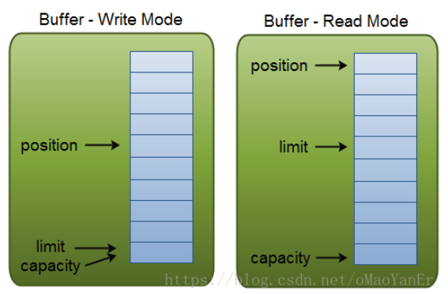

# 040-缓冲区-Buffer

[TOc]

## Buffer缓冲区是什么



NIO的通道本质上是一个内存块， 既可以是写入数据， 也可以从中读取数据， NIO 的Buffer 类， 是一个抽象类， 位于 java.nio包中， 其内部是一个内存块（数组）

NIO的Buffer和普通的内存块(Java数组) 不同的是， NIO buffer 对象， 提供了一组更加有效的方法， 用来进行写入和读取交替访问

Buffer类是一个线程不安全的类

## Buffer底层支持Java堆外内存和堆内内存

**堆外内存**是指与堆内存相对应的，把内存对象分配在JVM堆以外的内存，这些内存直接受操作系统管理（而不是虚拟机，相比堆内内存，I/O操作中使用堆外内存的优势在于：

- 不用被JVM GC线回收，减少GC线程资源占有
- 在I/O系统调用时，直接操作堆外内存，可以节省一次堆外内存和堆内内存的复制

ByteBuffer底层基于堆外内存的分配和释放基于malloc和free函数，对外allocateDirect方法可以申请分配堆外内存，并返回继承ByteBuffer类的DirectByteBuffer对象：

```java
public static ByteBuffer allocateDirect(int capacity) {
    return new DirectByteBuffer(capacity);
}
```

堆外内存的回收基于DirectByteBuffer的成员变量Cleaner类，提供clean方法可以用于主动回收，Netty中大部分堆外内存通过记录定位Cleaner的存在，主动调用clean方法来回收；另外，当DirectByteBuffer对象被GC时，关联的堆外内存也会被回收

> **tips**: JVM参数不建议设置-XX:+DisableExplicitGC，因为部分依赖Java NIO的框架(例如Netty)在内存异常耗尽时，会主动调用System.gc()，触发Full GC，回收DirectByteBuffer对象，作为回收堆外内存的最后保障机制，设置该参数之后会导致在该情况下堆外内存得不到清理

堆外内存基于基础ByteBuffer类的DirectByteBuffer类成员变量：Cleaner对象，这个Cleaner对象会在合适的时候执行unsafe.freeMemory(address)，从而回收这块堆外内存

## Buffer的作用

应用程序与通道（Channel）主要的交互交互操作，就是进行数据的read读取和write写入。

为了能够确保数据的读取和写入， NIO为大家准备了第三个重要的组件-NIO Buffer ， 

- 通道的读取， 就是将数据从通到读取到缓冲区中
- 通道的写入， 就是从缓冲区中写入到通道中

## Buffer类

java.nio.Buffer 类是一个抽象类， 对应Java的主要数据类型， 在NIO 中有8种缓冲区类， 分别是

| Buffer子类       | 存储类型                         |
| ---------------- | -------------------------------- |
| ByteBuffer       |                                  |
| CharBuffer       |                                  |
| DoubleBuffer     |                                  |
| FloatBuffer      |                                  |
| IntBuffer        |                                  |
| LongBuffer       |                                  |
| ShortBuffer      |                                  |
| MappedByteBuffer | 专门用于内存映射的一种ByteBuffer |

## 缓冲区分片

在NIO中，可以根据现有的缓冲区对象创建一个子缓冲区，即在现有缓冲区上切出来一片作为新的缓冲区， 但是现有的缓冲区与创建的缓冲区分片底层数据层面上是共享的，也即是说

字缓冲区相当于现有缓冲区的一个视图窗口， 调用slice()方法创建一个子缓冲区

```java
/**
 * 缓冲区分片
 */
public class BufferSlice {  
    static public void main( String args[] ) throws Exception {  
        ByteBuffer buffer = ByteBuffer.allocate( 10 );  
          
        // 缓冲区中的数据0-9  
        for (int i=0; i<buffer.capacity(); ++i) {  
            buffer.put( (byte)i );  
        }  
          
        // 创建子缓冲区  
        buffer.position( 3 );  
        buffer.limit( 7 );  
        ByteBuffer slice = buffer.slice();  
          
        // 改变子缓冲区的内容  
        for (int i=0; i<slice.capacity(); ++i) {  
            byte b = slice.get( i );  
            b *= 10;  
            slice.put( i, b );  
        }  
          
        buffer.position( 0 );  
        buffer.limit( buffer.capacity() );  
          
        while (buffer.remaining()>0) {  
            System.out.println( buffer.get() );  
        }  
    }  
}
```

在上面的实例中，分配一个容器大小为10的缓冲区并在其中放入0-9，而且该缓冲区基础之上又创建了一个子缓冲区，并改变了缓冲区的内容， 子缓冲区改变的值在原缓冲区上也发生了变化，说明是共享的