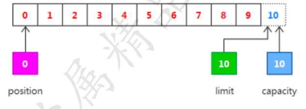
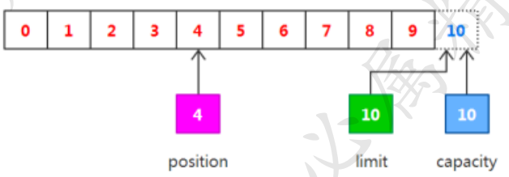
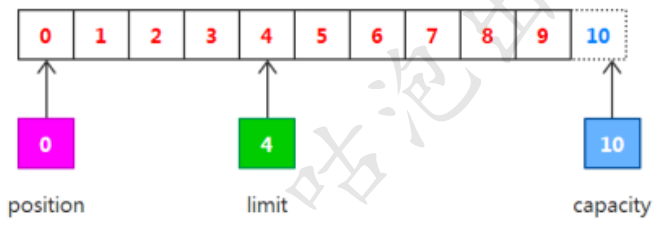
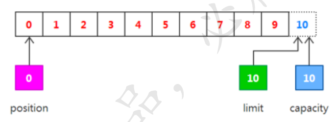

## 041-缓冲区-Buffer-重要属性.md

[TOC]

## Buffer类内部的重要属性

- 有一个 byte[] 数组内存块， 作为内存缓冲区

| 属性     | 说明                                                         |
| -------- | ------------------------------------------------------------ |
| capacity | 容量，既可以容纳的最大数据量，在缓冲区创建时设置并不能改变   |
| limit    | 上限， 缓冲区中当前的数据量                                  |
| position | 位置， 缓冲区中下一个要被读或者写的元素的索引                |
| mark     | 调用mark() 方法来设置 mark=position,  再调用 reset() 可以让 position 可以让 position 恢复到mark 标记位置即 position = mark |

### 重要属性1-capacity属性

Buffer 类的 capacoity 属性， 表示内部容量的大小，一旦写入的对象数量超过了capacity容量缓冲区就慢了， 不能再写入了

**capacity 容量不是指内存块 byte[] 数组的字节数量， 而是存储的数据对象的数量**

例如 DoubleBuffer ， 写入的数据就是double类型， 如果 capacity 是100 ， 也就是最多可以写入100个double 数据

capacity 一旦被初始化， 就不能被改变， 因为Buffer类的对象在初始化时， 会按照capacity分配内部的内存，内存大小分配好之后， 就不能改变了

### 重要属性2-position属性

Buffer类的position属性，表示当前的位置。position属性与缓冲区的读写模式有关，在不同的模式下，position属性的值是不同的

当新建一个缓冲区时， 是 写入模式，数据写入后， 如果要从缓冲区读取数据，也就要进行模式的切换，调用 filp 反转方法，将缓冲区编程读取模式

- 在写入模式下， position的值的变化规则如下
  1. 在进入写模式时， position 值为0 表示当前的写入位置为从头开始
  2. 当每个数据写到缓冲区后， position会向后移动到下一个可写的位置
  3. 初始的position 值为0 ， 最大可写值 position 为 limit -1 , 当 position值达到了limit 时， 缓冲区就已经无空间可以写了
- 在读模式下， position的值变化规则如下
  1. 当缓冲区刚开始进行到读模式时， position 被重置为0
  2. 当从缓冲区读取时， 也是从position 位置开始读，读取数据后， position向后移动到下一个可读的位置
  3. position 最大的值为最大可读上线 limit, 当 position达到limit 时， 表名缓冲区已经无数据可读

### 重要属性3-limit属性

Buffer类的limit属性， 表示读写的最大上限， limit 属性， 也与缓冲区的读写模式有关， 在不同的模式下，limit的值的含义是不同的

- 在写模式下， limit 属性值的含义为可以写入的数据最大上限
  - 在刚进入到写模式时， limit的值会被设置成缓冲区的capcaity容量值， 表示可以一直将缓冲区的容量写满
  - 在读默认下， limit 的值含义为最多能从缓冲区中读取到多少数据

一般来说， 是先写入再读取

- 当缓冲区写入完成时， 就可以开始从Buffer读取数据，可以用flip反转方法，将写模式下的position值， 设置为读模式的limit值， 也就是说， 将之前写入的最大数量， 作为可以读取的上限值

## 一个完整的例子

创建缓冲区， 刚开始， 缓冲区处于写模式

- position 为 0， limit 是最大容量capacity = 10

然后， 向缓冲区写数据， 每写入一个数据， position的值就向后移动一个位置， 也就是position 的值 +1 ， 假如写了4个值， 那么写入完成后， position =4

调用flip方法转换冲读模式， limit的值先会被设置成写模式的position， limit = 4 ,意思是读取的最大上限是4个数同时， 新的position会被重置为0， 表示可以从0开始读取

调用clear方法

