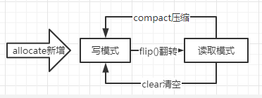

# 042-缓冲区-Buffer-重要方法

[TOC]

## 重要方法一览

| 方法名称          |                |
| ----------------- | -------------- |
| allocate()        | 创建缓冲区     |
| put()             | 写入到缓冲区   |
| flip()            | flip()反转     |
| get()             | 从缓冲区中读取 |
| rewind()          | rewind()倒带   |
| mark() 和 reset() |                |
| clear()           | 情况缓冲区     |

## 使用Buffer的基本步骤

1. 使用创建子类实例对象的 allocate方法， 创建一个Buffer类的实例对象
2. 调用put方法，将数据写入到缓冲区
3. 写入完成后，在开始读取数据前，调用 Buffer.flip() 方法， 将缓冲区的模式转化为读模式
4. 调用set方法， 从缓冲区中读取数据
5. 读取完成后， 调用 Buffer.clear 或者 Buffer.compact() 方法， 将缓冲区转化为写入模式

## allocate() - 创建缓冲区

使用Buffer缓冲区之前， 我们要使用子类获取一个实例， 并且分配内存空间

```java
static IntBuffer intBuffer = null;

public static void allocatTest() {
    intBuffer = IntBuffer.allocate(20);
    Logger.debug("------------after allocate------------------");
    Logger.debug("position=" + intBuffer.position());
    Logger.debug("limit=" + intBuffer.limit());
    Logger.debug("capacity=" + intBuffer.capacity());
}
```

IntBuffer 是Buffer具体的子类， 通过调用IntBuffer.allocate(20) ，创建了一个实例对象，分配20 * 4 字节的内存空间

    allocatTest |>  ------------after allocate------------------ 
    allocatTest |>  position=0 
    allocatTest |>  limit=20 
    allocatTest |>  capacity=20 
刚创建处于写入模式，  position=0 ， 最大可写上限limit=20 ， 也就是容量capacity=20 

## put() - 写入缓冲区

```java
public static void putTest() {
    for (int i = 0; i < 5; i++) {
        intBuffer.put(i);
    }
    Logger.debug("------------after putTest------------------");
    Logger.debug("position=" + intBuffer.position());
    Logger.debug("limit=" + intBuffer.limit());
    Logger.debug("capacity=" + intBuffer.capacity());
}
```

put方法的参数就是缓冲区类型的参数

```java
main |>  写入 
    putTest |>  ------------after putTest------------------ 
    putTest |>  position=5 
    putTest |>  limit=20 
    putTest |>  capacity=20 
```
写入完成后，position = 5, limit 和 capacity 不变

## flip() - 反转

使用flip将写模式转换成读取模式

```java
public static void flipTest() {

    intBuffer.flip();
    Logger.debug("------------after flipTest ------------------");

    Logger.debug("position=" + intBuffer.position());
    Logger.debug("limit=" + intBuffer.limit());
    Logger.debug("capacity=" + intBuffer.capacity());
}
```

在调用flip后， 

- 之前写入模式下的5， 就变成了可读上线limit值5
- 新的读取模式下的position值，编程了0，表示从头读取

    main |>  翻转 
    flipTest |>  ------------after flipTest ------------------ 
    flipTest |>  position=0 
    flipTest |>  limit=5 
    flipTest |>  capacity=20 
#### flip源码

```java
public final Buffer flip() {
    limit = position;
    position = 0;
    mark = -1;
    return this;
}
```

- 首先设置可读的长度上线limit, 将写模式下的缓冲区中的内容的最后写入位置position值， 作为读模式下limit的上线值
- 其次， 把读的其实位置position 设置为0  ， 表示从头开始读
- 最后， 清除之前的mark标记， 因为 mark标记保存的是写模式下的临时位置， 在读模式下， 继续使用旧的 mark标记，会造成位置混乱

#### 写模式和读取模式之前的转换



## get() - 从缓冲区中获取

```java
public static void getTest() {
    for (int i = 0; i < 2; i++) {
        int j = intBuffer.get();
        Logger.debug("j = " + j);
    }
    Logger.debug("------------after get 2 int ------------------");
    Logger.debug("position=" + intBuffer.position());
    Logger.debug("limit=" + intBuffer.limit());
    Logger.debug("capacity=" + intBuffer.capacity());
    for (int i = 0; i < 3; i++) {
        int j = intBuffer.get();
        Logger.debug("j = " + j);
    }
    Logger.debug("------------after get 3 int ------------------");
    Logger.debug("position=" + intBuffer.position());
    Logger.debug("limit=" + intBuffer.limit());
    Logger.debug("capacity=" + intBuffer.capacity());
}
```

               main |>  读取 
             getTest |>  j = 0 
             getTest |>  j = 1 
             getTest |>  ------------after get 2 int ------------------ 
             getTest |>  position=2 
             getTest |>  limit=5 
             getTest |>  capacity=20 
             getTest |>  j = 2 
             getTest |>  j = 3 
             getTest |>  j = 4 
             getTest |>  ------------after get 3 int ------------------ 
             getTest |>  position=5 
             getTest |>  limit=5 
             getTest |>  capacity=20 
## rewind() - 倒带

已经读完的数据， 如果需要再读一遍， 可以调用rewind() 方法， 就像播放磁带一样倒回去

```java
public static void rewindTest() {

    intBuffer.rewind();
    Logger.debug("------------after rewind ------------------");
    Logger.debug("position=" + intBuffer.position());
    Logger.debug("limit=" + intBuffer.limit());
    Logger.debug("capacity=" + intBuffer.capacity());
}
```

rewind（）方法， 主要是调整缓冲区的position值， 具体调整规则如下

1. position 重置为0， 所以可以重读缓冲区中的所有数据
2. limit保持不变， 数据量还是一样的， 仍然表示能从缓冲区中读取杜少个元素
3. mark 标记被清除， 表示之前的临时位置不能再用了

```java
     main |>  重复读 
      rewindTest |>  ------------after rewind ------------------ 
      rewindTest |>  position=0 
      rewindTest |>  limit=5 
      rewindTest |>  capacity=20 
          reRead |>  j = 0 
          reRead |>  j = 1 
          reRead |>  j = 2 
          reRead |>  j = 3 
          reRead |>  j = 4 
```
## mark() 和 reset()

- mark方法的作用是将当前position的值保存起来 放在 mark属性中， 让mark属性记住这个临时位置，之后可以调用Buffer.reset方法将mark的值设置到position中
- mark和 reset 是配套使用的

```java
/**
 * rewind之后，重复读
 * 并且演示 mark 标记方法
 */
public static void reRead() {


    for (int i = 0; i < 5; i++) {
        if (i == 2) {
            intBuffer.mark();
        }
        int j = intBuffer.get();
        Logger.debug("j = " + j);

    }
    Logger.debug("------------after reRead------------------");
    Logger.debug("position=" + intBuffer.position());
    Logger.debug("limit=" + intBuffer.limit());
    Logger.debug("capacity=" + intBuffer.capacity());

}
```

           reRead |>  ------------after reRead------------------ 
              reRead |>  position=5 
              reRead |>  limit=5 
              reRead |>  capacity=20 
                main |>  make&reset写读 
          afterReset |>  ------------after reset------------------ 
          afterReset |>  position=2 
          afterReset |>  limit=5 
          afterReset |>  capacity=20 
          afterReset |>  j = 2 
          afterReset |>  j = 3 
          afterReset |>  j = 4 
                main |>  清空 
## clear () - 清空缓冲区

在读取模式下， 调用clear() 方法将缓冲区切换为写入模式，

-  此方法将position清零
-  limit 设置为capacirty

```java
public static void clearDemo() {
    Logger.debug("------------after clear------------------");
    intBuffer.clear();
    Logger.debug("position=" + intBuffer.position());
    Logger.debug("limit=" + intBuffer.limit());
    Logger.debug("capacity=" + intBuffer.capacity());
}
```