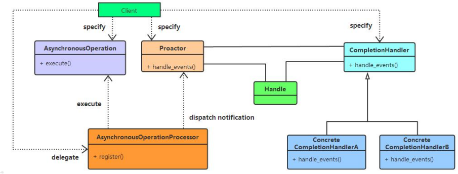

# 090-Java-AIO

### AIO简介

服务端:AsynchronousServerSocketChannel 

客服端:AsynchronousSocketChannel 

用户处理器:CompletionHandler 接口,这个接口实现应用程序向操作系统发起 IO 请求,当完成后处理具体逻辑，否则做 自己该做的事情， 

“真正”的异步IO需要操作系统更强的支持。

在IO多路复用模型中，事件循环将文件句柄的状态事件通知给用户线程， 由用户线程自行读取数据、处理数据。而在异步IO模型中，当用户线程收到通知时，数据已经被内核读取完毕，并放 在了用户线程指定的缓冲区内，内核在IO完成后通知用户线程直接使用即可。

异步IO模型使用了Proactor设计模式实现了这一机制，如下图所示： 



## AIO客户端

```java
public class AIOClient {
    private final AsynchronousSocketChannel client;

    public AIOClient() throws Exception{
        client = AsynchronousSocketChannel.open();
    }

    public void connect(String host,int port)throws Exception{
        client.connect(new InetSocketAddress(host,port),null,new CompletionHandler<Void,Void>() {
            @Override
            public void completed(Void result, Void attachment) {
                try {
                    client.write(ByteBuffer.wrap("这是一条测试数据".getBytes())).get();
                    System.out.println("已发送至服务器");
                } catch (Exception ex) {
                    ex.printStackTrace();
                }
            }

            @Override
            public void failed(Throwable exc, Void attachment) {
                exc.printStackTrace();
            }
        });
        final ByteBuffer bb = ByteBuffer.allocate(1024);
        client.read(bb, null, new CompletionHandler<Integer,Object>(){

                    @Override
                    public void completed(Integer result, Object attachment) {
                        System.out.println("IO操作完成" + result);
                        System.out.println("获取反馈结果" + new String(bb.array()));
                    }

                    @Override
                    public void failed(Throwable exc, Object attachment) {
                        exc.printStackTrace();
                    }
                }
        );

        try {
            Thread.sleep(Integer.MAX_VALUE);
        } catch (InterruptedException ex) {
            System.out.println(ex);
        }

    }

    public static void main(String args[])throws Exception{
        new AIOClient().connect("localhost",8000);
    }
}
```

## AIO服务端

```java
public class AIOServer {

    private final int port;

    public static void main(String args[]) {
        int port = 8000;
        new AIOServer(port);
    }

    public AIOServer(int port) {
        this.port = port;
        listen();
    }

    private void listen() {
        try {
            ExecutorService executorService = Executors.newCachedThreadPool();
            AsynchronousChannelGroup threadGroup = AsynchronousChannelGroup.withCachedThreadPool(executorService, 1);
            //开门营业
            //工作线程，用来侦听回调的，事件响应的时候需要回调
            final AsynchronousServerSocketChannel server = AsynchronousServerSocketChannel.open(threadGroup);
            server.bind(new InetSocketAddress(port));
            System.out.println("服务已启动，监听端口" + port);

            //准备接受数据
            server.accept(null, new CompletionHandler<AsynchronousSocketChannel, Object>(){
                final ByteBuffer buffer = ByteBuffer.allocateDirect(1024);
                //实现completed方法来回调
                //由操作系统来触发
                //回调有两个状态，成功
                public void completed(AsynchronousSocketChannel result, Object attachment){
                    System.out.println("IO操作成功，开始获取数据");
                    try {
                        buffer.clear();
                        result.read(buffer).get();
                        buffer.flip();
                        result.write(buffer);
                        buffer.flip();
                    } catch (Exception e) {
                        System.out.println(e.toString());
                    } finally {
                        try {
                            result.close();
                            server.accept(null, this);
                        } catch (Exception e) {
                            System.out.println(e.toString());
                        }
                    }

                    System.out.println("操作完成");
                }

                @Override
                //回调有两个状态，失败
                public void failed(Throwable exc, Object attachment) {
                    System.out.println("IO操作是失败: " + exc);
                }
            });

            try {
                Thread.sleep(Integer.MAX_VALUE);
            } catch (InterruptedException ex) {
                System.out.println(ex);
            }
        } catch (IOException e) {
            System.out.println(e);
        }
    }
}
```