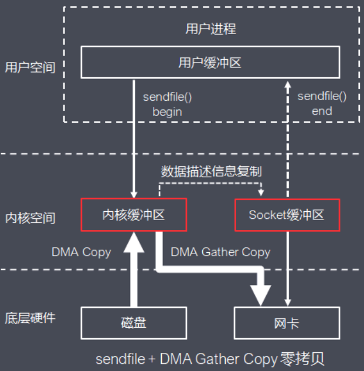
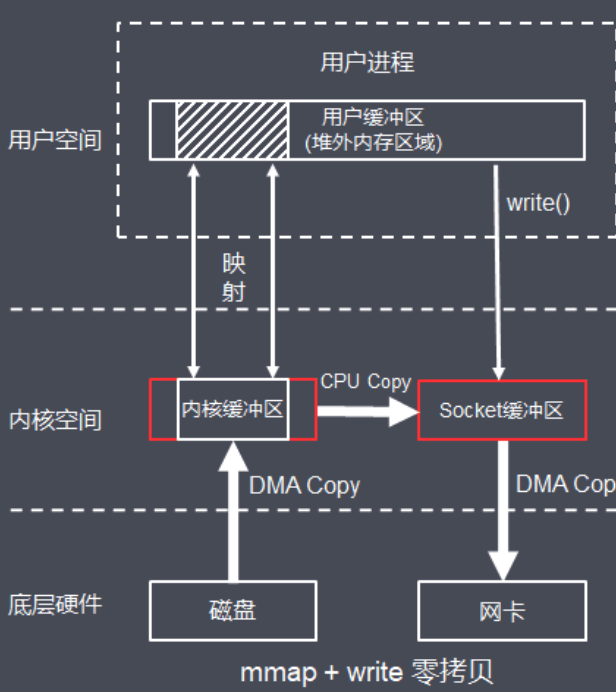

# 010-零拷贝.md

[TOC]

## 零拷贝

零拷贝(zero copy)技术，用于在数据读写中减少甚至完全避免不必要的CPU拷贝，减少内存带宽的占用，提高执行效率，零拷贝有几种不同的实现原理，下面介绍常见开源项目中零拷贝实现

### 1.1 Kafka零拷贝

Kafka基于Linux 2.1内核提供，并在2.4 内核改进的的sendfile函数 + 硬件提供的DMA Gather Copy实现零拷贝，将文件通过socket传送

函数通过一次系统调用完成了文件的传送，减少了原来read/write方式的模式切换。同时减少了数据的copy, sendfile的详细过程如下：



基本流程如下：

- (1) 用户进程发起sendfile系统调用
- (2) 内核基于DMA Copy将文件数据从磁盘拷贝到内核缓冲区
- (3) 内核将内核缓冲区中的文件描述信息(文件描述符，数据长度)拷贝到Socket缓冲区
- (4) 内核基于Socket缓冲区中的文件描述信息和DMA硬件提供的Gather Copy功能将内核缓冲区数据复制到网卡
- (5) 用户进程sendfile系统调用完成并返回

相比传统的I/O方式，sendfile + DMA Gather Copy方式实现的零拷贝，数据拷贝次数从4次降为2次，系统调用从2次降为1次，用户进程上下文切换次数从4次变成2次DMA Copy，大大提高处理效率

Kafka底层基于java.nio包下的FileChannel的transferTo：

```
public abstract long transferTo(long position, long count, WritableByteChannel target)
```

transferTo将FileChannel关联的文件发送到指定channel，当Comsumer消费数据，Kafka Server基于FileChannel将文件中的消息数据发送到SocketChannel

### 1.2 RocketMQ零拷贝

RocketMQ基于mmap + write的方式实现零拷贝：mmap() 可以将内核中缓冲区的地址与用户空间的缓冲区进行映射，实现数据共享，省去了将数据从内核缓冲区拷贝到用户缓冲区

```
tmp_buf = mmap(file, len);
write(socket, tmp_buf, len);
```



mmap + write 实现零拷贝的基本流程如下：

- (1) 用户进程向内核发起系统mmap调用
- (2) 将用户进程的内核空间的读缓冲区与用户空间的缓存区进行内存地址映射
- (3) 内核基于DMA Copy将文件数据从磁盘复制到内核缓冲区
- (4) 用户进程mmap系统调用完成并返回
- (5) 用户进程向内核发起write系统调用
- (6) 内核基于CPU Copy将数据从内核缓冲区拷贝到Socket缓冲区
- (7) 内核基于DMA Copy将数据从Socket缓冲区拷贝到网卡
- (8) 用户进程write系统调用完成并返回

RocketMQ中消息基于mmap实现存储和加载的逻辑写在org.apache.rocketmq.store.MappedFile中，内部实现基于nio提供的java.nio.MappedByteBuffer，基于FileChannel的map方法得到mmap的缓冲区：

```
// 初始化
this.fileChannel = new RandomAccessFile(this.file, "rw").getChannel();
this.mappedByteBuffer = this.fileChannel.map(MapMode.READ_WRITE, 0, fileSize);
```

查询CommitLog的消息时，基于mappedByteBuffer偏移量pos，数据大小size查询：

```
public SelectMappedBufferResult selectMappedBuffer(int pos, int size) {
	int readPosition = getReadPosition();
	// ...各种安全校验
    
	// 返回mappedByteBuffer视图
	ByteBuffer byteBuffer = this.mappedByteBuffer.slice();
	byteBuffer.position(pos);
	ByteBuffer byteBufferNew = byteBuffer.slice();
	byteBufferNew.limit(size);
	return new SelectMappedBufferResult(this.fileFromOffset + pos, byteBufferNew, size, this);
}
```

> **tips: transientStorePoolEnable机制**Java NIO mmap的部分内存并不是常驻内存，可以被置换到交换内存(虚拟内存)，RocketMQ为了提高消息发送的性能，引入了内存锁定机制，即将最近需要操作的CommitLog文件映射到内存，并提供内存锁定功能，确保这些文件始终存在内存中，该机制的控制参数就是transientStorePoolEnable

因此，MappedFile数据保存CommitLog刷盘有2种方式：

- 1 开启transientStorePoolEnable：写入内存字节缓冲区(writeBuffer)  -> 从内存字节缓冲区(writeBuffer)提交(commit)到文件通道(fileChannel)  -> 文件通道(fileChannel) -> flush到磁盘
- 2 未开启transientStorePoolEnable：写入映射文件字节缓冲区(mappedByteBuffer) -> 映射文件字节缓冲区(mappedByteBuffer) -> flush到磁盘

RocketMQ 基于 mmap+write 实现零拷贝，适用于业务级消息这种小块文件的数据持久化和传输 Kafka 基于 sendfile 这种零拷贝方式，适用于系统日志消息这种高吞吐量的大块文件的数据持久化和传输

> **tips:** Kafka 的索引文件使用的是 mmap+write 方式，数据文件发送网络使用的是 sendfile 方式

### 1.3 Netty零拷贝

Netty 的零拷贝分为两种：

- 1 基于操作系统实现的零拷贝，底层基于FileChannel的transferTo方法
- 2 基于Java 层操作优化，对数组缓存对象(ByteBuf )进行封装优化，通过对ByteBuf数据建立数据视图，支持ByteBuf 对象合并，切分，当底层仅保留一份数据存储，减少不必要拷贝