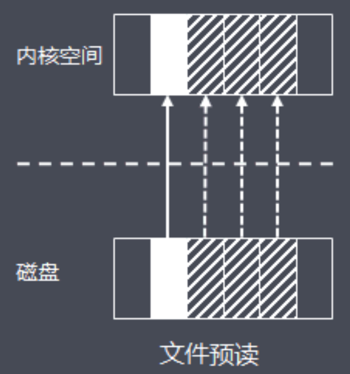

# 030-页缓存(PageCache)

[TOC]

## 什么是也缓存

页缓存（PageCache)是操作系统对文件的缓存，用来减少对磁盘的 I/O 操作，以页为单位的，内容就是磁盘上的物理块，页缓存能帮助**程序对文件进行顺序读写的速度几乎接近于内存的读写速度**，主要原因就是由于OS使用PageCache机制对读写访问操作进行了性能优化：

## 页缓存读取策略

**页缓存读取策略**：当进程发起一个读操作 （比如，进程发起一个 read() 系统调用），它首先会检查需要的数据是否在页缓存中：

- 如果在，则放弃访问磁盘，而直接从页缓存中读取
- 如果不在，则内核调度块 I/O 操作从磁盘去读取数据，并读入紧随其后的少数几个页面（不少于一个页面，通常是三个页面），然后将数据放入页缓存中

## 页缓存写策略

**页缓存写策略**：当进程发起write系统调用写数据到文件中，先写到页缓存，然后方法返回。此时数据还没有真正的保存到文件中去，Linux 仅仅将页缓存中的这一页数据标记为“脏”，并且被加入到脏页链表中

然后，由flusher 回写线程周期性将脏页链表中的页写到磁盘，让磁盘中的数据和内存中保持一致，最后清理“脏”标识。在以下三种情况下，脏页会被写回磁盘:

- 空闲内存低于一个特定阈值
- 脏页在内存中驻留超过一个特定的阈值时
- 当用户进程调用 sync() 和 fsync() 系统调用时

RocketMQ中，ConsumeQueue逻辑消费队列存储的数据较少，并且是顺序读取，在page cache机制的预读取作用下，Consume Queue文件的读性能几乎接近读内存，即使在有消息堆积情况下也不会影响性能，提供了2种消息刷盘策略：

- 同步刷盘：在消息真正持久化至磁盘后RocketMQ的Broker端才会真正返回给Producer端一个成功的ACK响应
- 异步刷盘，能充分利用操作系统的PageCache的优势，只要消息写入PageCache即可将成功的ACK返回给Producer端。消息刷盘采用后台异步线程提交的方式进行，降低了读写延迟，提高了MQ的性能和吞吐量

Kafka实现消息高性能读写也利用了页缓存

