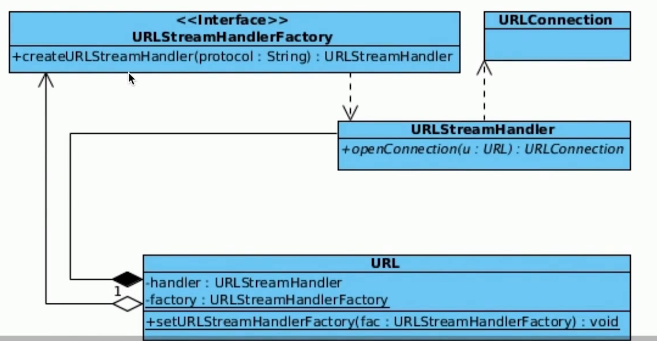

# 16-Java资源管理

[TOC]

| 职责         | 说明                                                         |
| ------------ | ------------------------------------------------------------ |
| 面向资源     | 文件系统 artifact(jar,war, ear文件) 远程资源            |
| API整合      | java.lang.ClassLoader#getResource java.io.File,  java.net.URL |
| 资源定位     | java.net.URL(定位) java.net.URI(鉴别)                   |
| 面向流式存储 | java.net.URLConnection                                       |
| 协议拓展     | java.net.URLStreamHandler java.net.URLStreamHandlerFactory |

## Java URL 协议拓展机制

- 基于java.net.URLStreamHandlerFactory
- 基于 java.net.URLStreamHandler

#### 基于java.net.URLStreamHandlerFactory

#### 基于 java.net.URLStreamHandler

JDK1.8内建协议实现

| 协议   | 实现类                                |
| ------ | ------------------------------------- |
| file   | `sun.net.www.protocol.file.Handler`   |
| ftp    | `sun.net.www.protocol.ftp.Handler`    |
| http   | `sun.net.www.protocol.http.Handler`   |
| https  | `sun.net.www.protocol.https.Handler`  |
| jar    | `sun.net.www.protocol.jar.Handler`    |
| mailto | `sun.net.www.protocol.mailto.Handler` |
| netdoc | `sun.net.www.protocol.netdoc.Handler` |

实现类名必须为"Handler"

| 实现类命名规则 | 实现类                                                       |
| -------------- | ------------------------------------------------------------ |
| 默认           | `sun.net.www.protocol.${protocol}.Handler`                   |
| 自定义         | 通过Java Properties java.protocol.handler.pkgs 指定实现类的包名,实现类必须为Handler 如果存在多个包名,通过分隔符 "\|" |