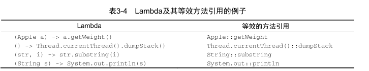

[返回目录](/README.md)

# 方法引用

方法引入可以让你重复使用现有的方法定义，并像Lambda一样传递他们。


Lambda:

```
inventory.sort((Apple a1, Apple a2)
-> a1.getWeight().compareTo(a2.getWeight()));
```

之后（使用方法引用和 java.util.Comparator.comparing ）：

```
inventory.sort(comparing(Apple::getWeight));
```

## 为什么要用方法引用

方法引用可以被看做仅仅调用特定方法的Lambda的一种快捷写法。

其核心思想：如果一个Lambda代表的只是“直接调用这个方法”，那最好还是用名称
来调用它，而不是去描述如何调用它。

事实上，方法引用就是让你根据已有的方法实现来创建
Lambda表达式。但是，显式地指明方法的名称，你的代码的可读性会更好。

## 方法引用是如何工作的

当你需要使用方法引用时，目标引用放在分隔符 :: 前，方法的名称放在后面。

例如，

Apple::getWeight 就是引用了 Apple 类中定义的方法 getWeight 。请记住，不需要括号，因为

你没有实际调用这个方法。方法引用就是Lambda表达式 \(Apple a\) -&gt; a.getWeight\(\) 的快捷
写法。



[返回目录](#)

