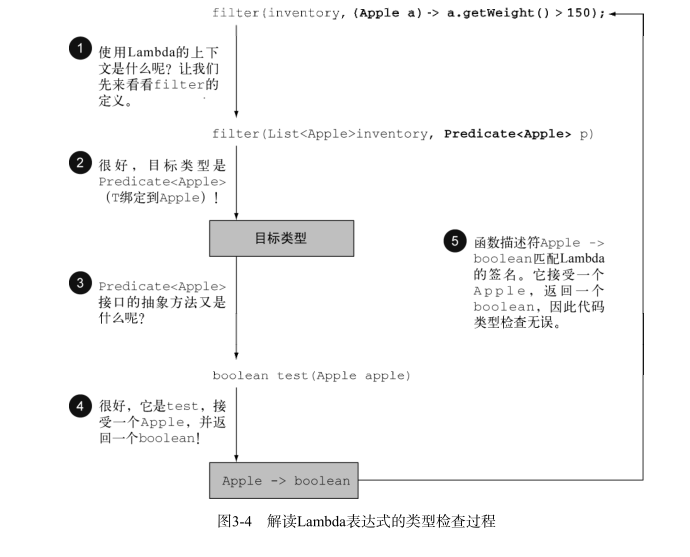

[返回目录](/README.md)

# 类型检查

Lambda表达式可以为函数式接口生成一个实例。然而，Lambda表达式本身并不包含它在实现哪个函数式接口的信息。

## 类型检查

Lambda的类型是从使用Lambda的**上下文**推断出来的。

上下文有可能：

1. 接受它传递的方法参数
2. 接受它的值的局部参数

上下文中的Lambda表达式需要的类型称为**目标类型**。

通过一个例子，查看Lambda表达式背后发生了什么：

```
List<Apple> heavierThan150g = filter(inventory,(Apple a) -> a.getWeight() > 150);
```



接受一个Apple 返回一个boolean：

**Apple -&gt; boolean**

**\(Apple a\) -&gt; a.getWeight\(\) &gt; 150**

## 类型检查过程可以分解为如下所示。

* 首先，你要找出 filter 方法的声明。

* 第二，要求它是 Predicate&lt;Apple&gt; （目标类型）对象的第二个正式参数。

* 第三， Predicate&lt;Apple&gt; 是一个函数式接口，定义了一个叫作 test 的抽象方法。

* 第四， test 方法描述了一个函数描述符，它可以接受一个 Apple ，并返回一个 boolean 。

* 最后， filter 的任何实际参数都必须匹配这个要求。

这段代码是有效的，因为我们所传递的Lambda表达式也同样接受 Apple 为参数，并返回一个

boolean 。请注意，如果Lambda表达式抛出一个异常，那么抽象方法所声明的 throws 语句也必

须与之匹配。

## 特殊的void兼容规则

如果一个Lambda的主体是一个语句表达式， 它就和一个返回 void 的函数描述符兼容（当

然需要参数列表也兼容）。例如，以下两行都是合法的，尽管 List 的 add 方法返回了一个

boolean ，而不是 Consumer 上下文（ T -&gt; void ）所要求的 void ：

```
// Predicate返回了一个boolean
Predicate<String> p = s -> list.add(s);
// Consumer返回了一个void
Consumer<String> b = s -> list.add(s);
```

[返回目录](#)

