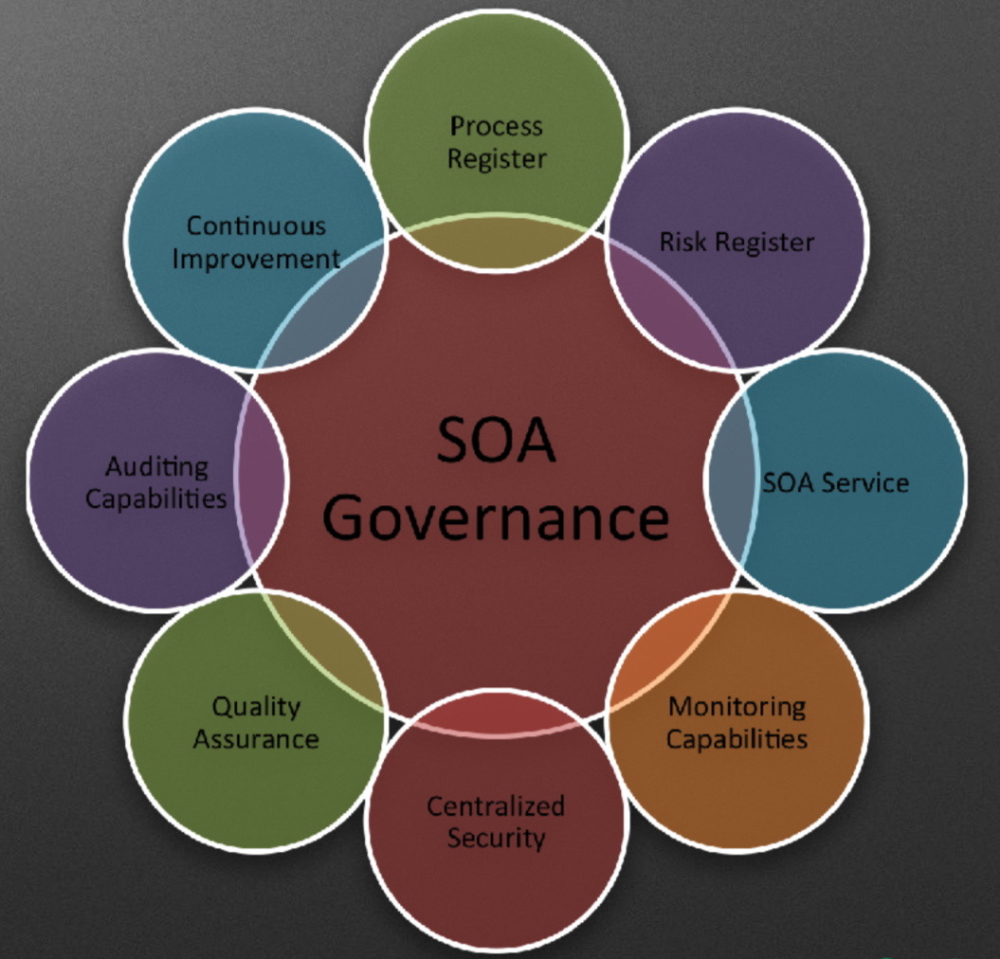

#  SOA-面向服务的架构

> A service-oriented architecture (SOA) is a style of software design where services are provided to the other components by application components, through a communication protocol over a network. The basic principles of service-oriented architecture are independent of vendors, products and technologies. A service is a discrete unit of functionality that can be accessed remotely and acted upon and updated independently, such as retrieving a credit card statement online.

SOA 是一种设计方法,其中包含多个服务,而服务之间可以通过配合最终会提供一些列功能。一个服务通常以独立的形式存在于操作系统中。服务之间通过网络调用,而非进程内调用的形式进行通讯

## SOA Governance

- SOA Service 
- Monitoring Capabilities 监控能力
- Centralized Secuirty 集中安全
- Quality Assurance  质量保证
- Auditing Capabilities 审计功能
- Continuous Improvenment 持续开发
- Process Register 流程注册
- Risk Register 风险注册