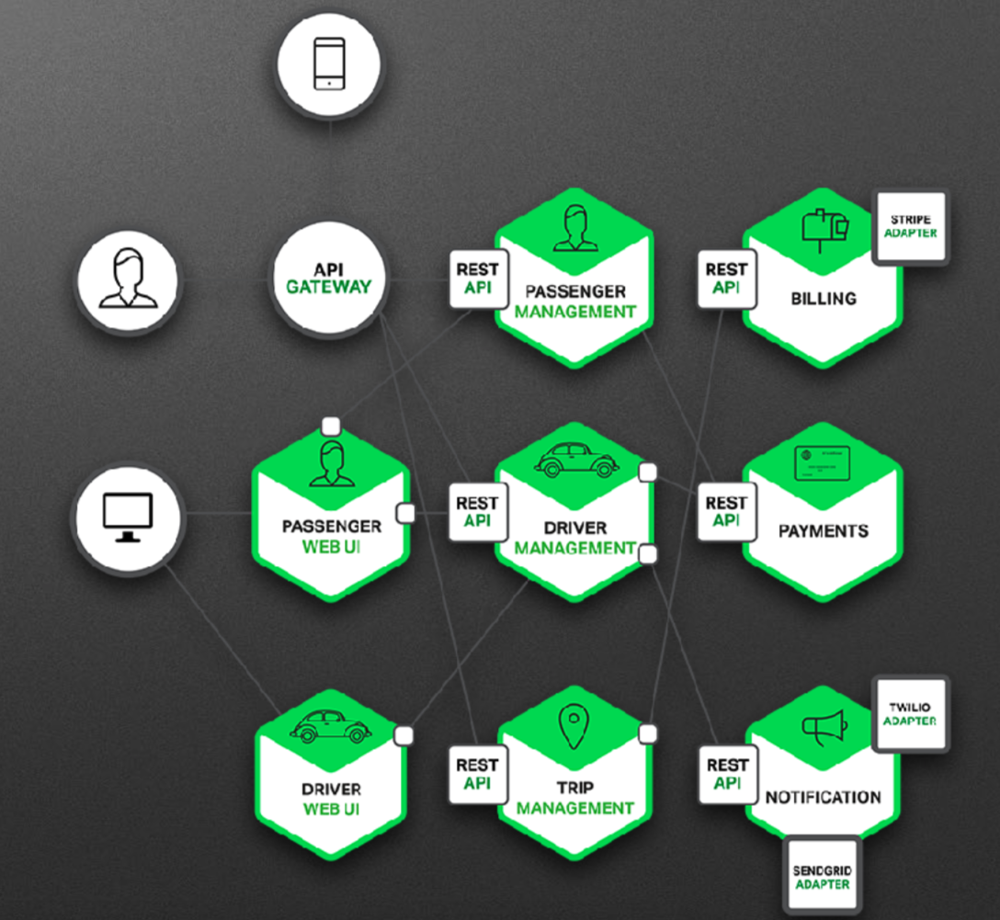

# MSA-微服务架构

Microservices is a variant of the service- oriented architecture (SOA) architectural style that structures an application as a collection of loosely coupled services. In a microservices architecture, services should be fine-grained and the protocols should be lightweight. The benefit of decomposing an application into different smaller services is that it improves modularity and makes the application easier to understand, develop and test.

- 微服务架构是 SOA (Service-oriented-architechture)的一种变种
- 服务应用之间松散耦合
- 细粒度服务,轻量级协议
- 增强模块性,更易理解与开发测试

