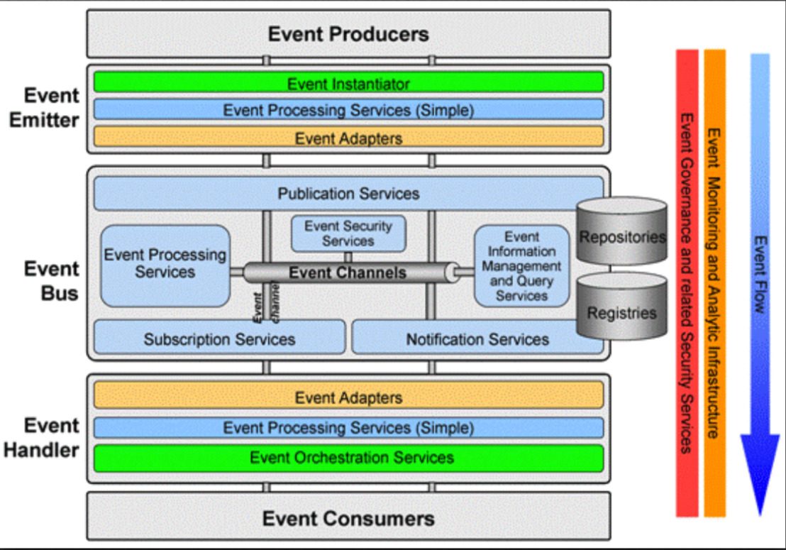

# EDA-事件驱动架构

Event-driven architecture (EDA), is a software architecture pattern promoting the production, detection, consumption of, and reaction to events.
This architectural pattern may be applied by the design and implementation of applications and systems that transmit events among loosely coupled software components and services. An event-driven system typically consists of event emitters (or agents), event consumers (or sinks), and event channels.

