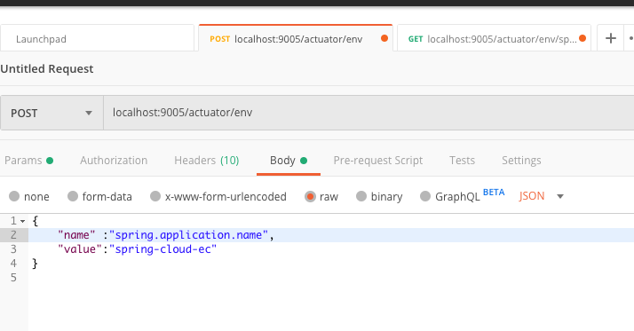
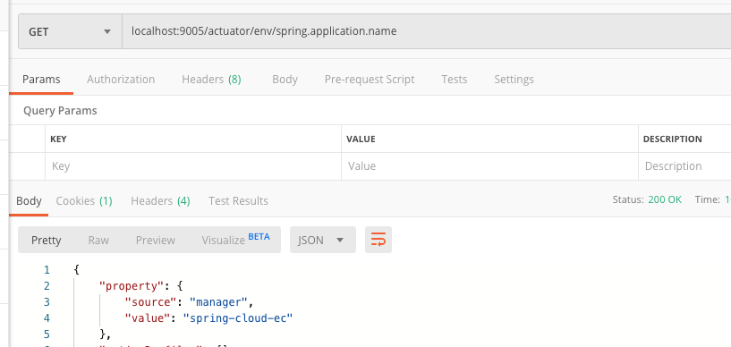
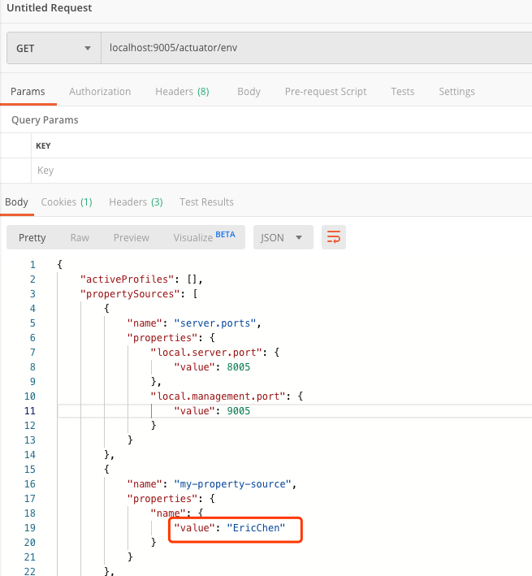
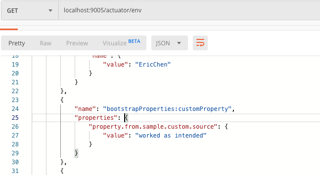

# Bootstrap

- 什么是 Bootstrap

Bootstrap 上下⽂文是 Spring Cloud 新引⼊入的，与传统 Spring 上下⽂相同,是`ConfigurableApplicationContext` 实例，由 `BootstrapApplicationListener` 在监听 `ApplicationEnvironmentPreparedEvent` 时创建。

## 简介

### Bootstrap上下文和 Main 上下文

Bootstrap 的上下文是 spring boot main 上下文的父,这意味着:

- Bootstrap 加载过了的 bean ,main 上下文不会加载
- Bootstrap 上下文 和 main上下文共享同一个环境,共享外部配置
- Bootstrap 属性是以高优先级添加的,本地无法覆盖

### application.yml 和 bootstrap.yml 的区别

- `application.yml`中的属性会覆盖`Bootstrap.yml` 中的的属性

## Spring Boot/Spring Cloud 上下文层次关系

spring的一个特性是child context会从它的parent context中继承属性资源和配置文件，因此main application context有一些额外的属性资源：

- `bootstrap`：如果在bootstrap context中发现`PropertySourceLocators`并且含有非空属性，那么一个`CompositePropertySource`将会以高优先级出现。

- `applicationConfig`：如果你有一个bootstrap.yml，并且设置了配置bootstrap context的属性，那么它们将会被添加到child context中。但是它们具有比application.yml或者其他配置更低的优先级。

由于资源属性的排序规则，“`bootstrap`”入口具有高优先级。注意这不包括bootstrap.yml中的数据（具有较低优先级，可以用来设置默认属性）。

## 修改 Bootstrap 属性的位置

`bootstrap.yml`可以通过在系统属性中设置`spring.cloud.bootstrap.name`或者`spring.cloud.bootstrap.location`来指定。

如果有一个激活的配置文件（通过`spring.profiles.active`或者`Environment` API设置），那么这些文件中的属性都会被加载。

## 覆盖远程属性的值

默认情况，Spring Cloud 是允许覆盖的，`spring.cloud.config.allowOverride=true`

通过bootstrap context添加到应用中的属性资源可能经常是“远程(remote)”的，例如从Spring Cloud Config Server读取的属性。默认情况下，他们不能被本地覆盖。

如果你希望让你的应用通过系统属性或者本地配置来重写那些远程配置，可以通过设置远程属性资源`spring.cloud.config.allowOverride=true`默认为 true（在本地设置无效）。

一旦设置了上面的标志，就可以通过下面两个远程属性来控制远程属性和系统属性跟本地配置的关系：

- `spring.cloud.config.overrideNone=true：`远程属性可以被本地任意属性资源覆盖默认为 false,
- `spring.cloud.config.overrideSystemProperties=false：`仅仅系统属性，命令行参数和环境变量（不包括配置文件）可以覆盖远程设置。默认为true

### 实例

使用 Postman 发送 Post 请求,调整`spring.application.name`的值为`spring-cloud-ec`

#### 开启actuator

```xml
<dependency>
    <groupId>org.springframework.boot</groupId>
    <artifactId>spring-boot-starter-actuator</artifactId>
</dependency>
```

#### 修改`spring.application.name`

使用 Postman 发送 Post 请求,调整`spring.application.name`的值为`spring-cloud-ec`

访问方式

```
POST:localhost:9005/actuator/env
```

参数

```json
{
    "spring.application.name": "spring-cloud-ec"
}
```

如图



修改后查询:



## 自定义Bootstrap 配置

 [05-netflix-eureka-consumer-8005](../00-code/note-spring-cloud/05-netflix-eureka-consumer-8005) 

bootstrap context可以被设置来做任何你想要做的事，只要在`/META-INF/spring.factories`文件中配置`org.springframework.cloud.bootstrap.BootstrapConfiguration`的值即可。

它的值是以逗号分隔的`@Configuration`类的全限定名。所以任何你想要在main application context中注入的bean都可以在这里配置。如果你希望控制启动顺序，在类上添加`@Order`注解（默认顺序为最后）。

>  注意：当你添加自定义的`BootstrapConfiguration`时,要小心这个类不能被`@ComponentScanned`到,如果扫描到会被加入到 main application context 

bootstrap程序最后将初始化器注入到main SpringApplication实例中。首先，通过`spring.factories`中配置的类来创建bootstrap context，然后所有`ApplicationContextInitializer`的bean将会被添加到main `SpringApplication`中，在其启动前。

### 实例

- 创建`META-INF/spring.factories`文件（类似于 Spring Boot 自定义 Starter）

```properties
org.springframework.cloud.bootstrap.BootstrapConfiguration= \
com.segmentfault.springcloudlesson2.boostrap.MyConfiguration
```

- 实现 `ApplicationContextInitializer`接口

```java
/**
 * 自定义 Bootstrap 配置
 *
 * @author EricChen 2019/12/15 10:49
 */
public class MyBootstrapConfiguration implements ApplicationContextInitializer {

    @Override
    public void initialize(ConfigurableApplicationContext applicationContext) {
        // 从 ConfigurableApplicationContext 获取 ConfigurableEnvironment 实例
        ConfigurableEnvironment environment = applicationContext.getEnvironment();
        // 获取 PropertySources
        MutablePropertySources propertySources = environment.getPropertySources();
        // 定义一个新的 PropertySource，并且放置在首位
        propertySources.addFirst(createPropertySource());
    }

    private PropertySource<?> createPropertySource() {
        Map<String, Object> source = new HashMap<>();
        source.put("name", "EricChen");
        PropertySource propertySource = new MapPropertySource("my-property-source", source);
        return propertySource;
    }
}
```


- 测试



## 自定义 Bootstrap 属性源

Bootstrap 过程中有一个默认的外部配置属性源,就是 SpringCloud 的配置服务,但是你可以添加附加的源,只需要添加一个`PropertySourceLocator`的 bean 到 bootstrap 的上下文(通过 spring.factories) ,例如你可以插入一个新增的属性进去,这个属性可以是从其他服务获取或者是从数据库中获取

#### 实例

- 实现`PropertySourceLocator`

```java
/**
 * 自定义 属性源
 *
 * @author EricChen 2019/12/15 11:05
 */
public class CustomPropertySourceLocator implements PropertySourceLocator {

    @Override
    public PropertySource<?> locate(Environment environment) {
        return new MapPropertySource("customProperty",
                Collections.<String, Object>singletonMap("property.from.sample.custom.source", "worked as intended"));
    }

}
```

- 配置`META-INF/spring.factories`

```properties
org.springframework.cloud.bootstrap.BootstrapConfiguration=\
cn.eccto.study.eureka.consumer.config.MyBootstrapConfiguration,\
cn.eccto.study.eureka.consumer.config.CustomPropertySourceLocator
```

#### 效果

