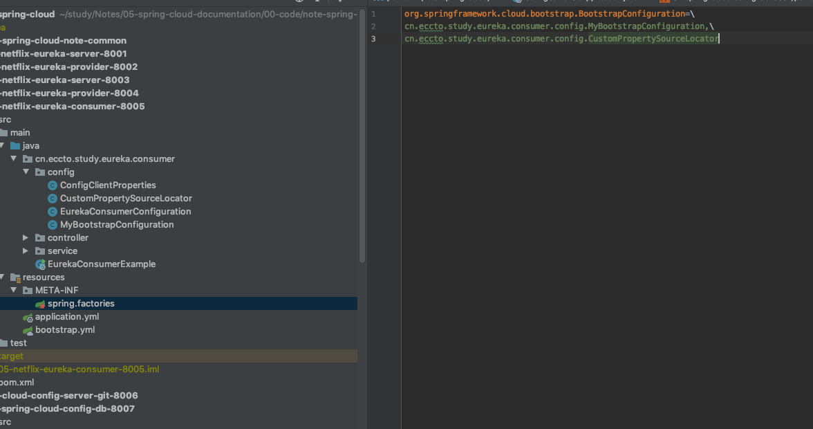

# Spring Cloud Context 

Application Context Services 

- Spring Cloud 基于 Spring Boot 开发
- Spring Cloud 另外构建了一些所有组件都有可能使用到的特性

## [The Bootstrap Application Context](https://cloud.spring.io/spring-cloud-static/Hoxton.RELEASE/reference/htmlsingle/#the-bootstrap-application-context)

- bootstrap context 是main 应用上下文的**父**上下文
- 负责从外部资源加载配置文件
- 解密从本地外部化配置文件的属性
- 两个上下文共享同一个`Environment`
- Bootstrap 优先级更高

```yaml
spring:
  application:
    name: foo
  cloud:
    config:
      uri: ${SPRING_CONFIG_URI:http://localhost:8888}
```

- 通过`bootstrap.yml`设置bootstrap 上下文
- 使用`spring.cloud.bootstrap.enabled=false`关闭 bootstrap 流程

## [ Application Context Hierarchies](https://cloud.spring.io/spring-cloud-static/Hoxton.RELEASE/reference/htmlsingle/#application-context-hierarchies)

应用程序上下文层次结构

- 如果你使用的是 `SpringApplication`和`SpringApplicationBuilder`来构建应用上下文,那么Bootstrap 上下文是 main 上下文的父
- Spring子上下文继承父上下文的 `property source`(属性源) 和` profiles`

所以不使用 Spring Cloud Config 的上下文缺少以下属性源

- "bootstrap":如果在 Bootstrap 上下文对象中找到了`PropertySourceLocators`实例并且其中有非空的属性.或者`CompositePropertySource`以更高权限出现,那么这个应用的属性来自于Spring Cloud Config Server
- "applicationConfig":[classpath:bootstrap.yml] .从配置文件`bootstrap.yml`中读取,或者指定配置文件,会配置到 Bootstrap 上下文中,优先级低于`application.yml`

可以使用以下方法设置一个上下文的父

```
SpringApplicationBuilder.child()
SpringApplicationBuilder.parent()
SpringApplicationBuilder.sibling()
```

BootStrap 上下文是其他上下文的父,相当于默认,子上下文的属性会覆盖父上文内的属性

## [Changing the Location of Bootstrap Properties](https://cloud.spring.io/spring-cloud-static/current/reference/htmlsingle/#customizing-bootstrap-properties)

你应用中加入 bootstrap 上下文的属性通常是 remote 的类型的,例如从 Spring Cloud Config Server.默认情况下他们不能本地覆盖,如果你想让本地属性源覆盖远程的属性,那么远程服务器 IXUS 要矛权限,设置为

```
spring.cloud.config.allowOverride=true
```

你本地设置这些属性是没用的,必须要在配置服务器上设置

一旦设置,两个更细粒度的设置控制远程属性相对于系统属性和应用程序的本地配置的位置

- `spring.cloud.config.overrideNone=true`: 允许通过任何属性文件覆盖配配置
- `spring.cloud.config.overrideSystemProperties=false`:只允许系统属性,命令行参数,环境变量(非本地配置文件) 可以覆盖远程的设置 

## [Customizing the Bootstrap Configuration](https://cloud.spring.io/spring-cloud-static/current/reference/htmlsingle/#customizing-the-bootstrap-configuration)

配置文件`/META-INF/spring.factories`中的`org.springframework.cloud.bootstrap.BootstrapConfiguration`,

自己声明一个 Bean ,实现`ApplicationContextInitializer`,并注册到该配置文件中

执行顺序:

- 首先 bootstrap 根据配置文件`spring.factories`上下文创建
- 然后所有的`ApplicationContextInitializer`都会 在 SpringApplication 启动前被加入到 `SpringApplication`

```java
**
 * 自定义 Bootstrap 配置
 *
 * @author EricChen 2019/12/15 10:49
 */
public class MyBootstrapConfiguration implements ApplicationContextInitializer {

    @Override
    public void initialize(ConfigurableApplicationContext applicationContext) {
        // 从 ConfigurableApplicationContext 获取 ConfigurableEnvironment 实例
        ConfigurableEnvironment environment = applicationContext.getEnvironment();
        // 获取 PropertySources
        MutablePropertySources propertySources = environment.getPropertySources();
        // 定义一个新的 PropertySource，并且放置在首位
        propertySources.addFirst(createPropertySource());
    }

    private PropertySource<?> createPropertySource() {
        Map<String, Object> source = new HashMap<>();
        source.put("name", "EricChen");
        PropertySource propertySource = new MapPropertySource("my-property-source", source);
        return propertySource;
    }
}

```



## [Customizing the Bootstrap Property Sources](https://cloud.spring.io/spring-cloud-static/current/reference/htmlsingle/#customizing-bootstrap-property-sources)

默认情况下,默认外部化配置的默认属性源是在 bootstrap 流程下添加到 SpringCloud Config Server 的,当然你也可以自定义添加一个源:

- 声明一个`PropertySourceLocator`类型的 bean
- 在`spring.factories`配置文件中配置

```java
/**
 * 自定义 属性源
 *
 * @author EricChen 2019/12/15 11:05
 */
public class CustomPropertySourceLocator implements PropertySourceLocator {

    @Override
    public PropertySource<?> locate(Environment environment) {
        return new MapPropertySource("customProperty",
                Collections.<String, Object>singletonMap("property.from.sample.custom.source", "worked as intended"));
    }

}

```

- 形参environment 和将要创建 ApplicationContext 的形参是同一个


## [Environment Changes](https://cloud.spring.io/spring-cloud-static/current/reference/htmlsingle/#environment-changes)

