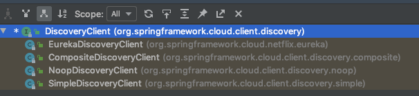
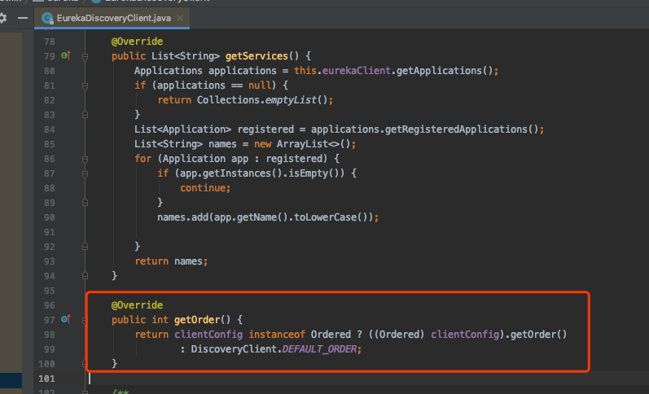

# Spring Cloud Commons : Common Abstractions

本章主要介绍了 `spring-cloud-commons`包,粗略介绍

The common abstraction 包包含了许多服务的抽象:

- service discovery
- load balancing
- circuit breakers

但是实现由各个不同的项目区实现,如 `Eureka` or `Consul`

## [ `@EnableDiscoveryClient` 注解](https://cloud.spring.io/spring-cloud-static/current/reference/htmlsingle/#discovery-client)

这个注解主要寻找的是通过`META-INF/spring.factories` 文件`DiscoveryClient`和`ReactiveDiscoveryClient`接口的实现类, 配置的 key如下

```
org.springframework.cloud.client.discovery.EnableDiscoveryClient
```

SpringCloud 默认会提供 blocking and reactive 的服务发现客户端,你可以设置关闭或者开启

```properties
spring.cloud.discovery.blocking.enabled=false
spring.cloud.discovery.reactive.enabled=false
```

彻底关闭服务发现

```properties
spring.cloud.discovery.enabled=false
```

默认情况下`DiscoveryClient`的实现类自动注册了本地 SpringBoot 服务器到 服务发现,你可以使用属性关闭自动注册

```java
@EnableDiscoveryClient(autoRegister = false)
```




系统中的默认实现类

- `DiscoveryClient (org.springframework.cloud.client.discovery)` 
- `CompositeDiscoveryClient (org.springframework.cloud.client.discovery.composite)`

组合客户端,用于组合其余两种

- `NoopDiscoveryClient (org.springframework.cloud.client.discovery.noop)`

没有在 classpath 下发现实现类的时候,会使用这个客户端

- `SimpleDiscoveryClient (org.springframework.cloud.client.discovery.simple)`

使用配置文件作为服务实例的源


> @EnableDiscoveryClient 不再需要.了,你可以设置一个DiscoveryClient 的实现类到 classpath来做到将 SpringBoot 应用注册到服务发现服务器

#### [Health Indicator](https://cloud.spring.io/spring-cloud-static/current/reference/htmlsingle/#health-indicator)

在 Commons 封装了健康监测,我们都知道, 一般情况下,微服务需要实现SpringBoot 中的`HealthIndicator`.Commons 中封装了一个叫做`DiscoveryHealthIndicator`的实现类

- `DiscoveryHealthIndicator (org.springframework.cloud.client.discovery.health)`
  - `EurekaHealthIndicator (org.springframework.cloud.netflix.eureka)`Eureka 实现
  - `DiscoveryClientHealthIndicator (org.springframework.cloud.client.discovery.health)`默认实现

我们可以关闭健康监测

```
spring.cloud.discovery.client.composite-indicator.enabled=false
```

关闭通用的服务发现客户端的健康监测:

```properties
spring.cloud.discovery.client.health-indicator.enabled=false
```

关闭`DiscoveryClientHealthIndicator`中的描述字段

```properties
spring.cloud.discovery.client.health-indicator.include-description=false
```

#### [Ordering `DiscoveryClient` instances](https://cloud.spring.io/spring-cloud-static/current/reference/htmlsingle/#ordering-discoveryclient-instances)

当使用多个服务发现客户单的时候可以使用排序功能,它们都实现了 Orderd 接口,默认为 0



- ConsulDiscoveryClient
- EurekaDiscoveryClient
- ZookeeperDiscoveryClient

```
spring.cloud.{clientIdentifier}.discovery.order
```

#### 服务注册

Commons 提供了`ServiceRegistry`接口,提供了方法来进行注册和取消注册

```java
public interface ServiceRegistry<R extends Registration> {

	/**
	 * Registers the registration. A registration typically has information about an
	 * instance, such as its hostname and port.
	 * @param registration registration meta data
	 */
	void register(R registration);

	/**
	 * Deregisters the registration.
	 * @param registration registration meta data
	 */
	void deregister(R registration);

  (...)
}
```

我们可以直接把他当做 bean 来使用:

```java
@Configuration
@EnableDiscoveryClient(autoRegister=false)
public class MyConfiguration {
    private ServiceRegistry registry;

    public MyConfiguration(ServiceRegistry registry) {
        this.registry = registry;
    }

    // called through some external process, such as an event or a custom actuator endpoint
    public void register() {
        Registration registration = constructRegistration();
        this.registry.register(registration);
    }
}
```

每一个注册中心实现项目都有自己的实现类

- `ZookeeperRegistration` used with `ZookeeperServiceRegistry`
- `EurekaRegistration` used with `EurekaServiceRegistry`
- `ConsulRegistration` used with `ConsulServiceRegistry`

#### 自动注册

默认开启,想关闭的话

```
@EnableDiscoveryClient(autoRegister=false)
```

```properties
spring.cloud.service-registry.auto-registration.enabled=false
```

#### 自动注册事件

注册时会触发两个事件:

- `InstancePreRegisteredEvent`实例注册之前
- `InstanceRegisteredEvent`实例注册之后触发

你可以添加一个`ApplicationListener`来监听它们

#### 服务注册的 Endpoints 端点

## [负载均衡地配置RestTemplate](https://cloud.spring.io/spring-cloud-static/current/reference/htmlsingle/#rest-template-loadbalancer-client)

```java
@Configuration
public class MyConfiguration {

    @LoadBalanced
    @Bean
    RestTemplate restTemplate() {
        return new RestTemplate();
    }
}

public class MyClass {
    @Autowired
    private RestTemplate restTemplate;

    public String doOtherStuff() {
        String results = restTemplate.getForObject("http://stores/stores", String.class);
        return results;
    }
}
```

- URI 需要使用一个虚拟的 hostname(也就是一个服务的名称).Ribbon 客户端用来创建全物理地址

- 如果你要使用一个负载均衡的 RestTemplate,你 classpath 下必须要有负载均衡器的实现类

> 默认下,如果你同时有`RibbonLoadBalancerClient`和`BlockingLoadBalancerClient`,为了保持向下兼容,会使用`RibbonLoadBalancerClient`.有个开关:
>
> ```properties
> spring.cloud.loadbalancer.ribbon.enabled
> ```

## [负载均衡的WebClient](https://cloud.spring.io/spring-cloud-static/current/reference/htmlsingle/#webclinet-loadbalancer-client)

```java
@Configuration
public class MyConfiguration {

    @Bean
    @LoadBalanced
    public WebClient.Builder loadBalancedWebClientBuilder() {
        return WebClient.builder();
    }
}

public class MyClass {
    @Autowired
    private WebClient.Builder webClientBuilder;

    public Mono<String> doOtherStuff() {
        return webClientBuilder.build().get().uri("http://stores/stores")
                        .retrieve().bodyToMono(String.class);
    }
}
```

#### 重试失败的请求

一个负载均衡的`RestTemplate`,可以配置重试错误的请求,默认下这个逻辑是关闭的,你可以通过添加[Spring Retry](https://github.com/spring-projects/spring-retry)到项目classpath 下,一些配置如下:

```
client.ribbon.MaxAutoRetries
client.ribbon.MaxAutoRetriesNextServer
client.ribbon.OkToRetryOnAllOperations
```

你可以关闭它们:

```
spring.cloud.loadbalancer.retry.enabled=false
```

如果想自定义实现一个`BackOffPolicy`策略,你可以创建一个 bean类型为`LoadBalancedRetryFactory`,覆盖`createBackOffPolicy`方法

```java
@Configuration
public class MyConfiguration {
    @Bean
    LoadBalancedRetryFactory retryFactory() {
        return new LoadBalancedRetryFactory() {
            @Override
            public BackOffPolicy createBackOffPolicy(String service) {
                return new ExponentialBackOffPolicy();
            }
        };
    }
}
```

如果想添加一个或者多个`RetryListener`实现类,你可以创建 bean 的类型`LoadBalancedRetryListenerFactory`,返回一个`RetryListener`数组,包含

2.0.0 以下版本:

```java
@Configuration
public class MyConfiguration {
    @Bean
    LoadBalancedRetryListenerFactory retryListenerFactory() {
        return new LoadBalancedRetryListenerFactory() {
            @Override
            public RetryListener[] createRetryListeners(String service) {
                return new RetryListener[]{new RetryListener() {
                    @Override
                    public <T, E extends Throwable> boolean open(RetryContext context, RetryCallback<T, E> callback) {
                        //TODO Do you business...
                        return true;
                    }

                    @Override
                     public <T, E extends Throwable> void close(RetryContext context, RetryCallback<T, E> callback, Throwable throwable) {
                        //TODO Do you business...
                    }

                    @Override
                    public <T, E extends Throwable> void onError(RetryContext context, RetryCallback<T, E> callback, Throwable throwable) {
                        //TODO Do you business...
                    }
                }};
            }
        };
    }
}
```

另外,如果你想根据指定返回 code 才进行 retry,那么设置

```
clientName.ribbon.retryableStatusCodes
```

例如

```yml
clientName:
  ribbon:
    retryableStatusCodes: 404,502
```

你也可以自己创建一个	`LoadBalancedRetryPolicy	`Bean,实现	`retryableStatusCode`方法

## [使用多个 `RestTemplate`对象](https://cloud.spring.io/spring-cloud-static/current/reference/htmlsingle/#multiple-resttemplate-objects)

你想要创建两个 `RestTemplate`,一个是负载均衡,一个不是负载均衡:

```java
@Configuration
public class MyConfiguration {

    @LoadBalanced
    @Bean
    RestTemplate loadBalanced() {
        return new RestTemplate();
    }

    @Primary
    @Bean
    RestTemplate restTemplate() {
        return new RestTemplate();
    }
}

public class MyClass {
@Autowired
private RestTemplate restTemplate;

    @Autowired
    @LoadBalanced
    private RestTemplate loadBalanced;

    public String doOtherStuff() {
        return loadBalanced.getForObject("http://stores/stores", String.class);
    }

    public String doStuff() {
        return restTemplate.getForObject("http://example.com", String.class);
    }
}
```

值得注意的是`@Primary`注解为了让`@Autowired`注解不产生歧义

同理,多个`WebClient`对象:

## [多个 WebClient 对象使用](https://cloud.spring.io/spring-cloud-static/current/reference/htmlsingle/#multiple-webclient-objects)

```java
@Configuration
public class MyConfiguration {

    @LoadBalanced
    @Bean
    WebClient.Builder loadBalanced() {
        return WebClient.builder();
    }

    @Primary
    @Bean
    WebClient.Builder webClient() {
        return WebClient.builder();
    }
}

public class MyClass {
    @Autowired
    private WebClient.Builder webClientBuilder;

    @Autowired
    @LoadBalanced
    private WebClient.Builder loadBalanced;

    public Mono<String> doOtherStuff() {
        return loadBalanced.build().get().uri("http://stores/stores")
                        .retrieve().bodyToMono(String.class);
    }

    public Mono<String> doStuff() {
        return webClientBuilder.build().get().uri("http://example.com")
                        .retrieve().bodyToMono(String.class);
    }
}
```

## [Spring WebFlux `WebClient` 配置成负载均衡客户端](https://cloud.spring.io/spring-cloud-static/current/reference/htmlsingle/#loadbalanced-webclient)

### [Spring WebFlux `WebClient` with `ReactorLoadBalancerExchangeFilterFunction`](https://cloud.spring.io/spring-cloud-static/current/reference/htmlsingle/#webflux-with-reactive-loadbalancer)

你可以配置一个 WebClient 去使用`ReactiveLoadBalancer`,如果你的 classpath下有

- Spring Cloud LoadBalancer starter
- Spring-webflux

那么`ReactorLoadBalancerExchangeFilterFunction`会自动配置,你可以这样设置一个`WebClient`作为一个 reactive load-balancer

```java
public class MyClass {
    @Autowired
    private ReactorLoadBalancerExchangeFilterFunction lbFunction;

    public Mono<String> doOtherStuff() {
        return WebClient.builder().baseUrl("http://stores")
            .filter(lbFunction)
            .build()
            .get()
            .uri("/stores")
            .retrieve()
            .bodyToMono(String.class);
    }
}
```

- URI 需要一个虚拟的 host name (也就是服务名称,而不是 host 名称)
- `ReactorLoadBalancer`用来创建一个全物理地址

> 默认情况下,如果在 classpath 下`spring-cloud-netflix-ribbon`,那么[`LoadBalancerExchangeFilterFunction`](https://cloud.spring.io/spring-cloud-static/current/reference/htmlsingle/#load-balancer-exchange-filter-function)用来保证向下兼容,
>
> 可以使用`ReactorLoadBalancerExchangeFilterFunction`,设置
>
> ```java
> spring.cloud.loadbalancer.ribbon.enabled=flase
> ```
>
> 

```java
public class MyClass {
    @Autowired
    private LoadBalancerExchangeFilterFunction lbFunction;

    public Mono<String> doOtherStuff() {
        return WebClient.builder().baseUrl("http://stores")
            .filter(lbFunction)
            .build()
            .get()
            .uri("/stores")
            .retrieve()
            .bodyToMono(String.class);
    }
}
```

### [Spring WebFlux `WebClient` with a Non-reactive Load Balancer Client](https://cloud.spring.io/spring-cloud-static/current/reference/htmlsingle/#load-balancer-exchange-filter-function)

如果你的 classpath 下没有 Spring Cloud LoadBalancer starter 但是有 spring-cloud-starter-netflix-ribbon.也可以使用 `LoadBalancerClient`的 WebClient

如果在 classpath 下有`spring-webflux`,`LoadBalancerExchangeFilterFunction`就会被自动配置,当然是一个非-reactive 方式:

```java
public class MyClass {
    @Autowired
    private LoadBalancerExchangeFilterFunction lbFunction;

    public Mono<String> doOtherStuff() {
        return WebClient.builder().baseUrl("http://stores")
            .filter(lbFunction)
            .build()
            .get()
            .uri("/stores")
            .retrieve()
            .bodyToMono(String.class);
    }
}
```

**在 2.0以后**, ` LoadBalancerExchangeFilterFunction`失效了,使用`ReactorLoadBalancerExchangeFilterFunction`

