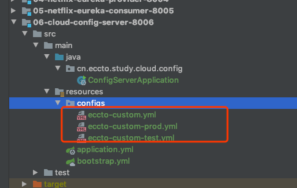
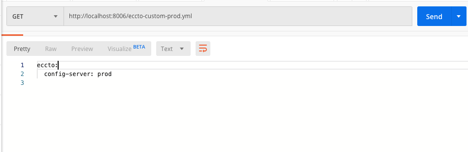
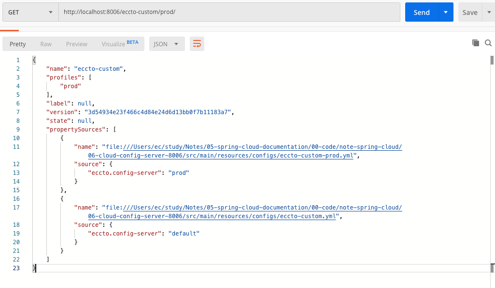
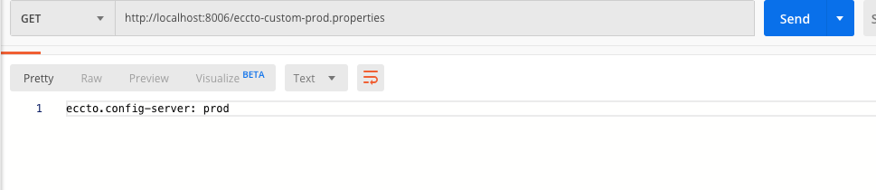
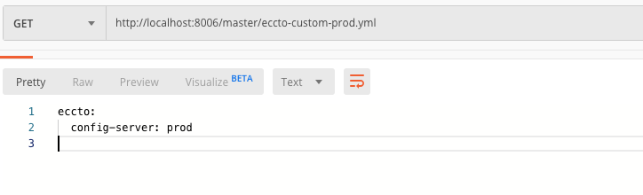

# 配置服务器的相关配置

## 配置

### 默认的存储测量时 git 仓库,通过以下属性配置

```xml
spring.cloud.config.server.git.uri
```

### 服务端`Environment`仓储

Spring Cloud 配置服务器器管理理多个客户端应⽤用的配置信息，然⽽而这些配置信息需要通过⼀一定的规责获取.Spring Cloud Config Sever 提供 `EnvironmentRepository` 接⼝口供客户端应⽤用获取，其中获取维度有三

- `{application}`:配置客户端应⽤用名称，即配置项`spring.application.name`
- `{profile}`:配置客户端应⽤用当前激活的Profile ,即配置项`spring.profiles.active`
- `{label}`:配置服务端标记的版本信息，如 Git 中的分⽀支名

服务端和获取的 url

```
/{application}/{profile}[/{label}]
/{application}-{profile}.yml
/{label}/{application}-{profile}.yml
/{application}-{profile}.properties
/{label}/{application}-{profile}.properties
```


## 基于文件系统(File System)

### 开启配置服务器

首先添加依赖

```xml
    <dependency>
        <groupId>org.springframework.cloud</groupId>
        <artifactId>spring-cloud-starter-config</artifactId>
    </dependency>
```

添加注解

```java
@EnableConfigServer
@SpringCloudApplication
public class ConfigServerApplication {

    public static void main(String[] args) {
        SpringApplication.run(ConfigServerApplication.class, args);
    }
}
```

### 创建本地路径

> 理解 Java 中的 ${user.dir}，在 IDE 中是指的当前项目物理路径

在 IDEA 中`src/main/resources`目录下，创建一个名为“configs”，它的绝对路径：`

```
${user.dir}/src/main/resources/config
```

配置 git 本地仓库 URI

```
## 配置服务器文件系统git 仓库
## ${user.dir} 减少平台文件系统的不一致
spring.cloud.config.server.git.uri = ${user.dir}/src/main/resources/configs
```

创建三个环境的配置文件



>  三个文件的环境 profile 分别）是：`default`、`prod`、`test`

初始化 git 仓库,需要对刚刚配置config 文件夹进行配置

```java
$ git init
$ git add .
$ git commit -m"first commit"
[master (root-commit) 3d54934] first commit
 3 files changed, 0 insertions(+), 0 deletions(-)
 create mode 100644 eccto-custom-prod.yml
 create mode 100644 eccto-custom-test.yml
 create mode 100644 eccto-custom.yml

```

### 测试

根据第一小结的端点测试:

```
/{application}/{profile}[/{label}]
/{application}-{profile}.yml
/{label}/{application}-{profile}.yml
/{application}-{profile}.properties
/{label}/{application}-{profile}.properties
```

- 测试第二个`/{application}/{profile}.yml`





- 测试第四个`/{application}-{profile}.properties`



## 基于线上Git仓库

#### 开启配置

首先添加依赖

```xml
    <dependency>
        <groupId>org.springframework.cloud</groupId>
        <artifactId>spring-cloud-starter-config</artifactId>
    </dependency>

```

添加注解

```java
@EnableConfigServer
@SpringCloudApplication
public class ConfigServerApplication {

    public static void main(String[] args) {
        SpringApplication.run(ConfigServerApplication.class, args);
    }
}

```

### 配置远程 git 仓库

```
spring:
  cloud:
    config:
      server:
        git:
          ## 配置服务器远程 Git 仓库（GitHub）
          uri: https://github.com/EricChen1688/tmp.git
          ## 强制拉去 Git 内容
          force-pull: true
#          search-paths: /05-spring-cloud-documentation/00-code/note-spring-cloud/06-cloud-config-server-8006/src/main/resources/configs
          default-label: master
#          uri: file://${user.dir}/06-cloud-config-server-8006/src/main/resources/configs

```

### 测试

根据第一小结的端点测试:

```
/{application}/{profile}[/{label}]
/{application}-{profile}.yml
/{label}/{application}-{profile}.yml
/{application}-{profile}.properties
/{label}/{application}-{profile}.properties

```

- `/{application}/{profile}[/{label}]`


- `/{application}-{profile}.yml`


- `/{label}/{application}-{profile}.yml`



...

## 基于数据库