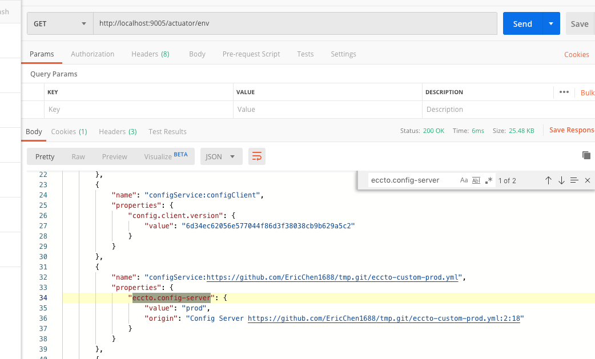
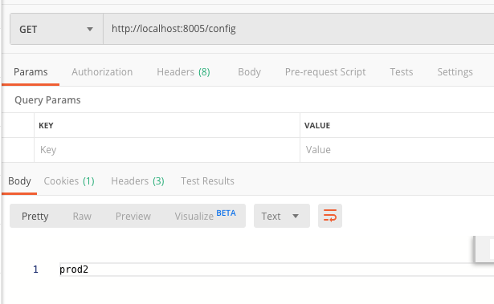
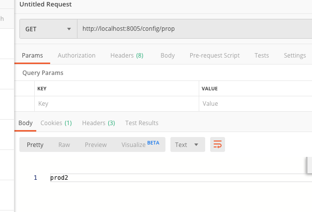
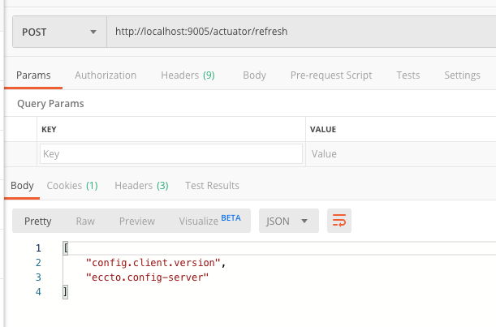
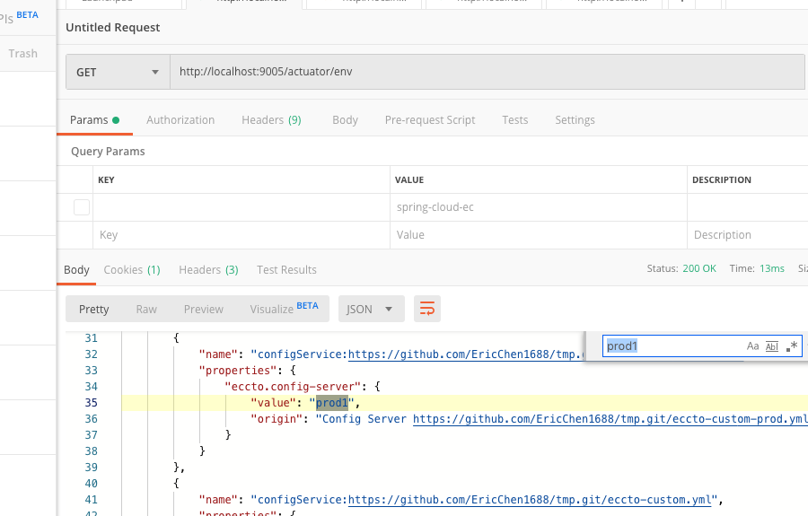
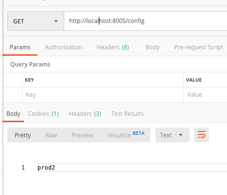
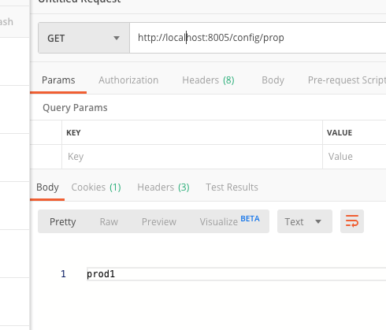

## SpringCloud Client 客户端配合

> 值得注意的是刷新配置文件

客户端主要分成三步

- 引入依赖
- 配置文件
- 测试

## 引入依赖

代码 [05-netflix-eureka-consumer-8005](../00-code/note-spring-cloud/05-netflix-eureka-consumer-8005) 

```xml
<dependency>
    <groupId>org.springframework.cloud</groupId>
    <artifactId>spring-cloud-config-client</artifactId>
</dependency>
```

## 配置

```yaml
spring:
  application:
    name: eccto-consumer
  cloud:
    config:
      overrideNone: true
      name: eccto-custom
      profile: prod
      label: master
      enabled: true
      discovery:
        enabled: true
        # 在注册中心的配置中心 ID
        service-id: eccto-config
```

### 测试

直接可以使用 actuator 去查看



## 变更测试

客户端代码不变.配置文件 git 地址内数据发生变化.

```java
@RestController
public class ConfigClientExampleController {

    @Value("${eccto.config-server:no data}")
    String value;

    @Autowired
    private ConfigClientProperties configClientProperties;

    @GetMapping("/config")
    public String getConfigFromConfigServer() {
        return value;
    }

    @GetMapping("/config/prop")
    public String getConfigClientProperties() {
        return configClientProperties.getConfigServer();
    }

}
```

```java
@Configuration("config")
@ConfigurationProperties("eccto")
public class ConfigClientProperties {

    private String configServer;

    public String getConfigServer() {
        return configServer;
    }

    public void setConfigServer(String configServer) {
        this.configServer = configServer;
    }
}

```


#### 刷新之前

- `@Value`注解声明的变量,正常显示



- `@ConfigurationProperties`方式,正常显示



#### git 仓库更改配置文件


#### 刷新操作



- 环境内属性发生变化



- `@Value` 注解方式生命的变量未改变



- `@ConfigurationProperties`方式,正常显示

