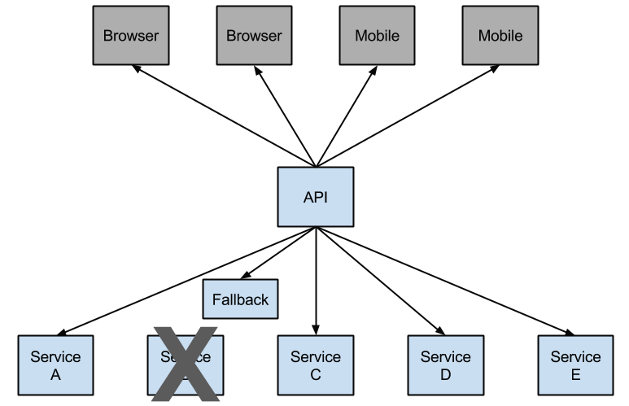

# Netflix Hystrix Clients

Netflix 创建一个一个库叫做 Hystrix,实现了 [circuit breaker pattern](https://martinfowler.com/bliki/CircuitBreaker.html).在微服务架构里,多个服务层之间的互相调用非常平常:如下图


一个底层服务的调用失败可能会级联影响到其他服务的调用,当

- 对特定服务在一个滚动窗口(`metrics.rollingStats.timeInMilliseconds` (default: 10 seconds))的
- 调用超过`circuitBreaker.requestVolumeThreshold` (default: 20 requests) 
- 且失败比例高于`circuitBreaker.errorThresholdPercentage` (default: >50%)时

断路器会断开,会直接调用开发者定义的 fallback,**Hystrix fallback prevents cascading failures**



有一个断开的断路器可以避免级联故障，并允许不堪重负或失败的服务有时间恢复。fallback可以是另一个受Hystrix保护的服务调用、静态数据或一个合理的空值。callback可能被链接，以便第一个callback执行一些其他业务调用，而这些调用又返回到静态数据。

## 引入项目

```xml
<dependency>
    <groupId>org.springframework.cloud</groupId>
    <artifactId>spring-cloud-starter-netflix-hystrix</artifactId>
</dependency>
```

添加`@EnableCircuitBreaker`

```java
@EnableCircuitBreaker 
@EnableDiscoveryClient 
@SpringBootApplication
public class EurekaConsumerExample {
    public static void main(String[] args) {
        SpringApplication.run(EurekaConsumerExample.class, args);
    }
}
```


可以直接使用`@SpringCloudApplication` 默认会添加`@EnableCircuitBreaker`

```java
@SpringCloudApplication
public class EurekaConsumerExample {
    public static void main(String[] args) {
        SpringApplication.run(EurekaConsumerExample.class, args);
    }
}

```

使用`@HystrixCommand`注解定义自己方法的失败回调

```java
@Service
public class EurekaConsumerServiceImpl implements IEurekaConsumerService {

    @Autowired
    private RestTemplate restTemplate;


    @Override
    @HystrixCommand(fallbackMethod = "helloFallback")
    public String helloService() {
        return restTemplate.getForEntity(ECCTO_PROVIDER_PRIFIX + "/hello", String.class).getBody();
    }

    public String helloFallback() {
        return "error message from helloFallback";
    }

}
```

