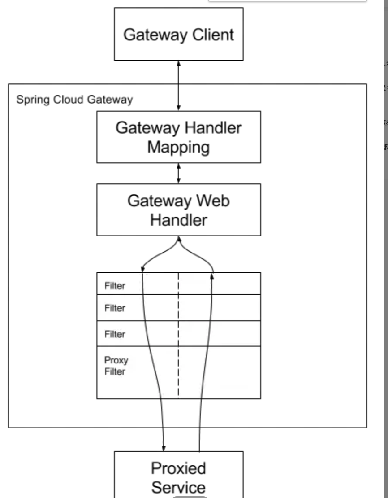

# 引入 SpringCloud Gateway

## 工作原理

- 客户端发送请求到 springCloud gataway
- 如果 gateway handler mapping 映射能够匹配这个请求到一个路由,就会发送到 Gatway Web Handler
- Gatway Web Handler 发送这请求到 fitler 链(过滤器被虚线分隔的原因是，过滤器可能在发送代理请求之前或之后执行逻辑。)
- 执行所有`pre`筛选器逻辑，然后发出代理请求。发出代理请求后，将执行`post`筛选器逻辑。
- 发送到指定路由

