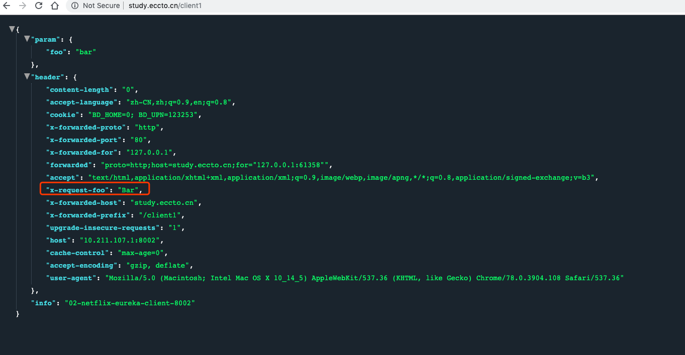
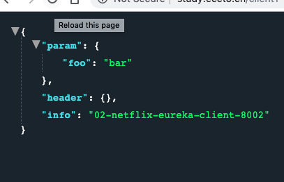
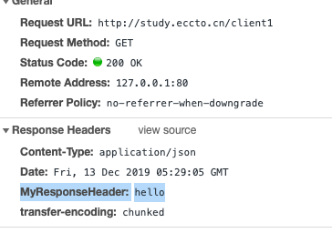

# GatewayFilter Factories

> - **本文作者：**二当家的
> - **本文链接：** [2019/01/01/spring cloud gateway系列教程2——GatewayFilter_上篇/](https://www.edjdhbb.com/2019/01/01/spring cloud gateway系列教程2——GatewayFilter_上篇/)
> - **版权声明：** 本博客所有文章除特别声明外，均采用 [CC BY-NC-SA 3.0 CN](http://creativecommons.org/licenses/by-nc-sa/3.0/cn/) 许可协议。转载请注明出处！

Route filters可以通过一些方式修改HTTP请求的输入和输出，针对某些特殊的场景，Spring Cloud Gateway已经内置了很多不同功能的GatewayFilter Factories。

下面就来通过例子逐一讲解这些GatewayFilter Factories。

## 1. AddRequestHeader GatewayFilter Factory

AddRequestHeader GatewayFilter Factory通过配置name和value可以增加请求的header。

**application.yml**：

```yaml
spring:
  cloud:
    gateway:
      routes:
      - id: add_request_header_route
        uri: http://www.google.com
        filters:
        - AddRequestHeader=X-Request-Foo, Bar
```

对匹配的请求，会额外添加`X-Request-Foo:Bar`的header。



## 2. AddRequestParameter GatewayFilter Factory

AddRequestParameter GatewayFilter Factory通过配置name和value可以增加请求的参数

**application.yml**：

```
spring:
  cloud:
    gateway:
      routes:
      - id: add_request_parameter_route
        uri: http://www.google.com
        filters:
        - AddRequestParameter=foo, bar
```

对匹配的请求，会额外添加`foo=bar`的请求参数。



## 3. AddResponseHeader GatewayFilter Factory

AddResponseHeader GatewayFilter Factory通过配置`name`和`value`可以增加响应的header。
**application.yml**：

```
spring:
  cloud:
    gateway:
      routes:
      - id: add_request_header_route
          uri: http://www.google.com
        filters:
        	- AddResponseHeader=MyResponseHeader, hello
```

对匹配的请求，响应返回时会额外添加`MyResponseHeader: hello`的header返回。



## 4. Hystrix GatewayFilter Factory

Hystrix是Netflix实现的断路器模式工具包，The Hystrix GatewayFilter就是将断路器使用在gateway的路由上，目的是保护你的服务避免级联故障，以及在下游失败时可以降级返回。

项目里面引入`spring-cloud-starter-netflix-hystrix`依赖，并提供`HystrixCommand`的名字，即可生效Hystrix GatewayFilter。
**application.yml**：

```yaml
spring:
  cloud:
    gateway:
      routes:
      - id: hystrix_route
        uri: http://www.google.com
        - Hystrix=myCommandName

```

那么剩下的过滤器，就会包装在名为`myCommandName`的`HystrixCommand`中运行。


Hystrix过滤器也是通过配置可以参数`fallbackUri`，来支持路由熔断后的降级处理，降级后，请求会跳过`fallbackUri`配置的路径，目前只支持`forward:`的URI协议。
**application.yml**：

```yml
spring:
  cloud:
    gateway:
      routes:
      - id: hystrix_route
        uri: lb://backing-service:8088
        predicates:
        - Path=/consumingserviceendpoint
        filters:
        - name: Hystrix
          args:
            name: fallbackcmd
            fallbackUri: forward:/incaseoffailureusethis
        - RewritePath=/consumingserviceendpoint, /backingserviceendpoint
```

当Hystrix降级后就会将请求转发到`/incaseoffailureusethis`。

#### 代码实例

02-netflix-eureka-provider-8002

```java
    @GetMapping("/error-test")
    public String error() throws Exception {
        throw new IllegalArgumentException("自定义请求出错,from 8002");
    }
```

04-netflix-eureka-provider-8004

```java
    @GetMapping("/error-test")
    public String error() throws Exception {
        //让处理线程等待几秒钟
        int sleepTime = new Random().nextInt(3000);
        Thread.sleep(sleepTime);
        logger.info("sleepTime:" + sleepTime);
        throw new IllegalArgumentException("自定义请求出错,from 8004");
    }
```

16-cloud-gateway-80

`cn.eccto.study.gateway.controller.FallbackController`

````java
/**
 * 自定义 hystrix_route fallback
 *
 * @author EricChen 2019/12/28 17:11
 */
@RestController
public class FallbackController {


    @GetMapping("/fallback")
    public String fallback() {
        return "fallback! from gateway";
    }

}

````

application-hystrix.yml

```
spring:
  cloud:
    gateway:
      routes:
        - id: hystrix_route
          uri: lb://eccto-provider
          predicates:
            - Path=/hystrix01/**
          filters:
            - StripPrefix=1
            - name: Hystrix
              args:
                name: fallbackcmd
                fallbackUri: forward:/fallback
```

当访问到第二个服务的时候,超时,所以就跳到 `/fallback`

整个流程其实是用`fallbackUri`将请求跳转到gateway内部的controller或者handler，然而也可以通过以下的方式将请求转发到外部的服务：

**application.yml**：

```yaml
spring:
  cloud:
    gateway:
      routes:
      - id: ingredients
        uri: lb://ingredients
        predicates:
        - Path=//ingredients/**
        filters:
        - name: Hystrix
          args:
            name: fetchIngredients
            fallbackUri: forward:/fallback
      - id: ingredients-fallback
        uri: http://localhost:9994
        predicates:
        - Path=/fallback
```

以上的例子，gateway降级后就会将请求转发到`http://localhost:9994`。

Hystrix Gateway filter在转发降级请求时，会将造成降级的异常设置在`ServerWebExchangeUtils.HYSTRIX_EXECUTION_EXCEPTION_ATTR`属性中，在处理降级时也可以用到。

比如下一节讲到的`FallbackHeaders GatewayFilter Factory`，就会通过上面的方式拿到异常信息，设置到降级转发请求的header上，来告知降级下游异常信息。

通过下面配置可以设置Hystrix的全局超时信息：

**application.yml**：

```properties
hystrix.command.fallbackcmd.execution.isolation.thread.timeoutInMilliseconds: 5000
```

## 5. FallbackHeaders GatewayFilter Factory

FallbackHeaders GatewayFilter Factory可以将Hystrix执行的异常信息添加到外部请求的`fallbackUri`header上。

```yaml
spring:
  cloud:
    gateway:
      routes:
      - id: ingredients
        uri: lb://ingredients
        predicates:
        - Path=//ingredients/**
        filters:
        - name: Hystrix
          args:
            name: fetchIngredients
            fallbackUri: forward:/fallback
      - id: ingredients-fallback
        uri: http://localhost:9994
        predicates:
        - Path=/fallback
        filters:
        - name: FallbackHeaders
          args:
            executionExceptionTypeHeaderName: Test-Header
```

这个例子中，当请求`lb://ingredients`降级后，`FallbackHeaders`filter会将`HystrixCommand`的异常信息，通过`Test-Header`带给`http://localhost:9994`服务。

你也可以使用默认的header，也可以像上面一下配置修改header的名字：

- `executionExceptionTypeHeaderName` (`"Execution-Exception-Type"`)
- `executionExceptionMessageHeaderName` (`"Execution-Exception-Message"`)
- `rootCauseExceptionTypeHeaderName` (`"Root-Cause-Exception-Type"`)
- `rootCauseExceptionMessageHeaderName` (`"Root-Cause-Exception-Message"`)

## 6. PrefixPath GatewayFilter Factory

The PrefixPath GatewayFilter Factor通过设置`prefix`参数来路径前缀。
**application.yml**：

```yaml
spring:
  cloud:
    gateway:
      routes:
      - id: prefixpath_route
        uri: http://www.google.com
        filters:
        - PrefixPath=/mypath
```

如果一个请求是`/hello`，通过上面路由，就会将请求修改为`/mypath/hello`。

## 7. PreserveHostHeader GatewayFilter Factory

PreserveHostHeader GatewayFilter Factory会保留原始请求的`host`头信息，并原封不动的转发出去，而不是被gateway的http客户端重置。

**application.yml**:

```yaml
spring:
  cloud:
    gateway:
      routes:
      - id: preserve_host_route
        uri: http://www.google.com
        filters:
        - PreserveHostHeader
```

## 8. RequestRateLimiter GatewayFilter Factory

RequestRateLimiter GatewayFilter Factory使用`RateLimiter`来决定当前请求是否允许通过，如果不允许，则默认返回状态码`HTTP 429 - Too Many Requests`。

RequestRateLimiter GatewayFilter可以使用一个可选参数`keyResolver`来做速率限制。

`keyResolver`是`KeyResolver`接口的一个实现bean，在配置里面，通过SpEL表达式`#{@myKeyResolver}`来管理bean的名字`myKeyResolver`。

**KeyResolver.java.**

```yaml
public interface KeyResolver {
	Mono<String> resolve(ServerWebExchange exchange);
}
```

`KeyResolver`接口允许你使用不同的策略来得出限制请求的key，未来，官方也会推出一些`KeyResolver`的不同实现。

`KeyResolver`默认实现是`PrincipalNameKeyResolver`，通过`ServerWebExchange`中获取`Principal`，并以`Principal.getName()`作为限流的key。

如果`KeyResolver`拿不到key，请求默认都会被限制，你也可以自己配置`spring.cloud.gateway.filter.request-rate-limiter.deny-empty-key`：是否允许空key，`spring.cloud.gateway.filter.request-rate-limiter.empty-key-status-code` ：空key时返回的状态码。

> RequestRateLimiter不支持捷径配置，如下面的配置是非法的

**application.properties.**

```
# INVALID SHORTCUT CONFIGURATION
spring.cloud.gateway.routes[0].filters[0]=RequestRateLimiter=2, 2, #{@userkeyresolver}

```

### 8.1 Redis RateLimiter

基于 [Stripe](https://stripe.com/blog/rate-limiters)的redis实现方案，依赖`spring-boot-starter-data-redis-reactive`Spring Boot starter，使用的是令牌桶算法。

`redis-rate-limiter.replenishRate`配置的是每秒允许通过的请求数，其实就是令牌桶的填充速率。

`redis-rate-limiter.burstCapacity`配置的是一秒内最大的请求数，其实就是令牌桶的最大容量，如果设置为0，则会阻塞所有请求。

所以可以通过设置相同的`replenishRate`和`burstCapacity`来实现匀速的速率控制，通过设置`burstCapacity`大于`replenishRate`来允许系统流量瞬间突发，但是对于这种情况，突发周期为`burstCapacity / replenishRate`秒，如果周期内有两次请求突发的情况，则第二次会有部分请求丢失，返回`HTTP 429 - Too Many Requests`。

**application.yml.**

```yml
spring:
  cloud:
    gateway:
      routes:
      - id: requestratelimiter_route
        uri: http://www.google.com
        filters:
        - name: RequestRateLimiter
          args:
            redis-rate-limiter.replenishRate: 10
            redis-rate-limiter.burstCapacity: 20
```

**Config.java.**

```java
@Bean
KeyResolver userKeyResolver() {
    return exchange -> Mono.just(exchange.getRequest().getQueryParams().getFirst("user"));
}
```

上面定义了每个用户每秒10个请求的速率限制，允许20的突发流量，突发完，下一秒只允许10个请求通过了，`KeyResolver`定义了通过请求获取请求参数`user`作为key。

你也可以实现`RateLimiter`接口自定义自己的请求速率限制器，在配置文件中使用SpEL表达式配置对应的bean的名字即可。

**application.yml.**

```yaml
spring:
  cloud:
    gateway:
      routes:
      - id: requestratelimiter_route
        uri: http://www.google.com
        filters:
        - name: RequestRateLimiter
          args:
            rate-limiter: "#{@myRateLimiter}"
            key-resolver: "#{@userKeyResolver}"

```

## 9. RedirectTo GatewayFilter Factory

RedirectTo GatewayFilter Factory使用`status`和`url`两个参数，其中`status`必须是300系列的HTTP状态码，`url`则是跳转的地址，会放在响应的`Location`的header中（http协议中转跳的header）。

```yaml
spring:
  cloud:
    gateway:
      routes:
      - id: prefixpath_route
        uri: http://www.google.cn
        filters:
        - RedirectTo=302, http://www.edjdhbb.com

```

## 10. RemoveNonProxyHeaders GatewayFilter Factory

RemoveNonProxyHeaders GatewayFilter Factory转发请求是会根据[IETF](https://tools.ietf.org/html/draft-ietf-httpbis-p1-messaging-14#section-7.1.3)的定义，默认会移除下列的http头信息：

- Connection
- Keep-Alive
- Proxy-Authenticate
- Proxy-Authorization
- TE
- Trailer
- Transfer-Encoding
- Upgrade

你也可以通过配置`spring.cloud.gateway.filter.remove-non-proxy-headers.headers`来更改需要移除的header列表。

## 11. RemoveRequestHeader GatewayFilter Factory

RemoveRequestHeader GatewayFilter Factory配置header的name，即可以移除请求的header。

**application.yml.**

```yml
spring:
  cloud:
    gateway:
      routes:
      - id: removerequestheader_route
        uri: http://www.google.com
        filters:
        - RemoveRequestHeader=X-Request-Foo

```

## 12. RemoveResponseHeader GatewayFilter Factory

RemoveResponseHeader GatewayFilter Factory通过配置header的name，会在响应返回时移除header。

```yaml
spring:
  cloud:
    gateway:
      routes:
      - id: removeresponseheader_route
        uri: http://www.google.com
        filters:
        - RemoveResponseHeader=X-Response-Foo

```

上面路由会在响应返回给gateway的客户端时，将`X-Response-Foo`响应头信息去掉。

## 13. RewritePath GatewayFilter Factory

RewritePath GatewayFilter Factory使用路径`regexp`和替换路径`replacement`两个参数做路径重写，两个都可以灵活地使用java的正则表达式。

**application.yml.**

```
spring:
  cloud:
    gateway:
      routes:
      - id: rewritepath_route
        uri: http://www.google.com
        predicates:
        - Path=/foo/**
        filters:
        - RewritePath=/foo/(?<segment>.*), /$\{segment}
```

对于上面的例子，如果请求的路径是`/foo/bar`，则gateway会将请求路径改为`/bar`发送给下游。

> 注：在YAML 的格式中使用`$\`来代替`$`。

## 14. RewriteResponseHeader GatewayFilter Factory

RewriteResponseHeader GatewayFilter Factory的作用是修改响应返回的header内容，需要配置响应返回的header的`name`，匹配规则`regexp`和替换词`replacement`，也是支持java的正则表达式。

**application.yml.**

```
spring:
  cloud:
    gateway:
      routes:
      - id: rewriteresponseheader_route
        uri: http://www.google.com
        filters:
        - RewriteResponseHeader=X-Response-Foo, , password=[^&]+, password=***
```

举个例子，对于上面的filter，如果响应的header`X-Response-Foo`的内容是`/42？user=ford&password=omg!what&flag=true`，这个内容会修改为`/42?user=ford&password=***&flag=true`。15. SaveSession GatewayFilter Factory

SaveSession GatewayFilter Factory会在请求下游时强制执行`WebSession::save`方法，用在那种像`Spring Session`延迟数据存储的，并在请求转发前确保session状态保存情况。

**application.yml.**

```
spring:
  cloud:
    gateway:
      routes:
      - id: save_session
        uri: http://www.google.com
        predicates:
        - Path=/foo/**
        filters:
        - SaveSession
```

如果你将`Spring Secutiry`于`Spring Session`集成使用，并想确保安全信息都传到下游机器，你就需要配置这个filter。

## 16. SecureHeaders GatewayFilter Factory

SecureHeaders GatewayFilter Factory会添加在返回响应中一系列安全作用的header，至于为什么，英文好的可以看一下[这篇博客](https://blog.appcanary.com/2017/http-security-headers.html)。

默认会添加这些头信息和默认内容：

- `X-Xss-Protection:1; mode=block`
- `Strict-Transport-Security:max-age=631138519`
- `X-Frame-Options:DENY`
- `X-Content-Type-Options:nosniff`
- `Referrer-Policy:no-referrer`
- `Content-Security-Policy:default-src 'self' https:; font-src 'self' https: data:; img-src 'self' https: data:; object-src 'none'; script-src https:; style-src 'self' https: 'unsafe-inline'`
- `X-Download-Options:noopen`
- `X-Permitted-Cross-Domain-Policies:none`

如果你想修改这些头信息的默认内容，可以在配置文件中添加下面的配置：

前缀：`spring.cloud.gateway.filter.secure-headers`

上面的header对应的后缀：

- `xss-protection-header`
- `strict-transport-security`
- `frame-options`
- `content-type-options`
- `referrer-policy`
- `content-security-policy`
- `download-options`
- `permitted-cross-domain-policies`

前后缀接起来即可，如：`spring.cloud.gateway.filter.secure-headers.xss-protection-header`

## 17. SetPath GatewayFilter Factory

SetPath GatewayFilter Factory采用路径`template`参数，通过请求路径的片段的模板化，来达到操作修改路径的母的，运行多个路径片段模板化。

**application.yml.**

```
spring:
  cloud:
    gateway:
      routes:
      - id: setpath_route
        uri: http://www.google.com
        predicates:
        - Path=/foo/{segment}
        filters:
        - SetPath=/{segment}
```

对于上面的例子，如果路径是`/foo/bar`，则对于下游的请求路径会修改为`/bar`。

## 18. SetResponseHeader GatewayFilter Factory

SetResponseHeader GatewayFilter Factory通过设置`name`和`value`来替换响应对于的header。

**application.yml.**

```
spring:
  cloud:
    gateway:
      routes:
      - id: setresponseheader_route
        uri: http://www.google.com
        filters:
        - SetResponseHeader=X-Response-Foo, Bar
```

对于上面的例子，如果下游的返回带有头信息为`X-Response-Foo:1234`，则会gateway会替换为`X-Response-Foo:Bar`，在返回给客户端。

## 19. SetStatus GatewayFilter Factory

SetStatus GatewayFilter Factory通过配置有效的Spring `HttpStatus`枚举参数，可以是类似于404的这些数字，也可以是枚举的name字符串，来修改响应的返回码。

**application.yml.**

```
spring:
  cloud:
    gateway:
      routes:
      - id: setstatusstring_route
        uri: http://www.google.com
        filters:
        - SetStatus=BAD_REQUEST
      - id: setstatusint_route
        uri: http://www.google.com
        filters:
        - SetStatus=401
```

上面例子中，两种路由都会将响应的状态码设置为401。

## 20. StripPrefix GatewayFilter Factory

StripPrefix GatewayFilter Factory通过配置`parts`来表示截断路径前缀的数量。

**application.yml.**

```
spring:
  cloud:
    gateway:
      routes:
      - id: nameRoot
        uri: http://nameservice
        predicates:
        - Path=/name/**
        filters:
        - StripPrefix=2
```

如上面例子中，如果请求的路径为`/name/bar/foo`，则路径会修改为`/foo`，即将路径的两个前缀去掉了。

## 21. Retry GatewayFilter Factory

Retry GatewayFilter Factory可以配置针对不同的响应做请求重试，可以配置如下参数：

- `retries`: 重试次数
- `statuses`: 需要重试的状态码，需要根据枚举 `org.springframework.http.HttpStatus`来配置
- `methods`: 需要重试的请求方法，需要根据枚举`org.springframework.http.HttpMethod`来配置
- `series`: HTTP状态码系列，详情见枚举`org.springframework.http.HttpStatus.Series`

**application.yml.**

```
spring:
  cloud:
    gateway:
      routes:
      - id: retry_test
        uri: http://localhost:8080/flakey
        predicates:
        - Host=*.retry.com
        filters:
        - name: Retry
          args:
            retries: 3
            statuses: BAD_GATEWAY
```

上面例子，当下游服务返回502状态码时，gateway会重试3次。

## 22. RequestSize GatewayFilter Factory

RequestSize GatewayFilter Factory会限制客户端请求包的大小，通过参数`RequestSize`来配置最大上传大小，单位字节。

**application.yml.**

```
spring:
  cloud:
    gateway:
      routes:
      - id: request_size_route
      uri: http://localhost:8080/upload
      predicates:
      - Path=/upload
      filters:
      - name: RequestSize
        args:
          maxSize: 5000000
```

如果请求大小超过5000kb限制，则会返回状态码`413 Payload Too Large`。

> 如果不设置这个filter，默认限制5M的请求大小。

## 23. Modify Request Body GatewayFilter Factory

> 官方说这个filter目前只是beta版本，API以后可能会修改。

Modify Request Body GatewayFilter Factory可以修改请求体内容，这个只能通过java来配置。

```
@Bean
public RouteLocator routes(RouteLocatorBuilder builder) {
    return builder.routes()
        .route("rewrite_request_obj", r -> r.host("*.rewriterequestobj.org")
            .filters(f -> f.prefixPath("/httpbin")
                .modifyRequestBody(String.class, Hello.class, MediaType.APPLICATION_JSON_VALUE,
                    (exchange, s) -> return Mono.just(new Hello(s.toUpperCase())))).uri(uri))
        .build();
}

static class Hello {
    String message;

    public Hello() { }

    public Hello(String message) {
        this.message = message;
    }

    public String getMessage() {
        return message;
    }

    public void setMessage(String message) {
        this.message = message;
    }
}
```

## 24. Modify Response Body GatewayFilter Factory

> 官方说这个filter目前只是beta版本，API以后可能会修改。

Modify Response Body GatewayFilter Factory用于修改响应返回的内容，同样只能通过java配置。

```
@Bean
public RouteLocator routes(RouteLocatorBuilder builder) {
    return builder.routes()
        .route("rewrite_response_upper", r -> r.host("*.rewriteresponseupper.org")
            .filters(f -> f.prefixPath("/httpbin")
        		.modifyResponseBody(String.class, String.class,
        		    (exchange, s) -> Mono.just(s.toUpperCase()))).uri(uri)
        .build();
}
```