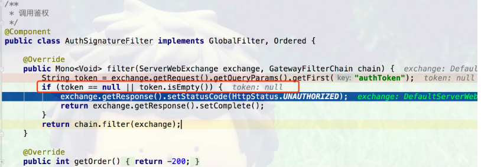
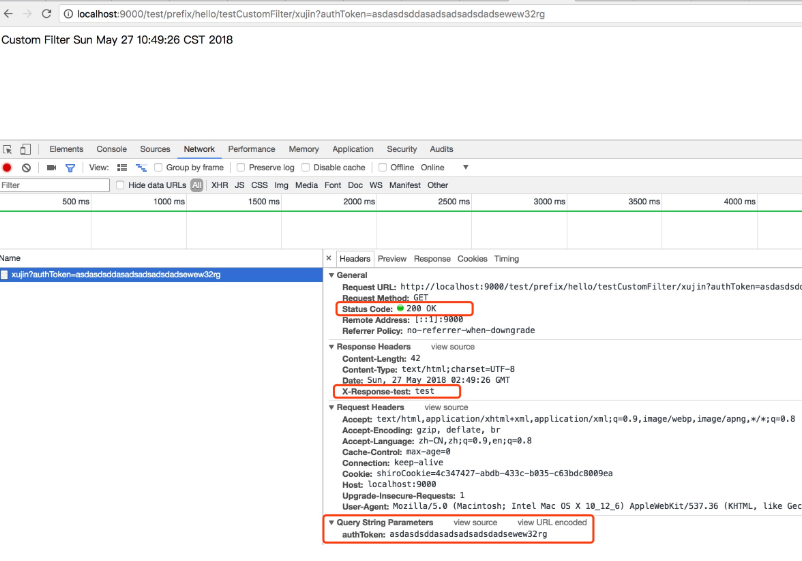

# Spring Cloud Gateway中的GatewayFilter和GlobalFilter

> 原文链接,转载请注明出处:https://xujin.org/sc/gw/gw07/

**摘要**:本文主要介绍了什么是GatewayFilter和GlobalFilter，以及区别和联系。然后介绍如何在Spring Cloud Gateway中自定义使用GatewayFilter和GlobalFilter。

## 1. Spring Cloud gateway的Filter


Spring Cloud gateway中的Filter从接口实现上分为两种一种是GatewayFilter，另外一种是GlobalFilter。

## 1.1 GatewayFilter与GlobalFilter的区别

区别用英语可以总结如下:
At a high level global filters are applied to all routes, while a gateway filter will be applied to an individual route(s)

> 在一个高的角度来看，Global filters会被应用到所有的路由上，而Gateway filter将应用到`单个路由`上或者`一个分组的路由`上。在下面的案例中将会进行说明。

## 1.2 本文代码地址

> https://github.com/SoftwareKing/sc-gateway/tree/master/ch2

## 2. GatewayFilter和GlobalFilter

### 2.1 GatewayFilter

#### 2.1.1 什么是GatewayFilter

Contract for interception-style, chained processing of Web requests that may be used to implement cross-cutting, application-agnostic requirements such
as security, timeouts, and others. Specific to a Gateway Copied from WebFilter

> GatewayFilter是从WebFilter中Copy过来的，相当于一个Filter过滤器，可以对访问的URL过滤横切处理，应用场景比如超时，安全等。

从Spring Cloud Gateway的源码中如下所示，可以看出GatewayFilter的使用场景:

```java
/**
 * Contract for interception-style, chained processing of Web requests that may
 * be used to implement cross-cutting, application-agnostic requirements such
 * as security, timeouts, and others. Specific to a Gateway
 *
 * Copied from WebFilter
 *
 * @author Rossen Stoyanchev
 * @since 5.0
 */
public interface GatewayFilter extends ShortcutConfigurable {

    String NAME_KEY = "name";
    String VALUE_KEY = "value";

    /**
     * Process the Web request and (optionally) delegate to the next
     * {@code WebFilter} through the given {@link GatewayFilterChain}.
     * @param exchange the current server exchange
     * @param chain provides a way to delegate to the next filter
     * @return {@code Mono<Void>} to indicate when request processing is complete
     */
    Mono<Void> filter(ServerWebExchange exchange, GatewayFilterChain chain);

}
```

> GatewayFilter和GlobalFilter两个接口中定义的方法一样都是Mono<Void> filter(ServerWebExchange exchange, GatewayFilterChain chain)，唯一的区别就是GatewayFilter继承了ShortcutConfigurable，GlobalFilter没有任何继承。

#### 2.1.2 自定义GatewayFilter(Custom GatewayFilter)

如org.xujin.sc.filter.CustomFilter代码所示，通过自定义GatewayFilter对路由转发的处理时长统计。

```java
package org.xujin.sc.filter;

import org.apache.commons.logging.Log;
import org.apache.commons.logging.LogFactory;
import org.springframework.cloud.gateway.filter.GatewayFilter;
import org.springframework.cloud.gateway.filter.GatewayFilterChain;
import org.springframework.core.Ordered;
import org.springframework.web.server.ServerWebExchange;
import reactor.core.publisher.Mono;

/**
 * 统计某个或者某种路由的的处理时长
 * @author xujin
 */
public class CustomFilter implements GatewayFilter, Ordered {

    private static final Log log = LogFactory.getLog(GatewayFilter.class);
    private static final String COUNT_Start_TIME = "countStartTime";

    @Override
    public Mono<Void> filter(ServerWebExchange exchange, GatewayFilterChain chain) {
        exchange.getAttributes().put(COUNT_Start_TIME, System.currentTimeMillis());
        return chain.filter(exchange).then(
                Mono.fromRunnable(() -> {
                    Long startTime = exchange.getAttribute(COUNT_Start_TIME);
                    Long endTime=(System.currentTimeMillis() - startTime);
                    if (startTime != null) {
                        log.info(exchange.getRequest().getURI().getRawPath() + ": " + endTime + "ms");
                    }
                })
        );
    }

    @Override
    public int getOrder() {
        return Ordered.LOWEST_PRECEDENCE;
    }
}
```

#### 2.1.3 Gateway Filter与RouteLocator绑定使用

在org.xujin.sc.GatewayServerApplication中customerRouteLocator如下所示:

```java
@SpringBootApplication
public class GatewayServerApplication {


    @Bean
    public RouteLocator customerRouteLocator(RouteLocatorBuilder builder) {
        return builder.routes()
                .route(r -> r.path("/test/prefix/**")
                        .filters(f -> f.stripPrefix(2)
                                .filter(new CustomFilter())
                                .addResponseHeader("X-Response-test", "test"))
                        .uri("lb://SC-CONSUMER")
                        .order(0)
                        .id("test_consumer_service")
                )
                .build();
    }

    public static void main(String[] args) {
        SpringApplication.run(GatewayServerApplication.class, args);
    }

}
```

1. r.path(“/test/prefix/**”)表示自定义了访问前缀，在真正的Gateway进行路由转发的时候，会用过f.stripPrefix(2)把前缀去掉。

   > 使用场景:可以把对外暴露的URL通过加前缀分组打标。

2. filter(new CustomFilter()

   > filter(new CustomFilter()，表示把自定义的Filter加到Filter链里面执行，注意一点是自定义GlobalFilter不需要加进去。

3. uri(“lb://SC-CONSUMER”)

   > uri(“lb://SC-CONSUMER”)表示Spring Cloud Gateway对spring.application.name等于sc-consumer源服务应用中的URL进行协议适配转发。

#### 2.1.4 测试如下:

1.访问http://localhost:9000/SC-CONSUMER/hello/xujin 能正常访问。

```shell
DEBUG 31658 --- [ctor-http-nio-2] o.s.c.g.h.RoutePredicateHandlerMapping   : Route matched: CompositeDiscoveryClient_SC-CONSUMER
2018-05-27 09:58:07.905 DEBUG 31658 --- [ctor-http-nio-2] o.s.c.g.h.RoutePredicateHandlerMapping   : Mapping [Exchange: GET http://localhost:9000/SC-CONSUMER/hello/xujin] to Route{id='CompositeDiscoveryClient_SC-CONSUMER', uri=lb://SC-CONSUMER, order=0, predicate=org.springframework.cloud.gateway.handler.predicate.PathRoutePredicateFactory$$Lambda$337/1295338046@f2ff0c8, gatewayFilters=[OrderedGatewayFilter{delegate=org.springframework.cloud.gateway.filter.factory.RewritePathGatewayFilterFactory$$Lambda$717/1168359877@1f74a2b, order=1}]}
2018-05-27 09:58:07.905 DEBUG 31658 --- [ctor-http-nio-2] o.s.c.g.handler.FilteringWebHandler      : Sorted gatewayFilterFactories: [OrderedGatewayFilter{delegate=GatewayFilterAdapter{delegate=org.springframework.cloud.gateway.filter.NettyWriteResponseFilter@f5bf288}, order=-1}, OrderedGatewayFilter{delegate=org.springframework.cloud.gateway.filter.factory.RewritePathGatewayFilterFactory$$Lambda$717/1168359877@1f74a2b, order=1}, OrderedGatewayFilter{delegate=GatewayFilterAdapter{delegate=org.springframework.cloud.gateway.filter.RouteToRequestUrlFilter@26c77f54}, order=10000}, OrderedGatewayFilter{delegate=GatewayFilterAdapter{delegate=org.springframework.cloud.gateway.filter.LoadBalancerClientFilter@4c38cd16}, order=10100}, OrderedGatewayFilter{delegate=GatewayFilterAdapter{delegate=org.springframework.cloud.gateway.filter.AdaptCachedBodyGlobalFilter@2c1d57bc}, order=2147483637}, OrderedGatewayFilter{delegate=GatewayFilterAdapter{delegate=org.springframework.cloud.gateway.filter.WebsocketRoutingFilter@6e9a0bea}, order=2147483646}, OrderedGatewayFilter{delegate=GatewayFilterAdapter{delegate=org.springframework.cloud.gateway.filter.NettyRoutingFilter@7ddcb0dc}, order=2147483647}, OrderedGatewayFilter{delegate=GatewayFilterAdapter{delegate=org.springframework.cloud.gateway.filter.ForwardRoutingFilter@3e856100}, order=2147483647}]
```

> 从上面的控制台打印日志可以看出，没有打印出该URL对应的耗时。

2.加上URL前缀/test/prefix/访问，测试URL为
http://localhost:9000/test/prefix/hello/testCustomFilter/xujin

```shell
2018-05-27 10:01:56.057 DEBUG 31658 --- [ctor-http-nio-2] o.s.c.g.h.RoutePredicateHandlerMapping   : Mapping [Exchange: GET http://localhost:9000/test/prefix/hello/testCustomFilter/xujin] to Route{id='test_consumer_service', uri=lb://SC-CONSUMER, order=0, predicate=org.springframework.cloud.gateway.handler.predicate.PathRoutePredicateFactory$$Lambda$337/1295338046@6dbaa72e, gatewayFilters=[OrderedGatewayFilter{delegate=org.springframework.cloud.gateway.filter.factory.StripPrefixGatewayFilterFactory$$Lambda$340/1149217113@41fb2078, order=0}, org.xujin.sc.filter.CustomFilter@281885a3, OrderedGatewayFilter{delegate=org.springframework.cloud.gateway.filter.factory.AddResponseHeaderGatewayFilterFactory$$Lambda$342/1099925775@4705cae6, order=0}]}
2018-05-27 10:01:56.057 DEBUG 31658 --- [ctor-http-nio-2] o.s.c.g.handler.FilteringWebHandler      : Sorted gatewayFilterFactories: [OrderedGatewayFilter{delegate=GatewayFilterAdapter{delegate=org.springframework.cloud.gateway.filter.NettyWriteResponseFilter@f5bf288}, order=-1}, OrderedGatewayFilter{delegate=org.springframework.cloud.gateway.filter.factory.StripPrefixGatewayFilterFactory$$Lambda$340/1149217113@41fb2078, order=0}, OrderedGatewayFilter{delegate=org.springframework.cloud.gateway.filter.factory.AddResponseHeaderGatewayFilterFactory$$Lambda$342/1099925775@4705cae6, order=0}, OrderedGatewayFilter{delegate=GatewayFilterAdapter{delegate=org.springframework.cloud.gateway.filter.RouteToRequestUrlFilter@26c77f54}, order=10000}, OrderedGatewayFilter{delegate=GatewayFilterAdapter{delegate=org.springframework.cloud.gateway.filter.LoadBalancerClientFilter@4c38cd16}, order=10100}, OrderedGatewayFilter{delegate=GatewayFilterAdapter{delegate=org.springframework.cloud.gateway.filter.AdaptCachedBodyGlobalFilter@2c1d57bc}, order=2147483637}, OrderedGatewayFilter{delegate=GatewayFilterAdapter{delegate=org.springframework.cloud.gateway.filter.WebsocketRoutingFilter@6e9a0bea}, order=2147483646}, OrderedGatewayFilter{delegate=GatewayFilterAdapter{delegate=org.springframework.cloud.gateway.filter.NettyRoutingFilter@7ddcb0dc}, order=2147483647}, OrderedGatewayFilter{delegate=GatewayFilterAdapter{delegate=org.springframework.cloud.gateway.filter.ForwardRoutingFilter@3e856100}, order=2147483647}, org.xujin.sc.filter.CustomFilter@281885a3]
2018-05-27 10:02:00.347  INFO 31658 --- [ctor-http-nio-8] o.s.cloud.gateway.filter.GatewayFilter   : /hello/testCustomFilter/xujin: 859ms
```

> 如上日志可以看到/hello/testCustomFilter/xujin: 859ms，Gateway转发的时候去掉了前缀。

### 2.2 GlobalFilter

#### 2.2.1 什么是GlobalFilter

> The GlobalFilter interface has the same signature as GatewayFilter. These are special filters that are conditionally applied to all routes. (This interface and usage are subject to change in future milestones).

Spring Cloud gateway定义了GlobalFilter的接口让我们去自定义实现自己的的GlobalFilter。GlobalFilter是一个全局的Filter，作用于所有的路由。

```java
public interface GlobalFilter {

    /**
     * Process the Web request and (optionally) delegate to the next
     * {@code WebFilter} through the given {@link GatewayFilterChain}.
     * @param exchange the current server exchange
     * @param chain provides a way to delegate to the next filter
     * @return {@code Mono<Void>} to indicate when request processing is complete
     */
    Mono<Void> filter(ServerWebExchange exchange, GatewayFilterChain chain);

}
```

#### 2.2.2 自定义全局过滤器(Custom GlobalFilter)

在这里简单定义AuthSignatureFilter实现`GlobalFilter`，使用场景就是Gateway对请求的URL校验权限，判断请求的URL是否是合法请求。通过从ServerWebExchange获取请求上下文中authToken对应的值，进行判null处理，其它的check逻辑可以自定定制。

```java
package org.xujin.sc.filter;

import org.springframework.cloud.gateway.filter.GatewayFilterChain;
import org.springframework.cloud.gateway.filter.GlobalFilter;
import org.springframework.core.Ordered;
import org.springframework.http.HttpStatus;
import org.springframework.stereotype.Component;
import org.springframework.web.server.ServerWebExchange;
import reactor.core.publisher.Mono;

/**
 * 调用鉴权
 */
@Component
public class AuthSignatureFilter implements GlobalFilter, Ordered {

    @Override
    public Mono<Void> filter(ServerWebExchange exchange, GatewayFilterChain chain) {
        String token = exchange.getRequest().getQueryParams().getFirst("authToken");
        if (token == null || token.isEmpty()) {
            exchange.getResponse().setStatusCode(HttpStatus.UNAUTHORIZED);
            return exchange.getResponse().setComplete();
        }
        return chain.filter(exchange);
    }

    @Override
    public int getOrder() {
        return -200;
    }
}
```

> GlobalFilter写完了，那问题来了？如何让其在Gateway中运行生效，有两种方式一种直接加`@Component`注解，另外一种可以在 Spring Config 中配置这个 Bean如下所示:

```java
@Bean
public AuthSignatureFilter authSignatureFilter(){
    return new AuthSignatureFilter();
}
```

#### 测试

1.访问http://localhost:9000/test/prefix/hello/testCustomFilter/xujin 如下所示由于authToken为空401返回.



2.访问http://localhost:9000/test/prefix/hello/testCustomFilter/xujin?authToken=asdasdsddasadsadsadsdadsewew32rg

