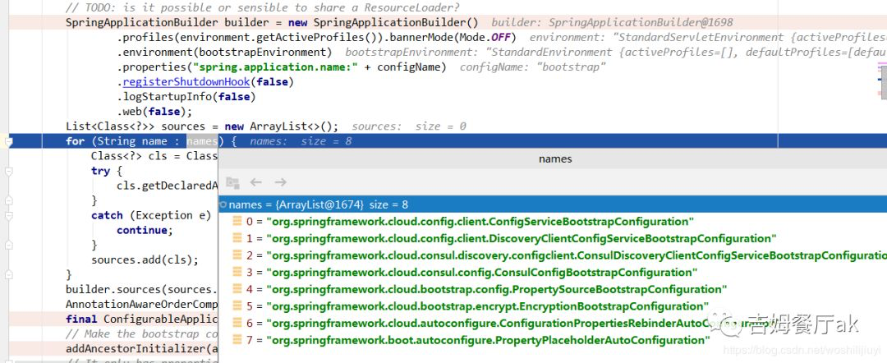

# 020-SpringCloudBootStrap上下文

在之前的博客《[SpringBoot | 第一篇：启动流程源码分析（上）](https://mp.weixin.qq.com/s?__biz=MzUwOTk1MTE5NQ==&mid=2247483664&idx=1&sn=4c384c9f1f49c9a3e4a481bceeba012b&chksm=f90b2ca4ce7ca5b2c1762e526c8bd0f34fd387552e182f3fa480386ad57e1cf3980d189e8b3d&token=302932053&lang=zh_CN&scene=21#wechat_redirect)》中，提到了 SpringBoot 在启动时，会触发相关一系列监听器，监听器各司其职，做一些初始化预处理操作。

SpringCloud 实现了自己的监听器：`BootstrapApplicationListener`，来初始化SpringCloud上下文环境。

来看一下该监听器被触发后的处理逻辑：

```java
@Override
public void onApplicationEvent(ApplicationEnvironmentPreparedEvent event) {
  ConfigurableEnvironment environment = event.getEnvironment();
  //如果未开启SpringCloud，直接返回
  if (!environment.getProperty("spring.cloud.bootstrap.enabled", Boolean.class,
                               true)) {
    return;
  }
  // don't listen to events in a bootstrap context
  //判断该监听器是否已经执行过，如果执行过，直接返回
  if (environment.getPropertySources().contains(BOOTSTRAP_PROPERTY_SOURCE_NAME)) {
    return;
  }
  //这里返回了一个 Spring 容器
  ConfigurableApplicationContext context = bootstrapServiceContext(environment,
                                                                   event.getSpringApplication());
  apply(context, event.getSpringApplication(), environment);
}
```

`bootstrapServiceContext`方法创建了一个 Spring 容器：

```java
private ConfigurableApplicationContext bootstrapServiceContext(
  ConfigurableEnvironment environment, final SpringApplication application) {
  StandardEnvironment bootstrapEnvironment = new StandardEnvironment();
  MutablePropertySources bootstrapProperties = bootstrapEnvironment
    .getPropertySources();
  for (PropertySource<?> source : bootstrapProperties) {
    bootstrapProperties.remove(source.getName());
  }
  //设置读取 bootstrap 文件
  String configName = environment
    .resolvePlaceholders("${spring.cloud.bootstrap.name:bootstrap}");
  //设置 bootstrap 文件路径
  String configLocation = environment
    .resolvePlaceholders("${spring.cloud.bootstrap.location:}");
  Map<String, Object> bootstrapMap = new HashMap<>();
  bootstrapMap.put("spring.config.name", configName);
  if (StringUtils.hasText(configLocation)) {
    bootstrapMap.put("spring.config.location", configLocation);
  }
  //设置是否已经初始化BootStrap环境
  bootstrapProperties.addFirst(
    new MapPropertySource(BOOTSTRAP_PROPERTY_SOURCE_NAME, bootstrapMap));
  for (PropertySource<?> source : environment.getPropertySources()) {
    bootstrapProperties.addLast(source);
  }
  //......
  //加载BootstrapConfiguration 配置类
  List<String> names = SpringFactoriesLoader
    .loadFactoryNames(BootstrapConfiguration.class, classLoader);
  for (String name : StringUtils.commaDelimitedListToStringArray(
    environment.getProperty("spring.cloud.bootstrap.sources", ""))) {
    names.add(name);
  }
  //创建 Spring 容器
  SpringApplicationBuilder builder = new SpringApplicationBuilder()
    .profiles(environment.getActiveProfiles()).bannerMode(Mode.OFF)
    .environment(bootstrapEnvironment)
    .properties("spring.application.name:" + configName)
    .registerShutdownHook(false)
    .logStartupInfo(false)
    .web(false);
  List<Class<?>> sources = new ArrayList<>();

  builder.sources(sources.toArray(new Class[sources.size()]));
  AnnotationAwareOrderComparator.sort(sources);
  final ConfigurableApplicationContext context = builder.run();
  //创建祖先容器
  addAncestorInitializer(application, context);
  bootstrapProperties.remove(BOOTSTRAP_PROPERTY_SOURCE_NAME);
  mergeDefaultProperties(environment.getPropertySources(), bootstrapProperties);
  return context;
}
```

首先，`SpringBoot`项目是通过`SpringApplicationBuilder`启动，在上述逻辑中又构建了一个`SpringApplicationBuilder`对象，再次执行run方法，所以启动流程会执行两遍，只是读取的配置文件和配置类不同。

> 之前有人问我，SpringCloud项目`ApplicationContextInitializer`实现类中的逻辑执行了两遍，原因就在于启动流程会执行两遍。

同样，当第二次创建`SpringApplicationBuilder`并启动时，会不会再次出发监听器，然后接着创建`SpringApplicationBuilder`呢？
肯定不会。否则就是死循环了。上面已经提到了，SpringCloud通过标识符`BOOTSTRAP_PROPERTY_SOURCE_NAME`来判断。监听器执行之后，会设置该变量对应值，下次启动前如果有值，表明已经执行。

上面有一行关键的代码：`addAncestorInitializer(application, context);`

ancestor 中文祖先的意思。具体来看一下：

```java
private void addAncestorInitializer(SpringApplication application,
            ConfigurableApplicationContext context) {
        boolean installed = false;
        //遍历所有的initializer，判断是否已经存在 祖先initializer
        for (ApplicationContextInitializer<?> initializer : application
                .getInitializers()) {
            if (initializer instanceof AncestorInitializer) {
                installed = true;
                // 如果存在，则设置 bootStrapApplication
                ((AncestorInitializer) initializer).setParent(context);
            }
        }
        //如果不存在，则创建。
        if (!installed) {
            application.addInitializers(new AncestorInitializer(context));
        }
    }
```

这里主要是创建 AncestorInitializer对象。

当BootStrap环境初始化完毕后，再次回到SpringBoot初始化流程会触发所有的initializers，当执行AncestorInitializer时，将BootStrap ApplicationContext容器设为父容器：

```java
private static class AncestorInitializer implements
            ApplicationContextInitializer<ConfigurableApplicationContext>, Ordered {

        private ConfigurableApplicationContext parent;

        public AncestorInitializer(ConfigurableApplicationContext parent) {
            this.parent = parent;
        }
        @Override
        public void initialize(ConfigurableApplicationContext context) {
            //如果已经存在父容器，则直接取出
            while (context.getParent() != null && context.getParent() != context) {
                context = (ConfigurableApplicationContext) context.getParent();
            }
            reorderSources(context.getEnvironment());
            //设置父容器
            new ParentContextApplicationContextInitializer(this.parent)
                    .initialize(context);
        }
}
```

上述方法将设置父容器的逻辑委托给`ParentContextApplicationContextInitializer`类处理，来看下`initialize`方法：

```java
public class ParentContextApplicationContextInitializer implements
        ApplicationContextInitializer<ConfigurableApplicationContext>, Ordered {

    private int order = Ordered.HIGHEST_PRECEDENCE;

    private final ApplicationContext parent;

    @Override
    public void initialize(ConfigurableApplicationContext applicationContext) {
        if (applicationContext != this.parent) {
            //设置父容器
            applicationContext.setParent(this.parent);
            //创建监听器，主要用来发布项目中存在父子容器事件
            applicationContext.addApplicationListener(EventPublisher.INSTANCE);
        }
    }
}
```

## BootStrapApplication容器的作用

**提前加载SpringCloud 相关的配置类，比如BootStrap Application会提前加载配置中心相关配置类，优先加读取`bootstrap`配置文件等逻辑。**

默认加载的配置如下：
