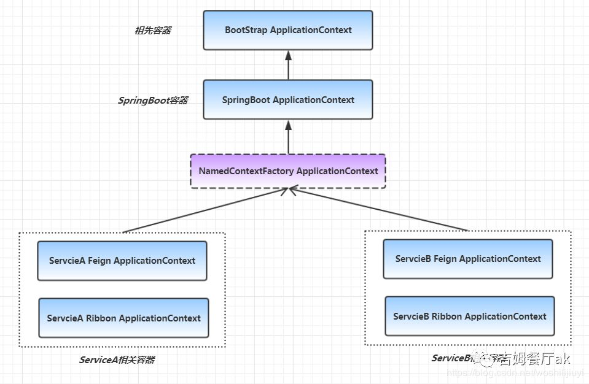
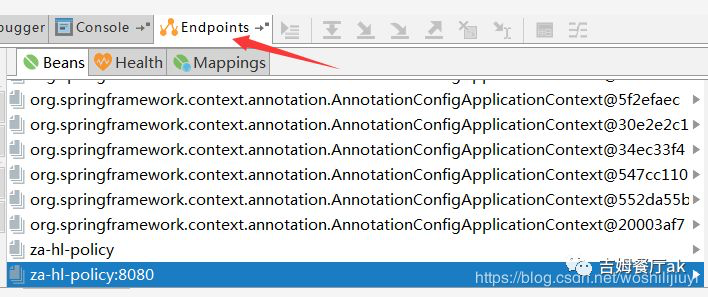

# 	SpringCloud服务配置容器上下文



上面 uml 图中提到了一个关键类：`NamedContextFactory`，从命名可以看出，这是一个工厂类：抽象容器工厂。

同 hystrix 线程隔离原理一样，该工厂根据不同的服务名称，创建不同的容器。该容器有2个实现类，`FeignContext` 和 `SpringClientFactory`，分别用来加载对应的配置。

来看一下相关的核心代码：

```java
public abstract class NamedContextFactory<C extends NamedContextFactory.Specification>
        implements DisposableBean, ApplicationContextAware {

    //Feign 和Ribbon 配置抽象接口
    public interface Specification {
        String getName();
        Class<?>[] getConfiguration();
    }

    //Application集合
    private Map<String, AnnotationConfigApplicationContext> contexts = new ConcurrentHashMap<>();


    protected AnnotationConfigApplicationContext getContext(String name) {
            //根据服务名称获取对应配置工厂，如果没有，则创建
            if (!this.contexts.containsKey(name)) {
                synchronized (this.contexts) {
                    if (!this.contexts.containsKey(name)) {
                        //创建并进行缓存
                        this.contexts.put(name, createContext(name));
                    }
                }
            }
            return this.contexts.get(name);
        }

    protected AnnotationConfigApplicationContext createContext(String name) {
        //创建一个 Spring 容器
        AnnotationConfigApplicationContext context = new AnnotationConfigApplicationContext();
        if (this.configurations.containsKey(name)) {
            for (Class<?> configuration : this.configurations.get(name)
                    .getConfiguration()) {
                //注入配置类
                context.register(configuration);
            }
        }
        //注入默认的Feign或Ribbon配置类
        for (Map.Entry<String, C> entry : this.configurations.entrySet()) {
            if (entry.getKey().startsWith("default.")) {
                for (Class<?> configuration : entry.getValue().getConfiguration()) {
                    context.register(configuration);
                }
            }
        }
        context.register(PropertyPlaceholderAutoConfiguration.class,
                this.defaultConfigType);
        context.getEnvironment().getPropertySources().addFirst(new MapPropertySource(
                this.propertySourceName,
                Collections.<String, Object> singletonMap(this.propertyName, name)));
        if (this.parent != null) {
            // Uses Environment from parent as well as beans
            //设置父类为 SpringBoot 创建的Spring 容器
            context.setParent(this.parent);
        }
        //启动容器
        context.refresh();
        return context;
    }
}
```

具体执行细节这里不做展开了，之前的文章《[SpringCloud | SpringCloud Feign的前世今生【源码深入分析】](https://mp.weixin.qq.com/s?__biz=MzUwOTk1MTE5NQ==&mid=2247483724&idx=1&sn=03b5193f49920c1d286b56daff8b1a09&chksm=f90b2cf8ce7ca5ee6b56fb5e0ffa3176126ca3a68ba60fd8b9a3afd2fd1a2f8a201a2b765803&token=302932053&lang=zh_CN&scene=21#wechat_redirect)》有详细介绍。

**所以，具体Feign 和 Ribbon配置类会创建多少实例，和项目本身依赖的服务有关。如果依赖10个服务，那就是10个Feign配置容器+10个Ribbon配置容器+SpringBoot容器+BootStrap容器。**

可以借助工具来看一下。如果项目引入了`SpringBoot` 监控模块`Spring Boot Actuator`，那在idea中可以看到已经创建的8个容器如下：



**注意：由于Ribbon 默认会采用懒加载，也就是只有第一次请求的时候才会加载。所以idea这里不会显示 Ribbon 相关配置类容器，只显示项目启动流程中创建完成的 Spring 容器。 这也是微服务经常第一次调用超时的根本原因，因为创建并启动一个Spring容器需要一定的时间。**

## **总结**

本篇主要介绍了 SpringCloud 项目中创建的 Spring 容器：

**首先 SpringBoot 项目启动，触发监听器，如果引入了SpringCloud 中的`BootstrapApplicationListener`，则开始初始化 SpringCloud 相关的上下文：Bootstrap ApplicationContext，将其设置为祖先容器，然后继续创建其子容器：SpringBoot ApplicationContext。**

**如果引入了 FeignClient，则会实例化一个容器工厂，以服务名称为key，\**value为\**Feign 和 Ribbon配置类容器，配置隔离，父容器则都为 SpringBoot ApplicationContext。**