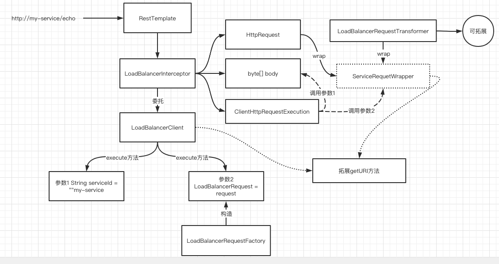

# 050-客户端负载均衡器-LoadBalancerClient

[TOC]

## LoadBalancerClient主要作用

LoadBalancerClient(客户端负载均衡器) 会根据负载均衡请求和服务名执行真正的负载均衡操作

## 调用中的位置



## 接口源码

```java
public interface LoadBalancerClient extends ServiceInstanceChooser {

	/**
		使用负载均衡得到的 ServiceInstance 为指定的服务执行请求
	 */
	<T> T execute(String serviceId, LoadBalancerRequest<T> request) throws IOException;

	<T> T execute(String serviceId, ServiceInstance serviceInstance, LoadBalancerRequest<T> request) throws IOException;

	/**
		使用服务实例 ServiceInstance 中的host和 port 属性构造出真正的URI, 
		比如 http://my-service/path/to/service 这个 URI里的 my-service 服务对应的
		- host 是 127.0.0.1
		- port 是 8080
		那么最终会输出 http://127.0.0.1:8080/path/to/service
	 */
	URI reconstructURI(ServiceInstance instance, URI original);

}

```

- LoadBalancerRequest 表示一次负载均衡请求, 被 LoadBalancerRequestFactory构造
- LoadBalancerRequestFactory 构造的实际上是包装类 ServiceRequestWrapper (内部基于 服务实例和请求信息构造出真正的URI)
- 然后根据 LoadBalancerRequestTransformer 做二次加工

## LoadBalancerRequestFactory详细

 [060-负载均衡请求工厂-LoadBalancerRequestFactory.md](060-负载均衡请求工厂-LoadBalancerRequestFactory.md) 

## LoadBalancerClient的默认实现

```java
public class BlockingLoadBalancerClient implements LoadBalancerClient {

	private final LoadBalancerClientFactory loadBalancerClientFactory;

	public BlockingLoadBalancerClient(LoadBalancerClientFactory loadBalancerClientFactory) {
    //①loadBalancerClientFactory
		this.loadBalancerClientFactory = loadBalancerClientFactory;
	}

	@Override
	public <T> T execute(String serviceId, LoadBalancerRequest<T> request)throws IOException {
		ServiceInstance serviceInstance = choose(serviceId);
		if (serviceInstance == null) {
			throw new IllegalStateException("No instances available for " + serviceId);
		}
		return execute(serviceId, serviceInstance, request); // ②
	}

	@Override
	public <T> T execute(String serviceId, ServiceInstance serviceInstance,LoadBalancerRequest<T> request) throws IOException {
		try {
			return request.apply(serviceInstance); // ③
		}
		catch (IOException iOException) {
			throw iOException;
		}
		catch (Exception exception) {
			ReflectionUtils.rethrowRuntimeException(exception);
		}
		return null;
	}

	@Override
	public URI reconstructURI(ServiceInstance serviceInstance, URI original) {
		return LoadBalancerUriTools.reconstructURI(serviceInstance, original);// ④
	}

	@Override
	public ServiceInstance choose(String serviceId) {
		ReactiveLoadBalancer<ServiceInstance> loadBalancer = loadBalancerClientFactory.getInstance(serviceId);// ⑤
		if (loadBalancer == null) {
			return null;
		}
		Response<ServiceInstance> loadBalancerResponse = Mono.from(loadBalancer.choose()).block();
		if (loadBalancerResponse == null) {
			return null;
		}
		return loadBalancerResponse.getServer();
	}
}

```

- ① loadBalancerClientFactory 是一个用于创建 ReactiveLoadBalancer的工厂类,  loadBalancerClientFactory  内部维护一个map, 这个map用于保存各个服务的ApplicationContext(Map 的key是服务名)

- ② 没有 ServiceInstance 参数的execute 方法内部会调用 choose 方法获取一个 ServiceInstance , 然后调用另外一个重载的execute方法
- ③ 有ServiceInstance 参数的execute 方法把负载均衡的操作者直接委托给LoadBalancerRequest 负载均衡请求

- ④ 根据URI和找到服务实例 ServiceInstance把负载均衡的操作直接委托给 LoadBalancerRequest 
- ⑤ 代码②处提到的choose 方法会返回服务实例 ServiceInstance , choose 方法首先会根据服务名和 loadBalancerClientFactory 得到该服务名锁对应的额ReactiveLoadBalancer Bean ,然后用 ReactiveLoadBalancer 的 choose方法得到服务实例 ServiceInstance