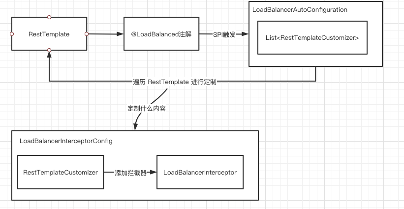

# 010-@LoadBalanced注解总结

[TOC]

## 1. @LoadBalancer对RestTemplate的支持

### 1.1 RestTemplateCustomizer定制RestTamplate 

@LoadBalancer 注解修饰了 RestTemplate 之后, 会根据 RestTemplateCustomizer 对 RestTamplate 进行定制

RestTemplateCustomizer  主要定制了 LoadBalancerInterceptor 负载均衡拦截器

#### 相关知识点

-  [030-@LoadBalanced-客户端负载均衡.md](030-@LoadBalanced-客户端负载均衡.md) 
-  [031-@LoadBalanced-源码-支持RestTemplate原理.md](031-@LoadBalanced-源码-支持RestTemplate原理.md) 

### 1.2 LoadBalancerInterceptor 

LoadBalancerInterceptor 负载均衡器通过 LoadBalancerClient 的 execute 方法完成最终的调用

execute 方法有两个参数

1. 服务名, 请求信息中的 host 即表示服务名
2. 负载均衡请求 (LoadBalancerRequest) , 通过 LoadBalancerRequestFactory 构造完成

#### 相关知识点

- [032-@LoadBalanced-底层拦截器-LoadBalancerInterceptor.md](032-@LoadBalanced-底层拦截器-LoadBalancerInterceptor.md) 

