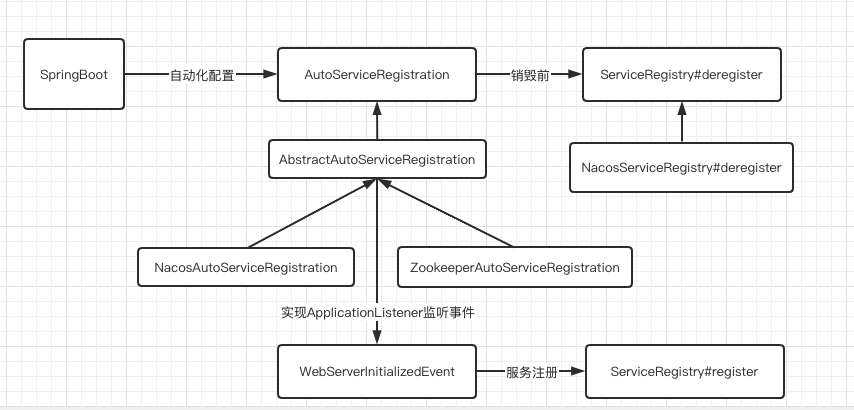

# 050-SpringCloud服务注册抽象-ServiceRegistry

[TOC]

## 一言蔽之

SpringCloud 的ServiceRegistry是对服务注册的抽象

```
org.springframework.cloud.client.serviceregistry.ServiceRegistry
```

## 服务注册和销毁的过程

- `AutoServiceRegistration`是一个标记接口, 没有任何方法
- 大部分的实现在`AbstractAutoServiceRegistration`中,同时也实现了`ApplicationListener<WebServerInitializedEvent>`用来接受事件
  - 收到WebServerInitializedEvent 事件时, 使用 ServiceRegistry完成了服务注册
  - 应用关闭时会触发 @PreDestory注解使用 ServiceRegistry完成服务的销毁



