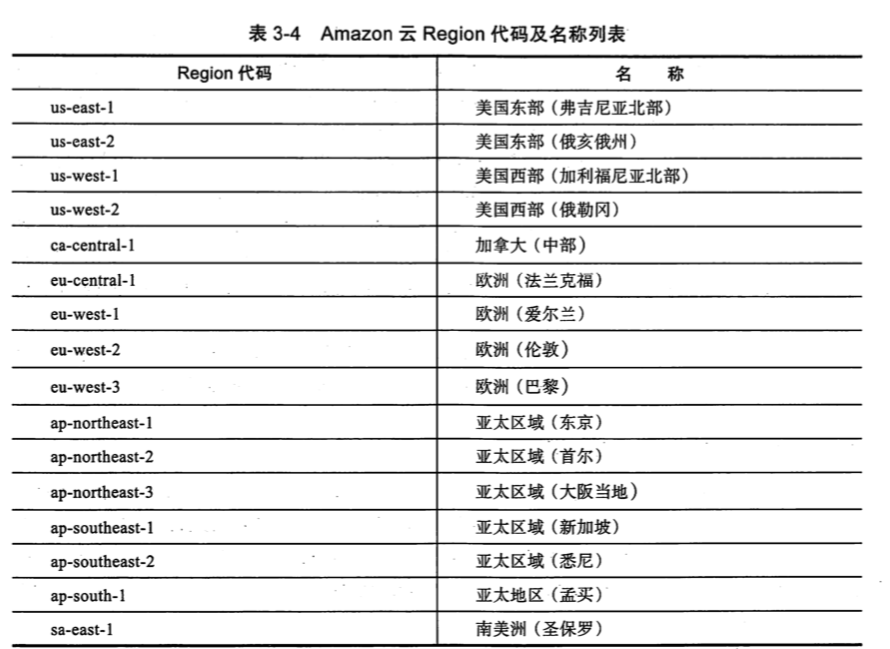
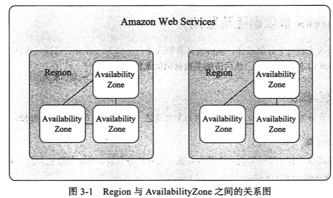

# Eureka 的设计理念

> https://medium.com/knerd/eureka-why-you-shouldnt-use-zookeeper-for-service-discovery-4932c5c7e764
>
> 在生产实践中,服务注册一级发现中心保留可用以及过期的数据总比丢失可用的数据好
>
> 这样的话,应用实例的注册信息在集群的所有节点间并不是强一致的,这就需要客户端能够支持负载均衡以及失败重试(ribbon 或者 loadblancer)

3 个核心问题

- 服务实例如何注册到服务中心
- 服务实例如何从服务中心剔除
- 服务实例信息一致性

## 服务实例如何注册到服务中心

本质上是服务启动的时候,调用 Eureka Server 的 REST API 的 register 方法,去注册这个应用的实例

## 服务实例如何从服务中心剔除

正常情况下,服务实例在关闭应用的时候,通过钩子方法或者其他生命周期回调去调用 Eureka Server 的 REST API 的 de-register 方法来删除自身服务实例的信息

服务实例挂掉的情况下: 使用心跳包来证明服务实例还是存活的,是健康的,是可以条用的; Eureka 采用的是心跳模式


## 服务实例信息一致性

服务注册以及发现中心不可能是单点的,势必是一个集群,那么服务实例注册信息如何在这个集群里保证一致呢?

- AP 优于 CP
- Peer to Peer 架构
- Zone 以及 Region 设计
- self preservation 设计

### AP 优于 CP

分布式系统领域有个重要的 CAP 理论

| CAP                 | 解释       | 详解                                                         |
| ------------------- | ---------- | ------------------------------------------------------------ |
| Consistency         | 数据一致性 | 数据在存在多副本的情况下,可能由于网络,机器故障,软件系统等问题导致数据写入部分副本成功,部分副本失败,进而造成副本之间数据不一致,存在冲突,满足一致性要求对数据的更新操作完成之后,多副本的数据保持一致 |
| Availability        | 可用性     | 在任何时候,客户端对集群进行读写操作时,请求能够正常相应,即在一定的延时内完成 |
| Partition Tolerance | 分区容忍性 | 发生通讯故障的时候,整个集群被分割为多个无法相互通讯的分区时,集群仍然可用 |

对于分布式系统来说,一般网络条件相对不可控,出现网络分区是不可避免的,所以系统必须具备**分区容忍性**

**在分布式系统中,P 是一个客观存在的事实**

往往分布式系统设计在 AP 和 CP 之间选择

对于 Zookeeper ,它是"CP"的,之所以 C 加引号是因为 Zookeeper 默认并不是严格的强一致,比如客户端 A 提交了一个写操作,Zookeeper 在过半数节点操作成功之后就返回,此时假设客户端 B 的读操作请求到的是 A 写操作尚未同步到的节点,那么读取的就不是客户端 A写操作成功之后的数据

## Peer to Peer 架构

一般来说,分布式系统的数据在多个副本之间的复制方式,可分为主从复制和对等复制

### 主从复制

主从复制也就是广为人知的 Master-Slave 模式,一个主,多个从,

- 所有对数据的写操作都提交到主,然后主同步到从
- 可以细分为同步更新,异步更新,同步异步混合更新

值得注意的是

对于主从复制模式来讲,写操作的压力都在主副本上,它是整个系统的瓶颈,但是从副本可以帮主副本分担读请求

### 对等复制

Peer to Peer 模式,副本之间不分主从,任何副本都可以接收读写操作,然后每个副本之间互相进行数据更新

值得注意的是

- 任何副本都可以接收写请求,不存在写操作的压力瓶颈

#### 客户端

客户端一般通过如下配置 EurekaServer 的 peer 节点

```
eureka:
  client:
    serviceUrl:
      # 注册中心地址
      defaultZone: http://ip:8000/eureka,http://ip:8002/eureka
      prefer-same-zone-eureka: true
```

- prefer-same-zone-eureka , 当有多个分区下,优先选择与应用实例所在分区一样的其他服务的实例,如果没有默认使用 defaultZone
- 客户端使用 quarantineSet 维护了一个不可用的 Eureka Server ,进行请求的时候,优先从可用列表中选择,如果请求失败则切换到下一个 Eureka Server 下进行充实,默认的重试次数是 3
- 为了防止每个 Client端都按照配置文件制定的顺序进行请求,造成 Eureka Server 节点请求分布不均衡的情况,Client 端有个定时任务,默认五分钟执行一次,来刷新并随机化 Eureka Server 的列表

#### 服务端

##### 注册中心之间的互相注册

Eureka Server 本身依赖的 Eureka Client , 也就是每个 Eureka Server 是作为其他 Eureka Server 的 Client ,在单个 Eureka Server 启动的时候,会有一个 syncUp 的操作,通过 Eureka Client 请求其他 EurekaServer 节点中的一个节点获取注册的应用实例信息,然后复制到其他 peer节点

##### 如何避免复制之间的死循环

Eureka Server 在执行复制操作的时候,使用 `HEADER_REPLICATION` 的 http header 来讲这个请求操作与普通应用实例的正常操作区分开来,这样其他 peer 节点接受到请求的时候,就不会再对它的 peer 节点进行复制操作,避免死循环

##### 数据同步 peer to peer 

前面说了 Eureka 是 peer to peer 模式的复制,有一个重要的问题就是复制的时候的冲突问题,Eureka 的两个解决方案

- LastDirtyTimestamp 
- heartbeat

##### LastDirtyTimestamp

开关 是`SyncWhenTimestampDiffers`配置,默认是开启的

- 当 `lastDirtyTimestamp` 值大于 Server 本地该实例的 `lastDirtyTimestamp` 值的时候,则表示 EurekaServer 之间出现了数据冲突,这个时候会返回 404,要求该实例重新进行注册
- 当 `lastDirtyTimestamp`  值小于 Server 本地该实例的 `lastDirtyTimestamp` 值,如果是 peer 节点的复制请求,则表示数据出现冲突,返回 409 给 peer 节点,要求其同步自己的最新的数据信息

peer 节点之间的互相复制并不能保证所有操作都能成功,因此 Eureka 还通过应用实例与 Server 之间的 heartbeat 也就是 renewLease 操作来进行数据的最终修修复,即如果发现了应实例数据与某个 Server 的数据出现不一致,则 server 返回 404,应用实例重新注册 register

### 总结一下

实际上服务端 peer to peer 进行复制的时候,使用的是最近时间戳和心跳包的方式

## Zooe 以及 Region 设计

由于 NetFlix 的服务大部分在 Amazon 上,因此 Eureka 的设置有一部分也基于 Amazon 的 Zone 和 Region 的基础设施上

Region: 代表一个独立的地理区间,比如 Eureka Server 默认设置了 4 个 Region

- us-east-1
- us-west-1
- us-west-2
- eu-west-1



每一个 Region 下,分忧多个 AvailabilityZone ,一个 Region 对应多个 AvailabilityZone 

每个 Region 之间是相互独立以及隔离的,默认情况下,资源值在单个 Region 之间的 AvailabilityZone 之间复制,夸 Region 之间不会进行资源复制,Region 与 AvailiabilityZone 之间的关系如图



> Availability Zone 可以看做是 Region 下的一个一个机房, 当一个机房挂掉,不影响其他机房

一个 `Availability Zone`可以设置多个实例,它们之间构成 peer节点,然后采用 peer to peer 的复制模式

## SELF PERSERVATION 自我保护机制

#### 是什么

Eureka Client 端和 Eureka Server 端之间有一个租约,Server 端会有定时任务剔除失效的实例

- Client 定时发送心跳包维持这个租约
- Server 通过当前注册的实例数,计算出每分钟应该受到多少心跳包,如果最近一分钟接收到的续租次数小于等于指定阈值的话,**就关闭租约失效剔除**,禁止定时任务剔除失效的实例,从而保护注册信息

#### 为什么要有这个机制

首先是注册中心都有健康检查,比较关键的问题是,处理好网络偶尔波动或者短暂不可用造成的误判

> 当我们在断点调试的时候,通常就会造成一种短暂不可用的情况

如果出现网络分区的问题,极端情况下,Eureka Server 情况部分服务的实例列表,将会严重影响到 EurekaServer 的 Availability 属性,因此要有一个机制,禁止它这种极端剔除服务的行为,从而保护注册信息


## 附录

https://medium.com/knerd/eureka-why-you-shouldnt-use-zookeeper-for-service-discovery-4932c5c7e764

> # Eureka! Why You Shouldn’t Use ZooKeeper for Service Discovery
>
> > Written by Peter Kelley
>
> Many companies use ZooKeeper for service discovery. At Knewton, we believe this is a fundamentally flawed approach. In this article, I will walk through our failures with ZooKeeper, tell you why you shouldn’t be using it for service discovery, and explain why Eureka is a better solution.
>
> **Remember What You’re Building On**
>
> Let’s back up. It’s important to first discuss what your target environment is *before* deciding what software to use or how to build your own. In the cloud, resiliency to equipment and network failure has to be a primary concern. When you’re running your software across a large number of replaceable pieces of hardware, it’s inevitable that one of them will fail at some point. At Knewton, we run on AWS, and we’ve seen many different types of failure. You have to design your systems expecting failure. Other companies on AWS [agree](http://techblog.netflix.com/2010/12/5-lessons-weve-learned-using-aws.html) (there are whole [books](http://shop.oreilly.com/product/0636920026839.do) written on the topic). You have to anticipate box failure, high latency, and network partitions — and build resiliency against them into your system.
>
> Don’t assume your environment is the same as others. Sure, if you’re managing your own datacenters, you quite possibly could be putting in the time and money to minimize hardware failures and network partitions. But cloud environments like AWS make a different trade-off. You are going to have these issues, and you had better prepare for them.
>
> **Failures with ZooKeeper**
>
> [ZooKeeper](http://zookeeper.apache.org/) is a great software project. It is mature, has a large community supporting it, and is used by many teams in production. It’s just the wrong solution to the problem of service discovery.
>
> In [CAP](http://codahale.com/you-cant-sacrifice-partition-tolerance/) terms, ZooKeeper is CP, meaning that it’s *consistent* in the face of partitions, not *available*. For many things that ZooKeeper does, this is a necessary trade-off. Since ZooKeeper is first and foremost a coordination service, having an eventually consistent design (being AP) would be a horrible design decision. Its core consensus algorithm, [Zab](http://web.stanford.edu/class/cs347/reading/zab.pdf), is therefore all about consistency.
>
> For coordination, that’s great. But for service discovery it’s better to have information that may contain falsehoods than to have no information at all. It is much better to know what servers were available for a given service five minutes ago than to have no idea what things looked like due to a transient network partition. The guarantees that ZooKeeper makes for coordination are the wrong ones for service discovery, and it hurts you to have them.
>
> ZooKeeper simply doesn’t handle network partitions the right way for service discovery. Like other types of failure in the cloud, partitions [actually](http://aphyr.com/posts/288-the-network-is-reliable) happen. It is best to be as prepared as possible. But — as outlined in a [Jepsen](http://aphyr.com/posts/291-call-me-maybe-zookeeper) post on ZooKeeper and the ZooKeeper [website](http://wiki.apache.org/hadoop/ZooKeeper/FailureScenarios) — in ZooKeeper, clients of the nodes that are part of the partition that can’t reach quorum lose communication with ZooKeeper and their service discovery mechanism altogether.
>
> It’s possible to supplement ZooKeeper with client-side caching or other techniques to alleviate certain failure conditions. Companies like [Pinterest](http://engineering.pinterest.com/post/77933733851/zookeeper-resilience-at-pinterest) and [Airbnb](http://nerds.airbnb.com/smartstack-service-discovery-cloud/) have done this. On the surface, this appears to fix things. In particular, client-side caching helps ensure that if any or all clients lose contact with the ZooKeeper cluster, they can fall back to their cache. But even here there are situations where the client won’t get all the discovery information that could be available. If quorum is lost altogether, or the cluster partitions and the client happens to be connected to nodes that are not part of quorum but still healthy, the client’s status will be lost even to those other clients communicating with those *same* healthy ZooKeeper nodes.
>
> More fundamentally, supplementing ZooKeeper, a consistent system, with optimistic caching is attempting to make ZooKeeper more *available*. ZooKeeper is meant to be *consistent*. This gives you neither: you have bolted a system that wants to be AP on top of a system that is CP. This is fundamentally the wrong approach. A service discovery system should be designed for availability from the start.
>
> Even ignoring CAP tradeoffs, setting up and maintaining ZooKeeper correctly is hard. Mistakes are so [common](http://www.infoq.com/presentations/Misconfiguration-ZooKeeper) that projects have been developed just to mitigate them. They exist for the [clients](http://curator.apache.org/) and even the ZooKeeper servers [themselves](http://techblog.netflix.com/2012/04/introducing-exhibitor-supervisor-system.html). Because ZooKeeper is so hard to use correctly, many of our failures at Knewton were a direct result of our misuse of ZooKeeper. Some things appear simple but are actually easy to get wrong: for example, reestablishing watchers correctly, handling session and exceptions in clients, and managing memory on the ZK boxes. Then there are actual ZooKeeper issues we hit, like [ZOOKEEPER-1159](https://issues.apache.org/jira/browse/ZOOKEEPER-1159) and [ZOOKEEPER-1576](https://issues.apache.org/jira/browse/ZOOKEEPER-1576). We even saw leadership election fail in production. These types of issues happen because of the guarantees ZooKeeper needs to make. It needs to manage things like sessions and connections, but because they aren’t needed for service discovery, they hurt more than they help.
>
> **Making the Right Guarantees: Success with Eureka**
>
> We switched to [Eureka](https://github.com/Netflix/eureka/), an open-source service discovery solution developed by [Netflix](https://www.netflix.com/). Eureka is built for availability and resiliency, two primary pillars of development at Netflix. They just [can’t](http://techblog.netflix.com/2010/12/5-lessons-weve-learned-using-aws.html) [stop](https://www.youtube.com/watch?v=dekV3Oq7pH8) [talking](http://techblog.netflix.com/2011/12/making-netflix-api-more-resilient.html) [about](http://techblog.netflix.com/2012/07/chaos-monkey-released-into-wild.html) it — and for good reason. Since the switch, we haven’t had a single service-discovery-related production outage. We acknowledged that in a cloud environment you are guaranteed failure, and it is absolutely critical to have a service discovery system that can survive it.
>
> First, if a single server dies, Eureka doesn’t have to hold any type of election; clients automatically switch to contacting a new Eureka server. Eureka servers in this case will also accept the missing Eureka server back when it reappears, but will only *merge* any registrations it has. There’s no risk of a revived server blowing out the entire service registry. Eureka’s even designed to handle broader partitions with zero downtime. In the case of a partition, each Eureka server will continue to accept new registrations and publish them to be read by any clients that can reach it. This ensures that new services coming online can still make themselves available to any clients on the same side of the partition.
>
> But Eureka goes beyond these. In normal operation, Eureka has a built-in concept of service heartbeats to prevent stale data: if a service doesn’t phone home often enough, then Eureka will remove the entry from the service registry. (This is similar to what people typically build with ZooKeeper and ephemeral nodes.) This is a great feature, but could be dangerous in the case of partitions: clients might lose services that were actually still up, but partitioned from the Eureka server. Thankfully, Netflix thought of this: if a Eureka server loses connections with too many clients too quickly, it will enter “self-preservation mode” and stop expiring leases. New services can register, but “dead” ones will be kept, just in case a client might still be able to contact them. When the partition mends, Eureka will exit self-preservation mode. Again, holding on to good and bad data is better than losing any of the good data, so this scheme works beautifully in practice.
>
> Lastly, Eureka caches on the client side. So even if every last Eureka server goes down, or there is a partition where a client can’t talk to any of the Eureka servers, then the service registry still won’t be lost. Even in this worst-case scenario, your service will still likely be able to look up and talk to other services. It is important to note that client-side caching is appropriate here. Because all healthy Eureka servers must be unresponsive to resort to it, we know there is no chance of new and better information possibly being reachable.
>
> Eureka makes the right set of guarantees for service discovery. There are no equivalents for leadership election or transaction logs. There is less for you to get wrong and less that Eureka has to do right. Because Eureka is built explicitly for service discovery, it provides a client library that provides functionality such as service heartbeats, service health checks, automatic publishing, and refreshing caches. With ZooKeeper, you would have to implement all of these things yourself. Eureka’s library is built using open-source code that everyone sees and uses. That’s better than a client library that only you and two other people have seen the code for.
>
> The Eureka servers are also infinitely easier to manage. To replace nodes, you just remove one and add another under the same EIP. It has a clear and concise website that provides a visual representation of all your services and their health. I can’t tell you how great it is to glance at a web page and see exactly what services are running or suffering issues. Eureka even provides a REST API, allowing for easy integration with other potential uses and querying mechanisms.
>
> **Conclusion**
>
> The biggest takeaways here are to remember what hardware you are building on and to only solve the problems you have to solve. Using Eureka provides both of these for us at Knewton. Cloud platforms are unreliable and Eureka is designed to handle their unique challenges. Service discovery needs to be as available and resilient as possible, and Eureka is designed to be just that.


