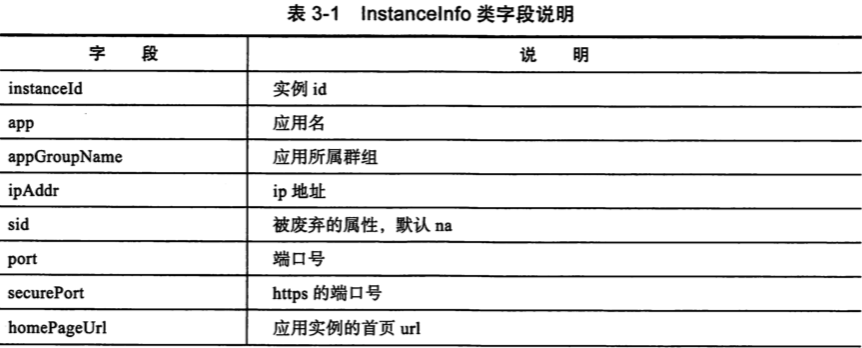
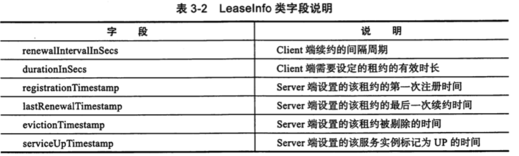

# 核心类

#### InstanceInfo

用来代表注册的服务实例




可以看到 InstanceInfo 里既有 metadata, 也有 dataCenterInfo, 还有一个比较重要的 leaseInfo ,用来表示该应用实例的租约信息

## LeaseInfo

Eureka 使用 `LeaseInfo` 来标识应用实例的租约信息,字段如下:



这些参数主要用于标识应用实例的心跳情况,比如约定的心跳周期,租约有效期,最近一次续约时间等

## ServiceInstance

ServiceInstance 是 Spring Cloud Service Discovery 的实例信息的抽象接口,约定了服务发现的实例应用有哪些通用的信息,方法如下

```
/**
 * Represents an instance of a service in a discovery system.
 *
 * @author Spencer Gibb
 * @author Tim Ysewyn
 */
public interface ServiceInstance {

	/**
	 * 服务 id
	 * @return The unique instance ID as registered.
	 */
	default String getInstanceId() {
		return null;
	}

	/**
   * 实例 的 host
	 * @return The service ID as registered.
	 */
	String getServiceId();

	/**
   * 实例的端口
	 * @return The hostname of the registered service instance.
	 */
	String getHost();

	/**
	 * 实例的端口
	 * @return The port of the registered service instance.
	 */
	int getPort();

	/**
		是否开启 https
	 * @return Whether the port of the registered service instance uses HTTPS.
	 */
	boolean isSecure();

	/**
		实例的 url 地址
	 * @return The service URI address.
	 */
	URI getUri();

	/**
		实例的元数据信息
	 * @return The key / value pair metadata associated with the service instance.
	 */
	Map<String, String> getMetadata();

	/**
		实例的 scheme
	 * @return The scheme of the service instance.
	 */
	default String getScheme() {
		return null;
	}
}
```

值得注意的是SpringCloud Discovery 适配了 zookeeper, Consul , Netfliex Eureka 等注册中心,因此其 ServiceInstance 定义更为抽象和通用, 而且采取的是定义方法的方式,

SpringCloud 对该接口的实现类为 EurekaRegistration , 实现了 ServiceInstance 接口,同时还实现了 Closeable 接口,它的作用之一就是在 close 的时候调用 eurekaClient()方法,实现了优雅关闭 Eureka Client

## InstanceStatus

InstanceStatus 用于标识服务实例的状态,它是一个枚举类

```
    public enum InstanceStatus {
        UP, // Ready to receive traffic
        DOWN, // Do not send traffic- healthcheck callback failed
        STARTING, // Just about starting- initializations to be done - do not
        // send traffic
        OUT_OF_SERVICE, // Intentionally shutdown for traffic
        UNKNOWN;

```

| 状态           | 描述                |
| -------------- | ------------------- |
| UP             |                     |
| DOWN           |                     |
| STARTING       |                     |
| OUT_OF_SERVICE | 停止服务,停接收请求 |
| UNKNOWN        |                     |

## 